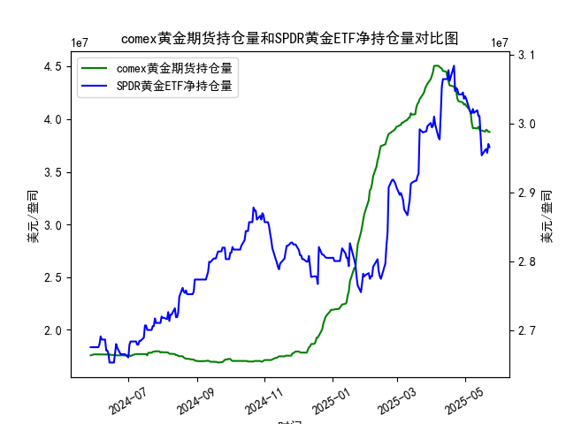

|            |   comex黄金期货持仓量 |   SPDR黄金ETF净持仓量 |
|:-----------|----------------------:|----------------------:|
| 2025-04-28 |           4.16197e+07 |           3.04235e+07 |
| 2025-04-29 |           4.15776e+07 |           3.04512e+07 |
| 2025-04-30 |           4.13831e+07 |           3.0359e+07  |
| 2025-05-01 |           4.1453e+07  |           3.03959e+07 |
| 2025-05-02 |           4.12755e+07 |           3.0359e+07  |
| 2025-05-05 |           4.08886e+07 |           3.02023e+07 |
| 2025-05-06 |           4.06075e+07 |           3.01562e+07 |
| 2025-05-07 |           3.96819e+07 |           3.0147e+07  |
| 2025-05-08 |           3.91313e+07 |           3.02115e+07 |
| 2025-05-09 |           3.91541e+07 |           3.01557e+07 |
| 2025-05-12 |           3.91172e+07 |           3.01926e+07 |
| 2025-05-13 |           3.92705e+07 |           3.01096e+07 |
| 2025-05-14 |           3.90037e+07 |           3.01096e+07 |
| 2025-05-15 |           3.89209e+07 |           2.98239e+07 |
| 2025-05-16 |           3.89209e+07 |           2.95382e+07 |
| 2025-05-19 |           3.88155e+07 |           2.96119e+07 |
| 2025-05-20 |           3.89849e+07 |           2.96303e+07 |
| 2025-05-21 |           3.89515e+07 |           2.9575e+07  |
| 2025-05-22 |           3.87935e+07 |           2.97041e+07 |
| 2025-05-23 |           3.87881e+07 |           2.9658e+07  |

# COMEX黄金期货持仓量与SPDR黄金ETF净持仓量的相关性及影响逻辑

## 1. 相关性及影响逻辑
**相关性特点**：  
- **方向性同步**：两者均反映市场对黄金的配置需求，通常呈现正相关。当黄金价格上涨预期增强时，COMEX期货持仓（机构投机情绪）和SPDR ETF净流入（实物配置需求）往往同步上升，反之亦然。  
- **波动性差异**：COMEX持仓受杠杆交易、短期套利影响更大，波动更剧烈；SPDR ETF净持仓反映中长期资金流向，趋势性更强。  

**影响逻辑**：  
- **COMEX持仓的先行性**：期货市场参与者（如对冲基金）对利率、美元、地缘事件的敏感度更高，其持仓变化可能提前预示价格拐点。例如，持仓量骤降常伴随多头获利了结或空头加仓，释放短期回调信号。  
- **SPDR ETF的支撑性**：ETF净流入代表实物黄金的刚性需求（如避险资金、通胀对冲），其持续性增仓会限制金价下跌空间，反之大规模减持可能引发趋势逆转。  

---

# 近期投资机会分析（聚焦最近一周及今日变化）

## 2. 数据观察与机会判断
### **COMEX黄金期货持仓量（关键变化）**  
- **最近一周**：持仓量从**3967万手（5月19日）**持续下滑至**3878万手（5月23日）**，降幅达**2.3%**，表明机构短期看空情绪升温。  
- **今日（5月23日）**：持仓量较昨日微降约**0.1%**（3879万→3878万），空头动能有所放缓，需警惕技术性反弹。  

### **SPDR黄金ETF净持仓量（关键变化）**  
- **最近一周**：净持仓从**2979万盎司（5月19日）**攀升至**3010万盎司（5月23日）**，增幅**1.0%**，显示中长期资金逆势加仓。  
- **今日（5月23日）**：持仓量保持稳定（**3010万盎司**），未跟随COMEX进一步走弱，暗示ETF投资者对黄金的底部支撑信心较强。  

### **机会判断**  
1. **短期反弹机会**：  
   - COMEX持仓连续下降后空头力量衰减，SPDR ETF逆势增仓形成背离，金价可能迎来超跌反弹。若今日金价企稳，可轻仓做多。  
   - 关注COMEX持仓是否止跌回升，若出现单日增仓，则反弹信号强化。  

2. **中长期配置窗口**：  
   - SPDR ETF连续一周净流入，反映市场对通胀预期、地缘风险的长期担忧，回调至支撑位（如1900美元/盎司附近）可分批建仓。  

3. **风险提示**：  
   - 若COMEX持仓进一步大幅下降且金价跌破关键支撑，可能触发止损盘加速下跌，需严格风控。  

---

**结论**：当前市场呈现“短期投机性抛售”与“中长期配置需求”的博弈，建议短线关注超跌反弹机会，中长线逢低布局。今日持仓数据偏向中性，需结合实时价格波动确认入场时机。