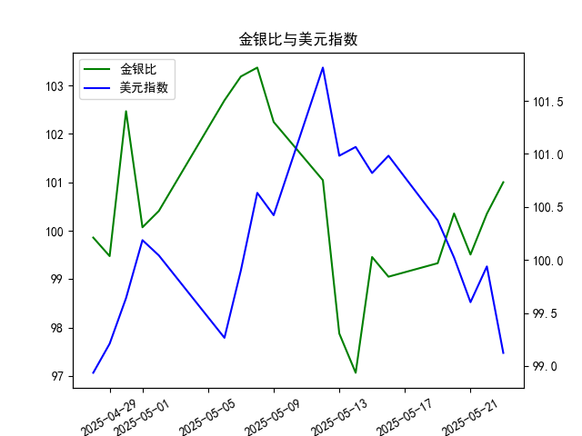

|            |    金价 |   银价 |   美元指数 |   金银比 |
|:-----------|--------:|-------:|-----------:|---------:|
| 2025-04-28 | 3296.3  | 33.01  |    98.9357 |  99.8576 |
| 2025-04-29 | 3305.05 | 33.225 |    99.21   |  99.4748 |
| 2025-04-30 | 3302.05 | 32.225 |    99.6403 | 102.469  |
| 2025-05-01 | 3214.75 | 32.125 |   100.187  | 100.07   |
| 2025-05-02 | 3249.7  | 32.365 |   100.042  | 100.408  |
| 2025-05-06 | 3391.45 | 33.025 |    99.2654 | 102.693  |
| 2025-05-07 | 3392.25 | 32.875 |    99.9006 | 103.186  |
| 2025-05-08 | 3352.3  | 32.43  |   100.633  | 103.37   |
| 2025-05-09 | 3324.55 | 32.515 |   100.422  | 102.247  |
| 2025-05-12 | 3235.4  | 32.02  |   101.814  | 101.043  |
| 2025-05-13 | 3227.95 | 32.98  |   100.983  |  97.876  |
| 2025-05-14 | 3191.95 | 32.885 |   101.066  |  97.064  |
| 2025-05-15 | 3191.05 | 32.085 |   100.82   |  99.4561 |
| 2025-05-16 | 3182.95 | 32.135 |   100.983  |  99.0493 |
| 2025-05-19 | 3230.15 | 32.52  |   100.373  |  99.3281 |
| 2025-05-20 | 3261.55 | 32.5   |   100.022  | 100.355  |
| 2025-05-21 | 3299.65 | 33.16  |    99.6014 |  99.5069 |
| 2025-05-22 | 3284    | 32.725 |    99.9388 | 100.351  |
| 2025-05-23 | 3342.65 | 33.095 |    99.1231 | 101.002  |

### 1. 金银比与美元指数的相关性及影响逻辑

**相关性**：  
金银比与美元指数通常呈现一定程度的负相关关系。当美元走强时，以美元计价的大宗商品（如黄金、白银）价格承压，但白银因工业属性更强，对经济周期更敏感，其跌幅可能超过黄金，导致金银比上升；反之，美元走弱时，贵金属价格普遍上涨，白银因弹性更大可能涨幅更显著，金银比可能下降。

**影响逻辑**：  
- **美元作为定价货币**：美元升值会直接压低黄金和白银的美元价格，但两者跌幅差异可能影响金银比。  
- **避险与工业需求分化**：黄金避险属性更强，在美元走弱时可能先于白银上涨；白银因工业用途（如光伏、电子）占比高，受经济预期影响更大，若经济疲软可能拖累白银表现。  
- **市场情绪传导**：美元指数下跌常伴随通胀预期升温或美联储宽松政策，此时黄金的抗通胀属性更突出，而白银可能因工业需求预期波动滞后。

---

### 2. 近期投资机会分析（聚焦最近一周）

#### **数据趋势**：
- **金银比**：  
  最近一周（5月19日-5月23日）从 **99.33** 升至 **101.00**，今日（5月23日）较昨日（5月22日）上升 **0.65**，表明黄金相对白银走强。  
- **美元指数**：  
  同期从 **100.37** 降至 **99.12**，今日单日跌幅达 **0.82**，显示美元显著走弱。

#### **关键信号**：
1. **美元与金银比背离**：  
   美元指数下跌本应对贵金属形成支撑，但金银比上升暗示资金更青睐黄金（避险或抗通胀需求），可能反映市场对经济放缓的担忧（压制白银工业需求）。  
2. **今日异动**：  
   - 美元指数大幅下跌，但金银比延续上升趋势，表明黄金短期强势可能延续。  
   - 白银若未跟随美元下跌而反弹，需警惕其供需面或工业需求疲软风险。

#### **潜在机会**：
- **做多黄金**：  
  美元走弱叠加避险需求，黄金可能持续受益，可关注黄金期货或ETF（如GLD）。  
- **做空白银/多黄金组合**：  
  若金银比继续扩大，可配对交易（多黄金、空白银），押注两者价差走阔。  
- **短期反弹博弈**：  
  美元超跌后若技术性反弹，可能压制贵金属价格，但需结合美联储政策预期谨慎操作。  

#### **风险提示**：
- 美元指数已接近短期低位，关注美国经济数据（如CPI、就业）对市场预期的修正。  
- 白银价格若因工业需求回升快速反弹，可能导致金银比回调，需动态跟踪库存及制造业PMI数据。