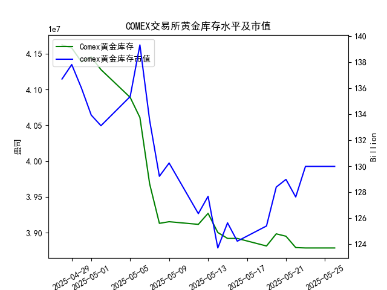

|            |   comex黄金库存量 |   comex黄金库存市值(billion) |   伦敦金现货价 |   上海金交所黄金现货价 |   美元兑人民币汇率 |
|:-----------|------------------:|-----------------------------:|---------------:|-----------------------:|-------------------:|
| 2025-04-29 |       4.15776e+07 |                       3314.5 |        3305.05 |                 780.05 |             7.2029 |
| 2025-04-30 |       4.13831e+07 |                       3286.4 |        3302.05 |                 780.19 |             7.2014 |
| 2025-05-01 |       4.1453e+07  |                       3231   |        3214.75 |                 780.19 |             7.2014 |
| 2025-05-02 |       4.12755e+07 |                       3225   |        3249.7  |                 780.19 |             7.2014 |
| 2025-05-05 |       4.08886e+07 |                       3310.1 |        3249.7  |                 780.19 |             7.2014 |
| 2025-05-06 |       4.06075e+07 |                       3430.9 |        3391.45 |                 792.2  |             7.2008 |
| 2025-05-07 |       3.96819e+07 |                       3364.7 |        3392.25 |                 798.51 |             7.2005 |
| 2025-05-08 |       3.91313e+07 |                       3302.1 |        3352.3  |                 786.5  |             7.2073 |
| 2025-05-09 |       3.91541e+07 |                       3326.3 |        3324.55 |                 785.5  |             7.2095 |
| 2025-05-12 |       3.91172e+07 |                       3230   |        3235.4  |                 759    |             7.2066 |
| 2025-05-13 |       3.92705e+07 |                       3251.4 |        3227.95 |                 763.9  |             7.1991 |
| 2025-05-14 |       3.90037e+07 |                       3171.7 |        3191.95 |                 758.38 |             7.1956 |
| 2025-05-15 |       3.89209e+07 |                       3228.1 |        3191.05 |                 735.86 |             7.1963 |
| 2025-05-16 |       3.89209e+07 |                       3191.8 |        3182.95 |                 746.4  |             7.1938 |
| 2025-05-19 |       3.88155e+07 |                       3230.6 |        3230.15 |                 754.5  |             7.1916 |
| 2025-05-20 |       3.89849e+07 |                       3293.2 |        3261.55 |                 753.49 |             7.1931 |
| 2025-05-21 |       3.89515e+07 |                       3311.4 |        3299.65 |                 773.82 |             7.1937 |
| 2025-05-22 |       3.87935e+07 |                       3290   |        3284    |                 778.36 |             7.1903 |
| 2025-05-23 |       3.87881e+07 |                       3351   |        3342.65 |                 776.4  |             7.1919 |
| 2025-05-26 |       3.87881e+07 |                       3351   |        3342.65 |                 773.94 |             7.1833 |

### 近期COMEX黄金库存与价格关联性分析及投资机会

#### 1. **COMEX黄金库存与价格的趋势验证**
   - **库存趋势**：近一个月COMEX黄金库存从4月28日的4161.97万盎司持续下降至5月26日的3878.81万盎司（降幅**6.8%**），反映市场供应端收缩。
   - **价格趋势**：伦敦金价同期从3296.30美元/盎司微涨至3342.65美元/盎司（涨幅**1.4%**），整体呈现弱正相关性；但上海金价受汇率影响小幅下跌（778.40→773.94人民币/克）。
   - **关键矛盾点**：库存下降速度显著快于金价涨幅，可能因市场对美联储政策、地缘风险等宏观因素反应滞后，或存在基本面支撑不足的风险。

---

#### 2. **最近一周（5/19-5/26）的异动与投资机会**
   - **COMEX库存与伦敦金价**：
     - 库存从3881.55万盎司降至3878.81万盎司（降幅**0.07%**），但伦敦金价从3230.15飙升至3342.65（涨幅**3.5%**），**短期背离明显**，可能反映市场对库存持续下降的预期加速定价。
     - **今日（5/26）与昨日（5/23）对比**：库存持平，伦敦金价亦未变动，需警惕短期回调风险。
   - **上海金价与汇率联动**：
     - 上海金价从754.50→773.94人民币/克（涨幅**2.6%**），但同期美元兑人民币汇率从7.1919→7.1833（人民币升值**0.12%**）。若剔除汇率影响，上海金价实际涨幅弱于伦敦市场，存在**跨市场套利空间**。
   - **关键事件节点**：
     - **5月7日**：COMEX库存单日锐减975万盎司（降幅**2.4%**），伦敦金价次日跳涨至3392.25美元/盎司，验证库存骤降对价格的直接刺激效应。

---

#### 3. **潜在投资策略**
   - **趋势性机会**：
     1. **做多伦敦金**：库存下降趋势未改，叠加避险情绪升温（如地缘冲突或经济数据疲软），可逢低布局。
     2. **多伦空沪套利**：若人民币升值预期持续，可做多伦敦金（美元计价）同时做空上海金（人民币计价），捕捉汇率与价差的双重收益。
   - **短期交易信号**：
     - **库存拐点预警**：若未来一周COMEX库存回升，可能触发金价回调，需密切关注库存数据发布。
     - **汇率波动窗口**：5月26日人民币汇率单日升值0.09%，若升值加速可能压制上海金价，建议对冲汇率风险。

---

#### 4. **风险提示**
   - **政策风险**：美联储货币政策转向或压制金价上行空间。
   - **流动性风险**：COMEX库存降速趋缓可能削弱市场看涨情绪。
   - **技术面超买**：伦敦金价短期急涨后RSI指标接近超买区域，需警惕获利回吐。

---

### 结论
近期COMEX库存下降与金价上涨的弱正相关性中隐含结构性机会，建议优先关注**伦敦市场趋势性多头**及**跨市场套利**策略，同时结合库存数据和汇率波动动态调整仓位。