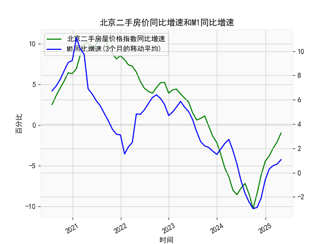

|            |   北京二手房屋价格指数同比增速 |   M1同比增速 |   M1同比增速(3个月的移动平均) |
|:-----------|-------------------------------:|-------------:|------------------------------:|
| 2023-09-30 |                            1.1 |          2.1 |                      2.2      |
| 2023-10-31 |                           -0.2 |          1.9 |                      2.06667  |
| 2023-11-30 |                           -1.4 |          1.3 |                      1.76667  |
| 2023-12-31 |                           -2.2 |          1.3 |                      1.5      |
| 2024-01-31 |                           -3.7 |          3.3 |                      1.96667  |
| 2024-02-29 |                           -5.3 |          2.6 |                      2.4      |
| 2024-03-31 |                           -6.4 |          2.3 |                      2.73333  |
| 2024-04-30 |                           -8   |          0.6 |                      1.83333  |
| 2024-05-31 |                           -8.6 |         -0.8 |                      0.7      |
| 2024-06-30 |                           -7.8 |         -1.7 |                     -0.633333 |
| 2024-07-31 |                           -7.2 |         -2.6 |                     -1.7      |
| 2024-08-31 |                           -8.5 |         -3   |                     -2.43333  |
| 2024-09-30 |                          -10.3 |         -3.3 |                     -2.96667  |
| 2024-10-31 |                           -8.4 |         -2.3 |                     -2.86667  |
| 2024-11-30 |                           -6.2 |         -0.7 |                     -2.1      |
| 2024-12-31 |                           -4.5 |          1.2 |                     -0.6      |
| 2025-01-31 |                           -3.8 |          0.4 |                      0.3      |
| 2025-02-28 |                           -2.9 |          0.1 |                      0.566667 |
| 2025-03-31 |                           -2.1 |          1.6 |                      0.7      |
| 2025-04-30 |                           -1   |          1.5 |                      1.06667  |

### 1. 北京二手房屋价格指数同比增速与M1同比增速的相关性及影响逻辑

#### 相关性分析
从数据来看，两者在长期趋势中存在**阶段性正相关**，但传导存在时间差。  
- **2020年7月至2021年初**：M1增速从6.7%攀升至11.1%，同期房价增速从2.5%升至10.7%，显示流动性宽松直接推动房价上涨。  
- **2021年中至2022年**：M1增速回落至负区间（-2.4%），房价增速同步大幅下滑至-8.6%，反映流动性收紧对房地产市场的压制。  
- **2023年至今**：M1增速从-2.9%回升至1.07%，房价增速跌幅从-10.3%收窄至-1.0%，表明流动性改善对房价企稳的支撑作用。

#### 影响逻辑
- **流动性传导**：M1增速上升意味着企业和居民短期资金充裕，可能通过按揭贷款增加或投资需求释放推高房价。  
- **政策信号作用**：M1增速回升常伴随货币政策宽松（如降准、降息），降低购房成本，刺激市场信心。  
- **滞后效应**：M1变动对房价的影响通常滞后3-6个月，例如2021年M1见顶后房价增速在2022年才显著回落。

---

### 2. 近期投资机会分析（聚焦最近4个月）

#### 数据关键变化
- **北京二手房价增速**：  
  - **最近4个月（2025年1-4月）**：-3.8% → -2.9% → -2.1% → **-1.0%**，跌幅连续收窄，本月环比改善幅度达1.1个百分点，触底反弹趋势明确。  
- **M1增速**：  
  - **同期**：0.3% → 0.57% → 0.7% → **1.07%**，连续4个月回升，流动性环境显著改善。

#### 投资机会判断
1. **房地产板块估值修复**：  
   - 房价跌幅收窄叠加M1回升，预示市场对房地产悲观预期修正，开发商和房产服务类股票（如中介、建材）可能迎来反弹。  
   - **关注点**：政策放松预期（如限购优化、房贷利率下调）可能加速这一进程。

2. **核心区域二手房抄底**：  
   - 北京房价同比增速接近转正，刚需和改善型需求可能在流动性支持下集中释放，核心地段优质房源价格或率先企稳回升。  

3. **REITs及不动产金融产品**：  
   - M1增速回升往往伴随低风险偏好资金流向稳定收益资产，与房地产挂钩的REITs（如租赁住房、商业地产）可能受资金追捧。  

4. **短期交易性机会**：  
   - 若M1增速持续高于1%，房价同比增速可能在未来2-3个月内转正，短线布局地产ETF或周期股（如家电、家居）或存在超额收益。  

#### 风险提示
- **政策不确定性**：若M1增速回升过快引发通胀担忧，货币政策可能边际收紧，压制房价反弹空间。  
- **供需结构变化**：需跟踪北京二手房库存及新增挂牌量，避免短期供需错配导致价格波动。