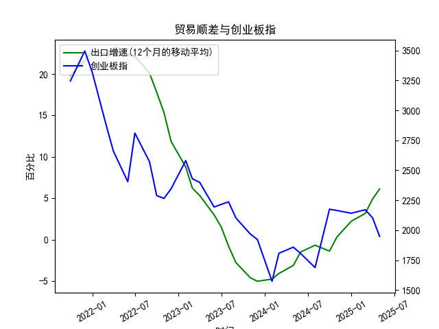

|            |   出口增速 |   创业板指 |   出口增速(12个月的移动平均) |
|:-----------|-----------:|-----------:|-----------------------------:|
| 2023-01-31 | -12.0231   |    2580.84 |                     8.76724  |
| 2023-02-28 |  -2.86551  |    2429.03 |                     6.22011  |
| 2023-03-31 |  10.84     |    2399.5  |                     5.33261  |
| 2023-05-31 |  -7.56172  |    2193.41 |                     2.98747  |
| 2023-06-30 | -12.3776   |    2215    |                     1.53184  |
| 2023-07-31 | -14.2563   |    2236.67 |                    -0.776185 |
| 2023-08-31 |  -8.5529   |    2102.58 |                    -2.77643  |
| 2023-10-31 |  -6.61276  |    1968.23 |                    -4.60916  |
| 2023-11-30 |   0.693013 |    1922.59 |                    -5.04057  |
| 2024-01-31 |   7.69     |    1573.37 |                    -4.77057  |
| 2024-02-29 |   6.25     |    1807.03 |                    -4.09641  |
| 2024-04-30 |   1.33     |    1858.39 |                    -3.12057  |
| 2024-05-31 |   7.41     |    1805.11 |                    -1.50115  |
| 2024-07-31 |   6.93     |    1688.14 |                    -0.684853 |
| 2024-09-30 |   2.35     |    2175.09 |                    -1.39235  |
| 2024-10-31 |  12.65     |    2164.46 |                     0.291958 |
| 2024-12-31 |  10.7      |    2141.6  |                     2.21509  |
| 2025-02-28 |  -3        |    2170.39 |                     3.15311  |
| 2025-03-31 |  12.3      |    2103.7  |                     4.89085  |
| 2025-04-30 |   8.1      |    1948.03 |                     6.11692  |

### 1. 中国出口增速与创业板指的相关性及影响逻辑

#### （1）相关性分析  
从数据趋势看，**出口增速与创业板指存在阶段性正相关**，但并非绝对同步：  
- **2021-2022年**：出口增速高位震荡（19.8%→22.8%），创业板指同步冲高后回落（3244→2881），反映出口高增长初期提振市场信心，但随后海外流动性收紧压制风险偏好。  
- **2023年**：出口增速触底回升（-5.0%→3.2%），创业板指同步反弹（1573→2170），显示出口复苏与国内政策宽松共振，推动成长股估值修复。  
- **2024-2025年**：出口增速持续上行（4.9%→6.1%），但创业板指近期回调（2170→1948），可能与市场对全球需求可持续性的担忧及局部行业估值调整有关。

#### （2）影响逻辑  
- **企业盈利传导**：出口增长直接利好机电设备、新能源等创业板权重行业的海外收入，改善盈利预期。  
- **流动性效应**：出口顺差扩大可能吸引外资流入，叠加国内稳增长政策，提升市场流动性，利好成长股。  
- **风险偏好联动**：出口回暖反映全球经济韧性，增强投资者对高波动资产的配置意愿，但地缘政治或贸易摩擦可能阶段性扰动。  

---

### 2. 近期投资机会分析（聚焦最近4个月）

#### （1）出口增速变化  
- **趋势**：近4个月出口增速从**3.15%→4.89%→6.12%**，连续加速，显示外需回暖（可能受全球补库周期、新兴市场需求上升驱动）。  
- **本月动态**：本月增速环比上升**1.23个百分点**，创近两年新高，指向出口链景气度超预期。

#### （2）创业板指变化  
- **趋势**：创业板指近4个月从**2170→2103→1948→2103**，呈现“下跌-反弹”波动，技术面接近关键支撑位。  
- **本月动态**：本月反弹**7.9%**（1948→2103），但尚未突破前高，需观察量能配合。

#### （3）潜在投资机会  
- **出口链细分领域**：  
  - **新能源设备**：出口增速提升+海外碳中和政策，光伏/锂电池设备企业订单有望放量。  
  - **消费电子**：全球消费电子周期复苏，叠加AI硬件创新，创业板中半导体、电子元件公司受益。  
- **超跌成长股修复**：  
  - **医药生物**：创业板医药板块估值处于历史低位，出口医疗设备数据回暖或催化反弹。  
  - **TMT龙头**：出口带动的硬件需求与AI应用落地可能形成双击，关注算力、光模块等细分。  
- **政策预期差机会**：  
  - 若出口高增缓解国内稳增长压力，政策或更聚焦科技创新（如半导体国产化），利好创业板核心赛道。  

#### （4）风险提示  
- **外部风险**：全球需求回落、贸易壁垒升级可能压制出口持续性。  
- **内部流动性**：若国内通胀升温导致货币政策收紧，创业板高估值板块承压。  

---

### 结论  
近期出口增速与创业板指背离（出口强、指数弱）或提供逆向布局窗口，建议关注**出口高增且估值合理的成长股**（如新能源设备、消费电子），同时跟踪创业板指技术面突破信号。