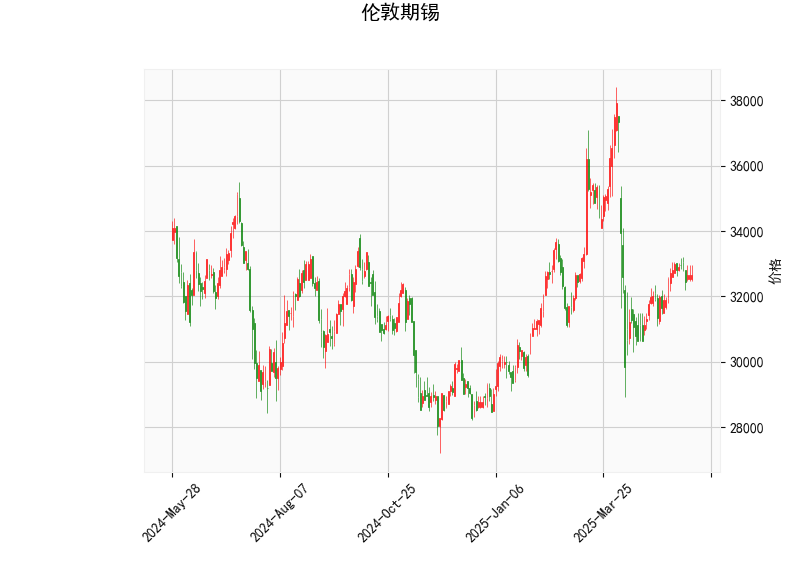

# 伦敦期锡技术分析及投资策略

## 一、技术指标解读

### 1. **当前价与布林轨道**
- **当前价32665**位于布林中轨（33114.6）**下方**，略低于中轨约1.4%，但明显高于布林下轨（29236.9）。短期价格处于**中性偏弱区间**，需关注能否突破中轨转为上行。
- **布林带宽**（上轨36992.3 - 下轨29236.9 = 7755.4）较大，表明市场**波动率较高**。若价格向上突破中轨，可能快速测试上轨（潜在涨幅约13%），反之可能回踩下轨（潜在跌幅约10.5%）。

### 2. **RSI（52.29）**
- RSI略高于50中性线，显示**多空力量暂时均衡**，但未进入超买（>70）或超卖（<30）区域。结合当前价与布林带位置，需警惕短期方向选择。

### 3. **MACD指标**
- **MACD（86.26）远高于信号线（16.07）**，柱状图（70.19）持续放大，表明**上涨动能强劲**。这种背离可能反映短期超买回调压力，但中期趋势仍偏多。

### 4. **K线形态**
- 无明确反转或持续形态，暂时缺乏方向性信号。

---

## 二、潜在机会与策略

### 1. **趋势跟踪策略**
- **多头机会**：若价格站稳中轨（33114.6）且MACD保持金叉，可分批建仓，目标上轨（36992.3），止损参考中轨下方2%（约32450）。
- **空头机会**：若价格跌破32000支撑位且MACD柱状图缩量，可轻仓试空，目标下轨（29236.9），止损设于32500上方。

### 2. **波段套利策略**
- **布林带收敛套利**：当前带宽处于高位，若波动率下降导致布林带收窄，可布局**卖出跨式期权组合**（同时卖出看涨和看跌期权），赚取时间价值衰减收益。

### 3. **对冲策略**
- **多锡空相关品种**：若锡价突破中轨后RSI未超买，可做多锡期货的同时做空铜/锌等关联度较高的工业金属，利用锡的强势表现获取相对收益。

---

## 三、风险提示
1. **MACD高位背离风险**：当前MACD绝对值偏高，若价格未能持续突破中轨，可能引发快速回调。
2. **流动性风险**：LME锡合约流动性低于其他基本金属，需注意持仓规模对滑点的影响。
3. **宏观事件敏感度**：锡价易受新能源产业链（如光伏焊带需求）、印尼出口政策等事件冲击，建议结合基本面动态调整仓位。