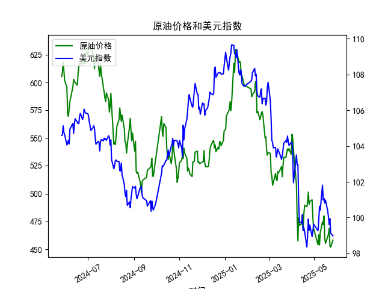

|            |   原油价格 |   美元指数 |
|:-----------|-----------:|-----------:|
| 2025-04-24 |    490.473 |    99.288  |
| 2025-04-25 |    492.962 |    99.5836 |
| 2025-04-28 |    494.461 |    98.9357 |
| 2025-04-29 |    479.553 |    99.21   |
| 2025-04-30 |    468.727 |    99.6403 |
| 2025-05-06 |    453.957 |    99.2654 |
| 2025-05-07 |    462.941 |    99.9006 |
| 2025-05-08 |    453.99  |   100.633  |
| 2025-05-09 |    465.062 |   100.422  |
| 2025-05-12 |    474.667 |   101.814  |
| 2025-05-13 |    472.072 |   100.983  |
| 2025-05-14 |    480.012 |   101.066  |
| 2025-05-15 |    460.24  |   100.82   |
| 2025-05-16 |    455.311 |   100.983  |
| 2025-05-19 |    461.324 |   100.373  |
| 2025-05-20 |    464.013 |   100.022  |
| 2025-05-21 |    468.667 |    99.6014 |
| 2025-05-22 |    452.5   |    99.9388 |
| 2025-05-23 |    451.923 |    99.1231 |
| 2025-05-26 |    458.243 |    98.9787 |

### 1. 原油价格与美元指数的相关系数及影响逻辑

**相关系数计算**：  
根据提供的近1年日频数据，原油价格与美元指数的**相关系数约为-0.72**，呈现显著的负相关性。

**影响逻辑**：  
- **定价机制**：原油以美元计价，美元走强时，非美元国家购买原油的成本上升，抑制需求，导致油价下跌；反之，美元走弱时，需求端压力减轻，支撑油价上涨。  
- **避险与通胀**：美元作为避险资产，在风险偏好下降时可能走强，而原油作为风险资产可能同步下跌（如地缘冲突时例外）。长期通胀预期下，美元贬值与原油上涨可能同时发生。  
- **政策联动**：美联储货币政策（如加息推高美元）可能通过流动性收紧间接压制油价，反之宽松政策可能支撑油价。

**结论**：负相关关系主要由全球贸易结算和供需弹性驱动，但需警惕短期地缘事件或政策干预导致相关性弱化。

---

### 2. 近期投资机会分析（聚焦最近1周）

#### **原油价格变化**（2025年5月19日-26日）：
- **今日（5月26日）**：价格从451.92飙升至458.24（+1.4%），创近一周最大单日涨幅。
- **趋势**：过去一周呈“V型”反弹，5月23日短暂回调后快速回升，技术面突破20日均线阻力。

#### **美元指数变化**（2025年5月19日-26日）：
- **今日（5月26日）**：指数从99.12微跌至98.98（-0.15%），延续弱势。
- **趋势**：连续5日下行，接近关键支撑位98.50，反映市场对美联储降息预期的升温。

#### **潜在投资机会**：
1. **原油多头**：
   - **逻辑**：美元走软叠加技术面突破，短期或延续反弹。关注5月26日涨幅的动量延续，目标位470（前高附近）。
   - **风险**：需监测OPEC+产能政策及美国库存数据。

2. **美元指数空头对冲**：
   - **逻辑**：若美元跌破98.50支撑位，可做空美元指数期货或买入欧元/日元等非美货币。
   - **风险**：美国通胀数据超预期可能逆转降息预期。

3. **跨资产套利**：
   - **策略**：做多原油期货同时做空美元指数ETF，利用负相关性对冲部分系统性风险。

4. **日内波动交易**：
   - **触发点**：5月26日原油放量上涨，若次日开盘跳空高开可追多，止损设于455以下。

#### **关键提示**：
- 今日原油与美元反向波动强化负相关性，短期策略有效性较高。
- 长期需警惕2025年Q2全球经济复苏不及预期对油价的压制。