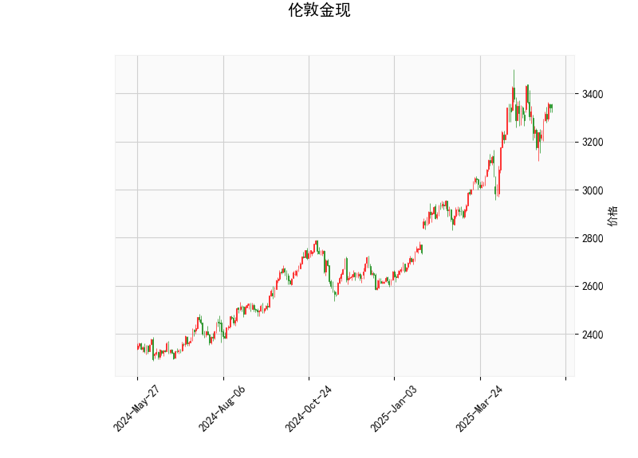

# 伦敦金现技术分析与投资策略

## 一、技术分析解读

### 1. 价格与RSI指标
- **当前价3342.21**位于布林通道中轨（3175.58）和上轨（3485.83）之间，距离中轨（+5.25%）比上轨（-4.14%）更近，显示价格处于中性偏强区域。
- **RSI 56.67**接近超买临界值（60）但未触发警示，暗示当前上涨动能尚未完全释放，但需警惕短期回调压力。

### 2. MACD指标
- **MACD线（29.80）高于信号线（29.65）**，柱状图**+0.15**呈现微幅扩张，表明短期多头略占优势但动能不足。
- **MACD与信号线趋于黏合**（差值仅0.15），暗示市场可能进入震荡整理阶段，需警惕"假金叉"后的方向选择。

### 3. 布林通道
- **通道宽度达620.48**（上轨3485.83 - 下轨2865.34），显示当前波动率显著扩大。当前价距离上轨空间（-4.14%）大于下轨距离（+16.67%），暗示上行阻力更为明确。
- **中轨持续上行**（3175.58）构成动态支撑，若价格回踩该位置不破，可能确认短期上升趋势。

### 4. K线形态
- **CDLMATCHINGLOW形态**（匹配低价形态）出现，通常意味着空头力量衰竭后的潜在反转信号，需结合成交量验证反转有效性。

---

## 二、投资机会与策略建议

### 1. 趋势跟踪策略
- **多头突破条件**：若价格站稳3350且MACD柱状图连续三日扩张，可看向3485上轨目标，止损设于中轨3175下方。
- **空头反转条件**：若RSI跌破50且MACD死叉，可能开启向2865下轨的回调，止损设于3350上方。

### 2. 区间套利机会
- **通道内波段操作**：在3175-3350区间高抛低吸，MACD死叉时在中轨附近（3175-3200）建立多单，接近上轨时逐步减仓。
- **突破套利机会**：若放量突破3485上轨，可追多至3600整数关口；若意外跌破3175中轨，可短空至3000心理关口。

### 3. 风险对冲组合
- **跨周期对冲**：持有中长线多单的同时，当30分钟图RSI超过70时可建立等额短线空单对冲。
- **波动率套利**：利用布林通道收窄时（当前通道宽度处于高位）卖出宽跨式期权组合，捕捉波动率回归收益。

---

## 三、关键观察节点
1. **美联储议息会议**：关注美元指数与美债收益率联动影响
2. **地缘政治风险**：俄乌冲突、中东局势可能触发避险买盘
3. **MACD柱状图变化**：连续3日扩张将确认趋势延续性
4. **实体黄金ETF持仓量**：SPDR黄金持仓变化反映机构动向

> **特别提示**：当前MACD与RSI出现轻微背离，建议仓位控制在30%以下，突破关键位后分批加仓。日内交易者可重点关注欧洲时段（14:00-17:00 GMT）的价格异动。