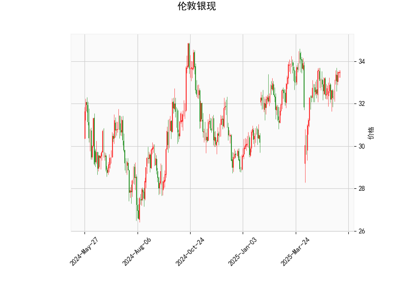

# 伦敦银现技术分析及策略建议

## 一、技术指标分析

### 1. 价格与布林轨道
- **当前价33.477**位于布林轨道中轨（32.87）与上轨（34.69）之间，距离上轨空间约1.2美元，距离中轨约0.6美元。
- **中轨支撑有效性**：若价格站稳中轨上方，短期可能维持偏强震荡；若跌破中轨则可能向下轨（31.06）测试支撑。
- **上轨阻力意义**：突破34.69可能触发加速上涨，但需注意该位置对应历史压力区。

### 2. RSI指标
- **56.99的RSI值**处于中性区域，既未超买（>70）也未超卖（<30），表明多空力量相对均衡。
- **方向性暗示**：RSI曲线若继续上行突破60，可能强化看涨动能；若回落至50下方则需警惕回调风险。

### 3. MACD指标
- **金叉确认**：MACD线（0.18）已上穿信号线（0.086），且柱状图（0.095）持续扩大，显示短期多头动能占优。
- **动能持续性**：MACD绝对值偏小，需关注后续柱状图能否持续放大以确认趋势强度。

### 4. K线形态组合
- **多空博弈信号**：四种十字星类形态（CDLDOJI/CDLHIGHWAVE/CDLLONGLEGGEDDOJI/CDLSPINNINGTOP）集中出现，反映市场犹豫情绪。
- **潜在变盘预警**：在价格接近布林上轨时出现此类形态，需警惕短期回调风险，特别是在缺乏重大利多驱动的情况下。

---

## 二、投资机会与策略建议

### （一）趋势跟踪策略
1. **突破交易机会**  
   - **做多条件**：价格放量突破34.69布林上轨，配合MACD柱状图持续扩大、RSI突破60  
   - **目标空间**：参考前高35-36美元区域  
   - **止损设置**：突破后回踩上轨不破（34.5-34.6）

2. **回调买入机会**  
   - **介入时机**：价格回踩中轨32.87附近企稳，MACD保持金叉状态  
   - **加仓信号**：出现看涨吞没/启明星等反转K线  
   - **止损保护**：布林下轨31.06下方1%（约30.9）

### （二）套利策略
1. **波动率套利**  
   - **背景依据**：布林带宽收窄（上轨-下轨=3.63美元）叠加十字星形态，预示潜在波动率放大  
   - **操作建议**：构建跨式期权组合，同时买入相同到期日的看涨和看跌期权  
   - **风控要点**：选择1-2周到期合约，止损整体权利金损失超30%

2. **日内区间交易**  
   - **交易区间**：32.87（中轨）-34.69（上轨）  
   - **高抛低吸**：靠近上轨短空（止损34.8），靠近中轨做多（止损32.7）  
   - **时间窗口**：配合美盘时段流动性高峰操作

### （三）风险提示
1. **技术面矛盾点**  
   - MACD金叉与十字星形态的冲突：需警惕"假突破"风险，建议等待日线收盘确认  
   - RSI中性区域易受消息面扰动：重点关注美联储政策预期、美元指数走势

2. **关键事件监测**  
   - 美国CPI数据、非农就业报告等宏观经济指标  
   - COMEX白银库存变化及ETF持仓量数据  
   - 地缘政治风险（如中东局势、工业金属需求变化）

---

**注**：当前技术面呈现多空胶着状态，建议采用"小仓位试单+突破加仓"的渐进策略，总仓位控制在账户资金的15%以内。若价格连续3日站稳34美元上方，可上调为中期看涨趋势行情。