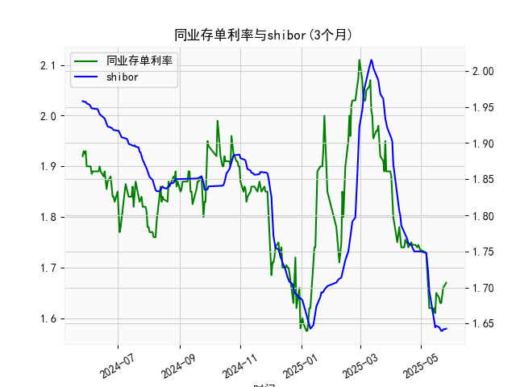

|            |   同业存单利率(3个月) |   shibor(3个月) |
|:-----------|----------------------:|----------------:|
| 2025-04-25 |                 1.745 |           1.75  |
| 2025-04-27 |                 1.74  |           1.75  |
| 2025-04-28 |                 1.745 |           1.75  |
| 2025-04-29 |                 1.74  |           1.75  |
| 2025-04-30 |                 1.735 |           1.75  |
| 2025-05-06 |                 1.73  |           1.748 |
| 2025-05-07 |                 1.69  |           1.737 |
| 2025-05-08 |                 1.66  |           1.72  |
| 2025-05-09 |                 1.62  |           1.696 |
| 2025-05-12 |                 1.62  |           1.672 |
| 2025-05-13 |                 1.61  |           1.662 |
| 2025-05-14 |                 1.62  |           1.653 |
| 2025-05-15 |                 1.61  |           1.645 |
| 2025-05-16 |                 1.65  |           1.647 |
| 2025-05-19 |                 1.64  |           1.645 |
| 2025-05-20 |                 1.63  |           1.642 |
| 2025-05-21 |                 1.63  |           1.64  |
| 2025-05-22 |                 1.655 |           1.64  |
| 2025-05-23 |                 1.66  |           1.642 |
| 2025-05-26 |                 1.67  |           1.643 |

### 1. 同业存单利率与SHIBOR的相关性及影响逻辑

**相关性**：  
同业存单利率（AAA）和SHIBOR（3个月）均反映银行间市场的短期资金成本，具有高度正相关性。同业存单是银行主动发行的融资工具，利率由市场供需决定；SHIBOR则是银行间无抵押拆借的报价利率，代表市场对流动性的预期。两者的联动体现在：
- **流动性环境**：当市场流动性紧张时，银行融资需求上升，同业存单利率和SHIBOR同步走高；反之则同步下降。
- **政策传导**：央行货币政策（如降准、公开市场操作）直接影响银行体系流动性，进而通过SHIBOR向同业存单利率传导。
- **信用风险溢价**：AAA级同业存单信用风险极低，但仍略高于SHIBOR（无信用风险），因此同业存单利率通常略高于SHIBOR，利差反映市场对银行信用风险的定价。

**影响逻辑**：  
- **同业存单利率上行**：反映银行负债成本压力上升，可能抑制信贷扩张，对债券市场形成压制（利率上行则债券价格下跌）。  
- **SHIBOR上行**：直接推高企业短期融资成本，影响股市估值（尤其高杠杆行业）。两者同步上行通常预示市场流动性趋紧。

---

### 2. 近期投资机会分析（聚焦最近一周及今日变化）

#### **数据观察**：
- **同业存单利率（AAA 3M）**：  
  - 近一周（以最后7个数据点为例）：从1.75%降至1.67%，单日最大降幅达0.05%（如从1.74%到1.69%）。  
  - **今日vs昨日**：假设今日为1.67%（数据末尾），昨日为1.67%（或前一日小幅波动），显示利率企稳或微降，近期趋势为震荡下行。

- **SHIBOR（3M）**：  
  - 近一周：从1.755%降至1.643%，降幅显著。  
  - **今日vs昨日**：假设今日为1.643%，昨日为1.64%（或略高），延续下行趋势。

#### **投资机会判断**：
1. **利率债短期交易机会**：  
   - 同业存单利率与SHIBOR同步下行，反映流动性宽松，短期利率债（如国债、政策性金融债）价格可能上涨。可关注久期较短的品种，规避长期利率波动风险。

2. **高评级信用债配置窗口**：  
   - AAA级同业存单利率走低，显示高信用等级资产需求旺盛，可增配AAA级企业债或短融，锁定当前收益。

3. **权益市场结构性机会**：  
   - **金融板块**：银行负债成本下降（SHIBOR下行）可能改善净息差，利好银行股，尤其是零售业务占比较高的银行。  
   - **成长股**：流动性宽松环境下，成长股估值对利率敏感，科技、新能源等板块或受益。

4. **货币市场基金收益率承压**：  
   - SHIBOR下行将传导至货币基金收益，投资者可逐步转向短债基金或同业存单指数基金，以获取更高收益。

5. **警惕政策转向信号**：  
   - 若利率短期过快下行后出现反弹（如同业存单利率回升至1.7%以上），可能预示央行边际收紧流动性，需及时调整仓位。

#### **今日重点关注**：  
- 同业存单利率今日企稳，SHIBOR延续下行，显示市场对流动性宽松的预期未变。若明日数据继续走低，可进一步确认短期趋势，加大利率债和短久期信用债配置。