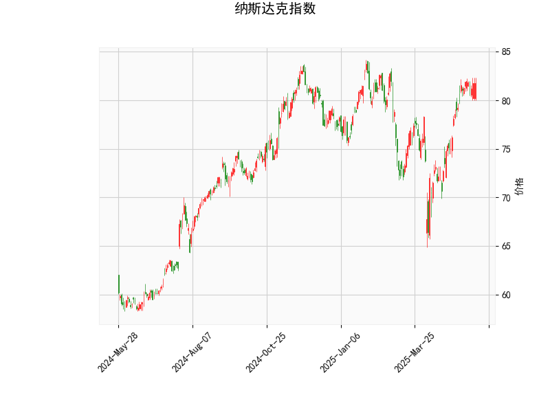

# 纳斯达克指数技术分析与投资策略

## 一、技术分析结果解读

### 1. **价格与布林带**
- **当前价（81.78）**处于布林带中轨（75.96）和上轨（83.65）之间，接近上轨，表明短期价格处于**相对强势区间**，但需警惕上轨附近的潜在阻力。
- **中轨方向**：若价格持续站稳中轨上方，可能延续上行趋势；若跌破中轨，可能转向震荡或回调。

### 2. **RSI指标**
- **RSI（65.13）**略高于中性值50，显示买方力量占优，但尚未进入超买区域（通常70以上为超买）。需关注RSI能否突破70或回落至50附近，以判断短期动能强弱。

### 3. **MACD指标**
- **MACD线（1.798）**高于信号线（1.762），柱状图（0.036）为正值且微幅扩张，表明**短期多头动能略有增强**，但信号较弱，需观察后续能否持续放量。

### 4. **K线形态**
- **暂无显著形态**：当前未出现明确的反转或持续形态（如吞没、十字星等），市场可能处于趋势延续或整理阶段。

---

## 二、潜在机会与策略建议

### 1. **趋势跟踪策略**
- **突破上轨做多**：若价格站稳83.65上方且RSI未超买（<70），可视为短期强势信号，目标看向前高或更高阻力位，止损设于中轨（75.96）下方。
- **回踩中轨买入**：若价格回调至中轨（75.96）附近且MACD柱状图未转负，可尝试逢低布局，止损设于下轨（68.27）下方。

### 2. **均值回归策略**
- **超买回调做空**：若价格触及上轨（83.65）且RSI突破70，可轻仓短空，目标看向中轨（75.96），止损设于上轨上方1%-2%。
- **区间波段操作**：在布林带上下轨（68.27-83.65）之间高抛低吸，结合RSI超买/超卖信号（70以上/30以下）增强胜率。

### 3. **风险提示**
- **MACD动能不足**：当前MACD柱状图扩张幅度较小，若后续缩量或转负，可能预示反弹乏力。
- **市场情绪扰动**：需关注宏观数据（如美联储政策、通胀）及科技股财报对纳斯达克指数的冲击。

---

## 三、总结
**短期偏多但需谨慎**：当前技术面显示多头占优，但接近布林带上轨和潜在超买区域，建议以回调做多为主，严格设置止损。若出现放量突破上轨，可顺势加仓；若跌破中轨，则需转向防御策略。