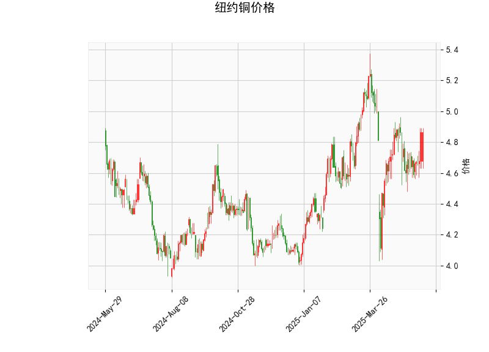

### 一、纽约铜价技术分析结果解读

#### 1. **价格与布林轨道**
- **当前价（4.865）**：位于布林带中轨（4.790）上方，但明显低于上轨（5.236）。表明价格处于**中性偏多区域**，但尚未进入超买区间。
- **布林带形态**：  
  - 上轨与下轨间距较宽，市场波动性较高，但当前价靠近中轨，短期可能进入震荡或温和上行阶段。
  - 若价格站稳中轨并向上突破，可能测试上轨（5.236）；若跌破中轨，则可能向下轨（4.343）寻求支撑。

#### 2. **RSI指标（57.89）**
- RSI值为57.89，接近60但未进入超买区（70以上），反映市场**多头占优但未过热**，存在进一步上涨的潜在动能。
- 若RSI持续向60上方攀升，需警惕短期回调风险；若回落至50以下，则可能转为空头主导。

#### 3. **MACD指标**
- **MACD线（0.016）**上穿**信号线（-0.010）**，形成“金叉”，柱状图（0.026）由负转正，显示**短期动能由空转多**。
- 但MACD值绝对值较小，表明趋势强度较弱，需结合价格和成交量确认持续性。

#### 4. **K线形态**
- 当前无显著K线形态（如看涨吞没、黄昏之星等），表明市场缺乏明确反转信号，短期可能延续现有趋势。

---

### 二、近期投资或套利机会与策略

#### 1. **趋势交易机会**
- **多头策略**：  
  - **入场条件**：若价格站稳中轨（4.790）且MACD柱状图持续扩大，可尝试轻仓做多。  
  - **目标位**：布林带上轨（5.236），对应约7.6%潜在涨幅。  
  - **止损位**：中轨下方（如4.750）或MACD柱状图转弱。  
- **空头策略**：  
  - **触发条件**：若价格跌破中轨且RSI回落至50以下，可考虑短空，目标下轨（4.343）。  
  - **风险提示**：MACD金叉后空单需谨慎，需确认趋势反转信号。

#### 2. **布林带区间套利**
- **高抛低吸**：  
  - 在布林带上下轨之间（4.343-5.236）进行波段操作，中轨附近（4.790）作为多空分水岭。  
  - 结合MACD金叉/死叉信号增强胜率。

#### 3. **跨期套利（Contango/Backwardation）**
- **假设**：若近月合约价格贴近布林带下轨（4.343），而远月合约溢价较高（Contango结构），可做空远月、做多近月，赚取价差收敛收益。  
- **需配合基本面**：关注库存变化及供需预期，避免单靠技术面操作。

#### 4. **风险提示**
- **关键事件**：美联储政策、全球经济复苏预期、铜矿供应扰动可能加剧波动。  
- **止损纪律**：MACD柱状图转弱或价格跌破关键支撑位（如中轨）时需果断离场。

---

### 总结
**短期策略**：轻仓试多，目标上轨5.236，止损4.750；若突破失败则转为区间操作。  
**套利机会**：关注跨期价差及布林带上下轨的回归交易，需结合基本面验证。