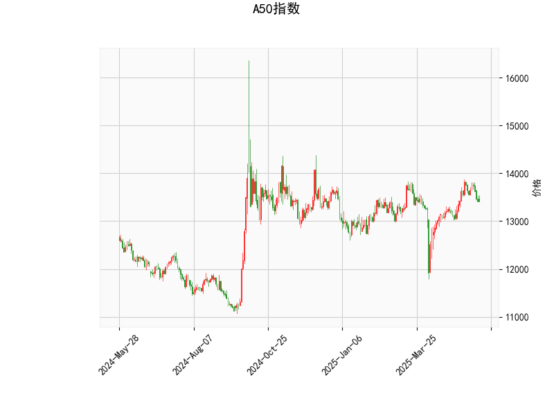

### 一、A50指数技术分析结果解读

#### 1. **价格与RSI指标**  
- **当前价（13404）**：位于布林带中轨（13307）附近，显示短期处于中性区域，未形成明确趋势。  
- **RSI（48.95）**：接近50的中性值，表明市场多空力量均衡，未进入超买（>70）或超卖（<30）区间。

#### 2. **MACD指标**  
- **MACD（86.31） vs 信号线（114.80）**：MACD低于信号线，且柱状图（-28.49）为负值，显示短期下跌动能占优，可能延续调整趋势。

#### 3. **布林带分析**  
- **价格位置**：当前价接近中轨，上下轨间距较大（13984 vs 12630），反映市场波动率较高，但未突破关键边界。  
- **潜在方向**：若价格站稳中轨并向上突破，可能测试上轨压力（13984）；若跌破中轨，则可能向下轨（12630）回落。

#### 4. **K线形态**  
- **CDLMATCHINGLOW（匹配低形态）**：通常出现在下跌趋势中，暗示空方力量衰竭，短期可能反弹。需结合成交量确认有效性。

---

### 二、投资机会与策略建议

#### 1. **短期波段交易**  
- **看涨策略**：  
  - **条件**：若价格站稳中轨（13307）且MACD柱状图缩窄（下跌动能减弱），可轻仓试多，目标上轨（13984）。  
  - **风险控制**：跌破中轨止损，关注RSI是否突破50分水岭。  
- **看跌策略**：  
  - **条件**：若MACD柱状图继续扩大负值，且价格跌破中轨，可短空至下轨（12630）。  
  - **风险控制**：反弹突破中轨止损，结合RSI是否下破40确认动能。

#### 2. **套利机会**  
- **布林带收敛套利**：  
  - 若布林带收窄（波动率下降），可布局突破策略：价格突破上轨时追多，跌破下轨时追空。  
- **K线形态反转套利**：  
  - CDLMATCHINGLOW需配合放量阳线确认反转，可逢低布局多单，止损于形态低点下方。

#### 3. **风险提示**  
- **MACD背离风险**：当前MACD与价格未同步走低，若价格反弹但MACD未金叉，需警惕假突破。  
- **外部因素**：需结合宏观数据（如中国PMI、政策动向）及外围市场（美股、港股）表现，避免单一技术信号误判。  

---

### 三、总结  
当前A50指数处于震荡格局，短期方向需关注中轨支撑与MACD动能变化。**策略上建议轻仓试单，严格止损**，并等待关键位置（如布林带边界、RSI超卖/超买）的共振信号。若CDLMATCHINGLOW形态确认，可优先布局短线反弹机会。