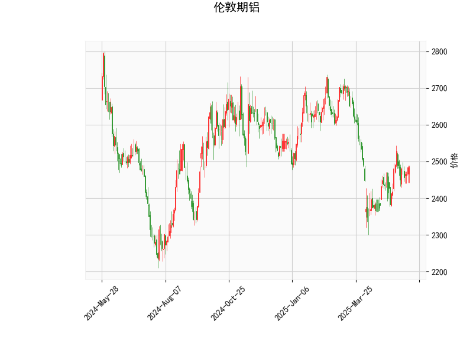

### 伦敦期铝技术分析结果解读

#### 1. 技术指标分析
**当前价与布林轨道**：  
- 当前价（**2483.0**）略低于布林带中轨（**2496.11**），接近中轴，表明价格处于短期均衡区间，未形成明显单边趋势。  
- 布林带上下轨间距较大（**2720.23 vs 2272.01**），反映市场近期波动率较高，但当前价格未触及极端区域（超买/超卖），需关注中轨突破方向。

**RSI（相对强弱指标）**：  
- RSI值为**53.63**，处于中性区域（50附近），表明多空力量暂时平衡，无明显超买或超卖信号。需结合其他指标判断趋势延续性。

**MACD（异同移动平均线）**：  
- MACD线（**5.495**）显著高于信号线（**1.011**），柱状图（**4.483**）持续扩张，显示短期上涨动能增强，可能形成**多头金叉**，需关注能否突破中轨压力。

**K线形态**：  
- 未出现经典反转或持续形态（如吞没、十字星等），短期方向需依赖指标和价格对关键点位的突破。

---

#### 2. 投资/套利机会与策略

##### **趋势跟踪策略**  
- **看多条件**：若价格站稳中轨（**2496.11**）且MACD柱状图持续扩大，可轻仓做多，目标看向上轨（**2720.23**），止损设于中轨下方（如**2450**）。  
- **看空条件**：若价格跌破中轨且MACD动能转弱，可尝试短空，目标下轨（**2272.01**），止损设于中轨上方（如**2520**）。

##### **区间交易策略**  
- **高抛低吸**：当前价格接近中轨，若未突破，可等待价格回落至下轨（**2270附近**）时布局多单，或反弹至上轨（**2720附近**）时反手做空，需严格设置止损（如5%幅度）。

##### **套利机会**  
- **跨期套利**：若远期合约贴水（价格低于近月），可关注正套（买远卖近），但需结合库存和供需基本面验证。  
- **波动率套利**：布林带开口扩大隐含波动率上升，可考虑卖出期权（如宽跨式组合），但需防范重大事件冲击。

---

##### **风险提示**  
- 布林带中轨为短期多空分水岭，若假突破可能引发反向波动。  
- MACD与RSI的背离（如价格新高但指标走弱）需警惕趋势反转。  
- 关注宏观事件（如LME库存变化、能源价格波动）对铝价的突发影响。