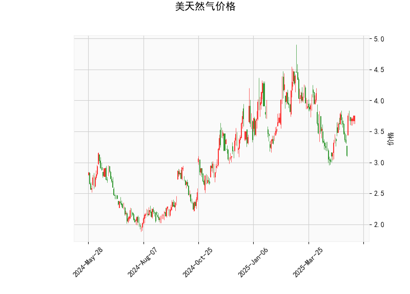

### 美天然气价格技术分析解读

#### 1. 技术指标分析
- **当前价（3.757）与布林轨道**  
  当前价格位于布林轨道中轨（3.68）上方，但距离上轨（4.41）仍有约17%的空间，而距离下轨（2.94）较远。这表明价格处于**中性偏强区间**，但尚未进入超买区域。若价格能站稳中轨并向上突破，可能打开进一步上涨空间；若跌破中轨，则需警惕回调风险。

- **RSI（56.73）**  
  RSI处于中性区间（50-70），未进入超买（>70）或超卖（<30）区域，显示市场多空力量相对均衡，但略偏向买方。若RSI持续上行至65以上，需关注短期回调压力。

- **MACD指标**  
  MACD线（0.052）高于信号线（0.010），柱状图（0.042）为正值且持续扩张，形成**金叉看涨信号**。但MACD绝对值较小，动能尚未显著增强，需结合价格突破中轨的持续性确认趋势。

- **K线形态**  
  当前无明确反转或持续形态（如吞没、十字星等），短期内方向性信号不足，需观察后续价格对布林轨道的测试结果。

---

#### 2. 潜在机会与策略

##### **短期投资机会**
- **看多策略**（适合风险偏好较高者）  
  - **入场条件**：若价格站稳中轨（3.68）并伴随成交量放大，可尝试做多。  
  - **目标价**：上轨4.41附近（约17%潜在空间）。  
  - **止损**：中轨下方3.65或前低支撑位（如2.94下轨）。  
  - **逻辑**：MACD金叉+价格突破中轨，可能开启短期上行趋势。

- **区间套利策略**（适合保守型投资者）  
  - **高抛低吸**：若价格接近上轨（4.41）且RSI>65，可部分止盈；若回落至中轨（3.68）附近且RSI<50，可逢低吸纳。  
  - **逻辑**：布林轨道收窄（上轨与中轨间距较小），价格可能进入震荡阶段。

##### **风险提示**
- **警惕假突破**：若价格突破中轨后快速回落，可能形成“诱多陷阱”，需结合MACD动能确认。  
- **波动率风险**：天然气价格受天气、库存等事件驱动明显，需关注基本面突发消息（如寒潮、供应中断）。  

##### **衍生品策略建议**
- **期权保护**：持有期货多单时，可买入看跌期权（行权价3.65以下）对冲下行风险。  
- **跨期套利**：若近远月价差扩大，可做空近月合约、做多远月合约，捕捉价差回归机会。

---

**结论**：当前技术面偏多但动能不足，建议结合中轨支撑（3.68）和MACD动能变化灵活操作，短期关注上轨压力位突破情况，同时需警惕基本面扰动风险。