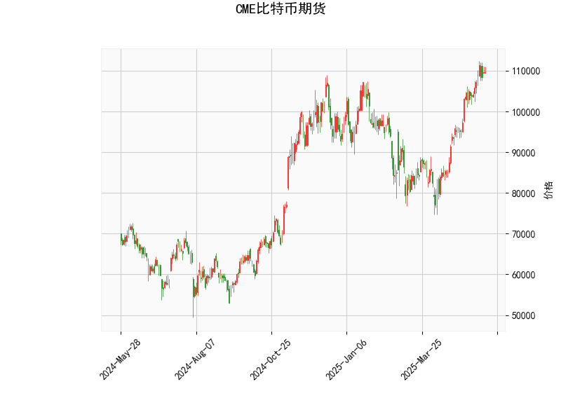

# CME比特币期货技术分析及策略建议

## 一、技术指标解析

### 1. 多空力量指标
- **RSI（71.93）**：已突破70超买线，反映短期多头占优。但需警惕极端超买后的回调风险，历史经验显示RSI>75时比特币常出现5%-15%的回调。
- **MACD指标**：快线（4980）上穿慢线（4891）且柱状图持续扩张，中期上涨动能仍在延续。但MACD绝对值处于高位，需关注顶背离风险。

### 2. 波动率指标
- **布林通道**：当前价（109,715）紧贴上轨（111,872），中轨（91,869）与现价存在17%空间。通道带宽达40,000点，显示市场处于高波动周期。若价格突破上轨可能加速冲顶，回落至中轨则形成强支撑。

### 3. K线形态
- **三大十字星**（CDLDOJI/CDLGRAVESTONEDOJI/CDLLONGLEGGEDDOJI）：日内多空激烈博弈，特别是墓碑十字星形态在历史高位出现时，常伴随趋势反转。结合RSI超买，短期顶部信号增强。

---

## 二、投资机会与策略建议

### 1. 趋势跟踪策略
- **突破追涨**：若价格站稳111,872（布林上轨）可轻仓追多，目标看至前高125,000区域，止损设于109,000。
- **回调买入**：关注中轨91,869支撑，若回落至此区域且MACD未死叉，可布局多单，止损89,000，目标105,000。

### 2. 反转交易策略
- **空头狙击**：现价区域（109,000-111,872）建立空头头寸，止损113,000，第一目标102,000（斐波那契23.6%回撤），第二目标91,869（布林中轨）。
- **期权保护**：买入115,000看跌期权对冲下行风险，权利金控制在本金2%以内。

### 3. 套利机会挖掘
- **跨期套利**：观察近远月合约价差，若近月溢价率超过5%（年化60%），可做空近月/做多远月进行展期收益套利。
- **波动率套利**：当IV（隐含波动率）显著高于HV（历史波动率）20%以上时，可卖出宽跨式期权组合，赚取波动率回归收益。

---

## 三、风险提示
1. **杠杆控制**：期货保证金建议维持在30%以上，避免极端波动导致强平。
2. **事件驱动**：关注美国SEC对现货ETF的审批进展，以及各国央行数字货币政策变化。
3. **流动性风险**：CME比特币期货日均成交量约50亿美元，大额单笔交易（>500合约）需采用冰山订单分批入场。

（注：以上分析基于历史数据统计，实际交易需结合实时市场变化动态调整。）