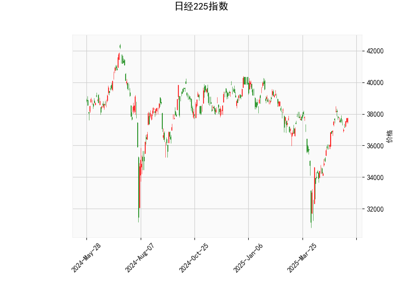

# 日经225指数技术分析及策略建议

## 一、技术指标分析

### 1. 价格与布林带
- **当前价37724.11**位于布林带中轨（36253.99）上方，接近上轨（39603.22），但距离仍有**4.8%空间**。中轨提供短期支撑，若站稳中轨上方则维持偏多格局。
- **布林带开口扩大**（上下轨差值6700点），显示**波动率显著上升**，需警惕价格快速突破或回调风险。

### 2. RSI指标
- **60.36**处于中性偏多区间，未进入超买区（70+），反映市场买盘力量占优但未过热。若RSI突破65可能加速上行，跌破55则需警惕短期回调。

### 3. MACD指标
- **MACD（469.9）下穿信号线（481.3）形成死叉**，柱状图转负（-11.4），显示**短期动能偏弱**。但MACD绝对值仍处高位，需观察是否形成"空中加油"形态（高位死叉后快速反弹）。

### 4. 形态分析
- **K线形态无明确信号**，未出现乌云盖顶、启明星等经典反转形态，当前趋势延续概率较高。

---

## 二、投资机会与策略建议

### 1. 趋势跟踪策略
- **多头策略**：若价格站稳中轨（36250）上方，可分批布局多单，目标上轨39600（对应**5%潜在涨幅**），止损设在中轨下方1-2%。
- **突破交易**：若收盘价突破前高38100，可加仓追多，目标上轨区域。

### 2. 均值回归策略
- **布林带区间交易**：在36250（中轨）至39600（上轨）间高抛低吸。接近上轨时减仓（RSI若同步进入70+更佳），回调至中轨附近补仓。
- **MACD背离捕捉**：若价格创新高但MACD未同步新高，可建立反向头寸。

### 3. 套利机会
- **期现套利**：关注股指期货升贴水变化，若期货大幅贴水（如超过1%），可做多期货同时做空ETF套利。
- **跨期套利**：观察近月-远月合约价差，若出现异常扩大（如近月溢价超1.5%），可进行买远抛近操作。

### 4. 风险提示
- **MACD死叉风险**：若柱状图持续扩大负值且价格跌破中轨，可能引发技术性抛售。
- **事件驱动风险**：重点关注4月日本央行议息会议、日元汇率波动及企业财报季影响。
- **止损纪律**：建议单笔交易风险控制在总资金2%以内，多空分水岭关注36000整数关口。

---

**注**：以上分析基于静态技术指标，实际交易需结合实时行情、成交量变化及基本面因素综合判断。建议搭配VIX波动率指数（当前约20）监控市场情绪，若快速攀升至25+需警惕系统性风险。