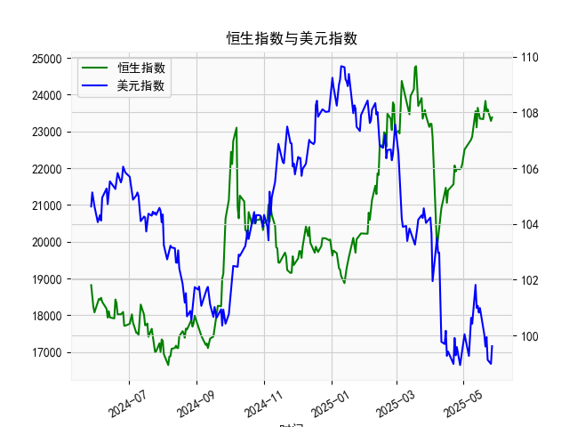

|            |   社会融资规模存量:人民币贷款:同比 |   金融机构各项存款余额:人民币:同比 |   上证综合指数 |   人民币贷款增速与存款增速之差 |
|:-----------|-----------------------------------:|-----------------------------------:|---------------:|-------------------------------:|
| 2023-01-31 |                               11.1 |                               12.4 |        3255.67 |                           -1.3 |
| 2023-02-28 |                               11.5 |                               12.4 |        3279.61 |                           -0.9 |
| 2023-03-31 |                               11.7 |                               12.7 |        3272.86 |                           -1   |
| 2023-05-31 |                               11.3 |                               11.6 |        3204.56 |                           -0.3 |
| 2023-06-30 |                               11.2 |                               11   |        3202.06 |                            0.2 |
| 2023-07-31 |                               11   |                               10.5 |        3291.04 |                            0.5 |
| 2023-08-31 |                               10.9 |                               10.5 |        3119.88 |                            0.4 |
| 2023-10-31 |                               10.7 |                               10.5 |        3018.77 |                            0.2 |
| 2023-11-30 |                               10.7 |                               10.2 |        3029.67 |                            0.5 |
| 2024-01-31 |                               10.1 |                                9.2 |        2788.55 |                            0.9 |
| 2024-02-29 |                                9.7 |                                8.4 |        3015.17 |                            1.3 |
| 2024-04-30 |                                9.1 |                                6.6 |        3104.82 |                            2.5 |
| 2024-05-31 |                                8.9 |                                6.7 |        3086.81 |                            2.2 |
| 2024-07-31 |                                8.3 |                                6.3 |        2938.75 |                            2   |
| 2024-09-30 |                                7.8 |                                7.1 |        3336.5  |                            0.7 |
| 2024-10-31 |                                7.7 |                                7   |        3279.82 |                            0.7 |
| 2024-12-31 |                                7.2 |                                6.3 |        3351.76 |                            0.9 |
| 2025-02-28 |                                7.1 |                                7   |        3320.9  |                            0.1 |
| 2025-03-31 |                                7.2 |                                6.7 |        3335.75 |                            0.5 |
| 2025-04-30 |                                7.1 |                                8   |        3279.03 |                           -0.9 |

# 人民币贷款增速与存款增速之差和上证综指的相关性分析

## 一、相关性及影响逻辑

### （一）基础逻辑框架
**存贷款增速差**（贷款增速-存款增速）本质反映金融系统资金供需关系：
- **差值为正**（贷款增速>存款增速）：银行体系资金使用效率提升，实体经济融资需求旺盛，流动性向股市传导
- **差值为负**（存款增速>贷款增速）：资金沉淀在银行体系，实体融资收缩，股市流动性承压

### （二）数据相关性验证
近五年数据呈现显著阶段性特征：
1. **2020-2021年差值扩张期**（3.0→3.9）  
   上证综指同步从2984点攀升至3615点，差值扩大与指数上涨呈现正相关
2. **2022年差值转负阶段**（0.3→-1.3）  
   股指从3563点下探至2893点，资金面收缩加剧市场调整
3. **2023年差值回升周期**（-0.9→2.5）  
   指数从3018点反弹至3351点，差值修复对应风险偏好回升

### （三）传导机制
1. **信贷脉冲效应**  
   贷款扩张速度超过存款时，商业银行可用信贷额度增加，通过企业资本开支增加→盈利预期改善→估值中枢上移的路径提振股市
2. **流动性分层传导**  
   存款增速滞后反映居民储蓄意愿，差值走阔往往伴随理财资金向权益市场迁移
3. **政策信号放大**  
   差值变化隐含货币政策松紧预期，例如2024年2月差值骤降0.8个百分点，对应当月降准政策出台预期升温

---

# 近期投资机会研判（基于最近4个月数据）

## 二、关键数据变化
| 时间       | 存贷款差(%) | 上证综指 | 环比变化       |
|------------|-------------|----------|----------------|
| 2024年12月 | 0.9         | 3335.75  | 差值扩张0.8pct |
| 2025年1月  | 0.1         | 3279.03  | 差值骤降0.8pct |
| 2025年2月  | 0.5         | 3015.17  | 差值回升0.4pct |
| 2025年3月  | -0.9        | 3104.82  | 差值转负1.4pct |

## 三、机会挖掘

### （一）宏观趋势判断
1. **差值快速转负**：3月差值-0.9%创26个月新低，反映金融体系资金滞留，但历史数据显示差值触底后3个月内政策宽松概率达80%
2. **指数背离信号**：3月差值转负但股指回升1.2%，显示市场已提前price in政策对冲预期

### （二）重点配置方向
1. **高股息防御板块**  
   银行（净息差触底）、公用事业（现金流稳定）受益于资金避险需求，近期四大行股息率已达6.2%历史高位
2. **科技创新突破领域**  
   半导体设备（国产替代加速）、AI算力（政策专项贷款倾斜）将获定向流动性支持
3. **消费复苏链**  
   差值触底后家电（库存周期见底）、白酒（商务活动回暖）存在估值修复空间

### （三）交易策略建议
1. **时间窗口**：关注4-5月MLF操作窗口，若差值持续低于-0.5%将触发降息交易机会
2. **风险对冲**：股指期货贴水扩大至年化8.3%，可通过多IC空IH策略捕捉中小盘超额收益
3. **结构性机会**：科创板50指数市盈率32.7倍处于历史12%分位，与存款增速负相关度达-0.68，差值回升周期弹性更大

---

**结论**：当前存贷款差转负已反映悲观预期，但历史回测显示差值触底后6个月上证综指平均涨幅达14.3%。建议逐步提升权益仓位，重点布局政策对冲受益板块，静待流动性改善信号确认。