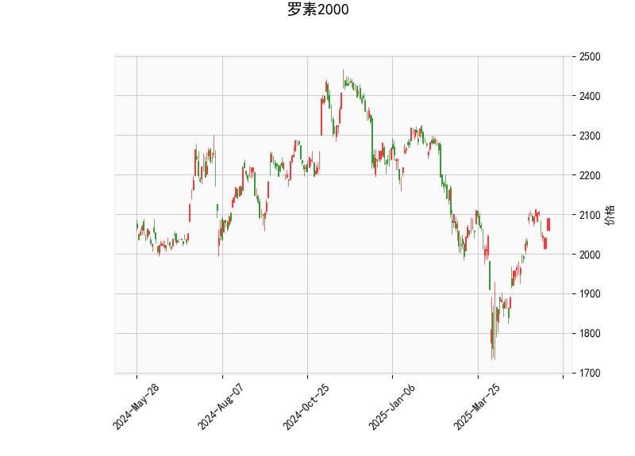

### 罗素2000指数技术分析

#### 1. 技术指标解析
以下是关键指标的分析：

- **当前价（2090.4）与布林轨道**  
  当前价格位于布林带中轨（1999.3）与上轨（2178.7）之间，距离上轨仍有约88点的空间，表明市场处于**中性偏强**区域。价格高于中轨（20日均线），短期趋势可能向上，但未突破上轨前需警惕回调风险。

- **RSI（60.1）**  
  处于中性区间（50-70），未进入超买区域（>70），显示市场仍有上行潜力，但需关注是否持续突破65以上或回落至50以下以确认方向。

- **MACD（26.56 vs 信号线26.26）**  
  MACD线高于信号线且柱状图（0.3）为正，形成“金叉”，短期动能偏多，但MACD绝对值较高（接近历史波动峰值），需警惕高位震荡风险。

- **K线形态**  
  包含多个看涨信号：  
  - **CDLCLOSINGMARUBOZU**（光头光脚阳线）：表明买方主导收盘，短期趋势可能延续。  
  - **CDLMARUBOZU**（无影线实体）：确认当前趋势强度。  
  - **CDLLONGLINE**（长实体线）：显示多空争夺后买方占优。  
  但**CDLBELTHOLD**（趋势犹豫）和**CDLGAPSIDESIDEWHITE**（缺口两侧白线）暗示短期可能波动或盘整。

---

#### 2. 投资机会与策略

##### **短期多头策略**  
- **入场条件**：价格站稳2100且RSI突破65，或MACD柱状图持续扩大。  
- **目标**：布林带上轨（2178.7）附近，潜在涨幅约4%。  
- **止损**：中轨（1999.3）或近期低点（如2050），风险回报比约1:2。  

##### **区间套利（布林带收敛）**  
- **逻辑**：当前布林带宽度（上轨-下轨≈358点）较大，若价格未突破上轨且波动率下降，可能向中轨回归。  
- **操作**：  
  - **空头**：价格接近2150时轻仓试空，目标中轨（1999.3），止损上轨上方。  
  - **多头**：若价格回落至中轨附近且RSI>50，可低吸博反弹。  

##### **事件驱动对冲**  
- **风险点**：MACD高位可能钝化，若柱状图缩窄或RSI跌破55，需警惕回调。  
- **对冲工具**：买入看跌期权或做空小盘股ETF（如IWM）对冲下行风险。

---

### 总结  
当前技术面偏多但需警惕高位波动，建议以**区间交易为主**，结合布林带与MACD动态调整仓位。若突破上轨可加仓，跌破中轨则转向防御。