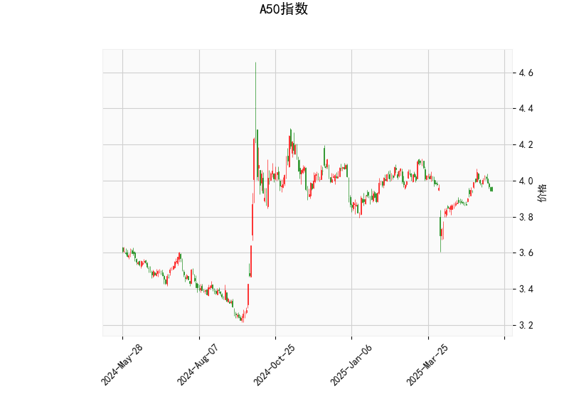

# A50指数技术分析及策略建议

## 一、技术指标解析

### 1. RSI指标（47.8）
- **中性区域运行**：当前RSI值略低于50分水岭，显示市场短期处于多空均衡状态，未出现显著超买（>70）或超卖（<30）信号。
- **潜在动能观察**：若RSI后续突破50向上，可能预示短期反弹动能增强。

### 2. MACD指标
- **空头信号**：MACD线（0.014）下穿信号线（0.018），柱状图转负（-0.004），显示短期动量减弱。
- **交叉验证需求**：需结合价格位置判断其有效性，当前差值较小，可能仅为短期技术回调。

### 3. 布林轨道
- **震荡区间收窄**：当前价（3.946）贴近中轨（3.953），上下轨间距约7.5%（4.137-3.769），显示市场处于震荡格局。
- **方向选择窗口**：若有效突破中轨，可能向上轨4.137测试；若跌破下轨3.769，则可能开启下行空间。

### 4. K线形态
- **CDLLONGLINE**：长实体K线暗示多空争夺激烈，需结合位置判断——若出现在回调低位则可能为反转信号。
- **CDLMATCHINGLOW**：双底形态雏形，显示3.769附近存在支撑，但需成交量配合确认有效性。

---

## 二、投资机会与策略建议

### 1. 短期交易策略
- **区间操作**：在3.77（下轨）-4.14（上轨）区间内高抛低吸
  - *做多触发条件*：价格站稳中轨3.95且MACD柱状图转正，目标上看4.0整数关口
  - *做空触发条件*：价格跌破3.90且RSI下穿45，目标下看3.77支撑位
  - *止损设置*：突破区间边界1%时止损

- **突破策略**：若收盘价连续两日站上4.0，可考虑趋势跟随做多，目标上看前高4.14

### 2. 套利机会
- **跨期套利**：关注近月合约与季月合约价差变化，当价差超过历史均值1.5%时，可进行买近抛远操作
- **波动率套利**：结合期权市场，当隐含波动率低于历史波动率5%时，可构建跨式组合

### 3. 风险提示
- **指标矛盾性**：MACD偏空与K线看涨形态存在矛盾，建议等待价格突破中轨确认方向
- **事件驱动风险**：重点关注中国PMI数据、美联储议息会议等宏观事件对A50的影响
- **仓位管理建议**：初始仓位不超过20%，突破关键位后可追加至30-40%

---

**注**：以上分析基于历史数据，实际交易需结合实时行情与资金管理策略。建议配合成交量变化（未提供）进行交叉验证，当价格突破关键位时需有至少2%的放量确认。