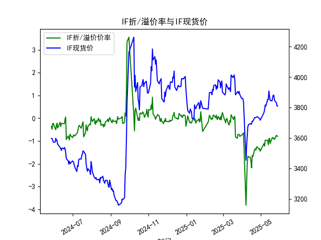
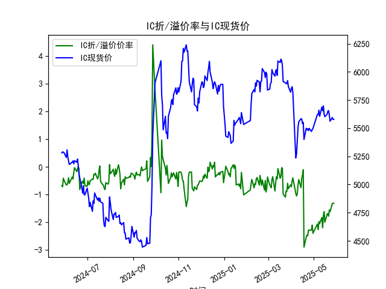
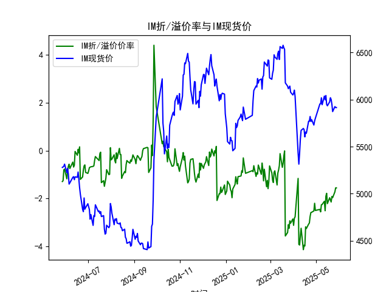

|            |   IF折/溢价率 |   IF现货价 |   IH折/溢价率 |   IH现货价 |   IC折/溢价率 |   IC现货价 |   IH折/溢价率 |   IH现货价 |
|:-----------|--------------:|-----------:|--------------:|-----------:|--------------:|-----------:|--------------:|-----------:|
| 2025-04-28 |     -1.34913  |     3730.6 |      -2.27382 |     5471   |      -2.27382 |     5471   |      -2.51923 |     5729   |
| 2025-04-29 |     -1.33181  |     3724.8 |      -2.10005 |     5487.2 |      -2.10005 |     5487.2 |      -2.19842 |     5773.6 |
| 2025-04-30 |     -1.44197  |     3716.2 |      -2.39398 |     5497   |      -2.39398 |     5497   |      -2.49939 |     5801.4 |
| 2025-05-06 |     -1.11177  |     3766.2 |      -2.06144 |     5622   |      -2.06144 |     5622   |      -2.45329 |     5953.2 |
| 2025-05-07 |     -1.2169   |     3785   |      -2.26234 |     5620.2 |      -2.26234 |     5620.2 |      -2.55739 |     5955.2 |
| 2025-05-08 |     -0.957625 |     3816   |      -1.97107 |     5660   |      -1.97107 |     5660   |      -2.2617  |     6018.8 |
| 2025-05-09 |     -0.976471 |     3808.6 |      -2.04348 |     5604.8 |      -2.04348 |     5604.8 |      -2.25057 |     5945.2 |
| 2025-05-12 |     -0.966676 |     3853   |      -1.82396 |     5688   |      -1.82396 |     5688   |      -2.1153  |     6037   |
| 2025-05-13 |     -1.16158  |     3851   |      -2.19778 |     5654.6 |      -2.19778 |     5654.6 |      -2.51032 |     5996.6 |
| 2025-05-14 |     -0.908163 |     3907.4 |      -1.74715 |     5697.8 |      -1.74715 |     5697.8 |      -1.90524 |     6043   |
| 2025-05-15 |     -0.880406 |     3872.8 |      -1.6149  |     5623   |      -1.6149  |     5623   |      -1.78364 |     5949   |
| 2025-05-16 |     -1.10785  |     3846   |      -1.99531 |     5601.8 |      -1.99531 |     5601.8 |      -2.21348 |     5933.8 |
| 2025-05-19 |     -0.875523 |     3843.2 |      -1.70946 |     5623   |      -1.70946 |     5623   |      -1.96768 |     5975.4 |
| 2025-05-20 |     -0.840664 |     3865.4 |      -1.6802  |     5650.8 |      -1.6802  |     5650.8 |      -2.06014 |     6019.4 |
| 2025-05-21 |     -0.898296 |     3881.2 |      -1.77707 |     5655.6 |      -1.77707 |     5655.6 |      -2.14574 |     6000.6 |
| 2025-05-22 |     -0.87548  |     3879.6 |      -1.55138 |     5614.8 |      -1.55138 |     5614.8 |      -1.91397 |     5950   |
| 2025-05-23 |     -0.9292   |     3846.2 |      -1.61406 |     5561.8 |      -1.61406 |     5561.8 |      -1.96463 |     5872   |
| 2025-05-26 |     -0.748858 |     3831.2 |      -1.32042 |     5594.6 |      -1.32042 |     5594.6 |      -1.72151 |     5925   |
| 2025-05-27 |     -0.786501 |     3809.2 |      -1.31181 |     5578   |      -1.31181 |     5578   |      -1.55547 |     5915   |
| 2025-05-28 |     -0.786501 |     3809.2 |      -1.31181 |     5578   |      -1.31181 |     5578   |      -1.55547 |     5915   |

### 一、股指期货折/溢价率与现货价的相关性及影响逻辑

#### 1. **定义与基本关系**
- **折价率（贴水）**：期货价格低于现货价格，反映市场对未来价格预期偏悲观或存在套利成本（如资金占用、分红等）。
- **溢价率（升水）**：期货价格高于现货价格，反映市场对未来价格预期偏乐观或流动性溢价。
- **相关性**：折/溢价率与现货价格通常呈现动态均衡。当现货价格上涨时，若期货未同步跟涨（折价率扩大），可能隐含市场对短期回调的担忧；反之，若期货溢价率随现货上涨而扩大，则可能反映持续看多情绪。

#### 2. **影响逻辑**
- **市场情绪与预期**：折价率扩大可能伴随空头情绪增强（如对冲需求或投机性做空），溢价率扩大则反映多头主导。
- **套利机制**：折价率触发“买期货卖现货”的正向套利，推动期货价格向现货收敛；溢价率触发反向套利。
- **资金成本与分红**：股指期货的定价需考虑无风险利率和成分股分红，分红季折价率会自然扩大（期货价格需扣除分红影响）。
- **基差收敛效应**：临近交割日，折/溢价率会逐步收敛至零，交割日附近基差波动可能加剧。

---

### 二、近期投资机会分析（聚焦最近一周）

#### 1. **IF（沪深300股指期货）**
- **最新数据**（2025-05-28）：折价率-0.786%，现货价3809.2（与昨日持平）。
- **近期趋势**：折价率连续两日保持-0.786%，现货价企稳，反映市场情绪中性偏谨慎。若现货突破震荡区间，折价率可能快速收敛，存在趋势跟随机会。

#### 2. **IH（上证50股指期货）**
- **最新数据**（2025-05-28）：折价率-1.311%，现货价5578.0（与昨日持平）。
- **近期趋势**：折价率维持高位（超-1.3%），显示蓝筹股承压。若政策面释放利好（如降息预期），高折价率可能吸引多头入场修复基差。

#### 3. **IC（中证500股指期货）**
- **最新数据**（2025-05-28）：折价率-1.311%，现货价5578.0（与昨日持平）。
- **近期趋势**：与IH类似，折价率偏高，但中小盘股弹性更大。若市场风险偏好回升（如成长板块轮动），IC的基差修复空间可能优于IH。

#### 4. **IM（中证1000股指期货）**
- **最新数据**（2025-05-28）：折价率-1.555%，现货价5915.0（与昨日持平）。
- **近期趋势**：折价率持续高于其他品种，反映小盘股流动性溢价不足。若资金面改善（如杠杆资金入场），IM的超跌修复弹性可能最大。

#### 5. **今日关键信号**
- **基差稳定性**：各品种折价率均未进一步扩大，现货价止跌，可能预示短期底部形成。
- **跨品种套利**：IM折价率显著高于IH/IC，若市场风格切换至小盘股，可关注IM-IH价差收敛机会。

---

### **总结建议**
- **多头策略**：关注IF/IC基差收敛机会，若现货放量突破，可布局期货多单。
- **套利策略**：IM折价率偏高，可逐步建仓多IM空IH组合，博弈小盘股反弹。
- **风险提示**：需警惕交割日临近（2025-05-28为数据截止日）的基差波动放大风险。

