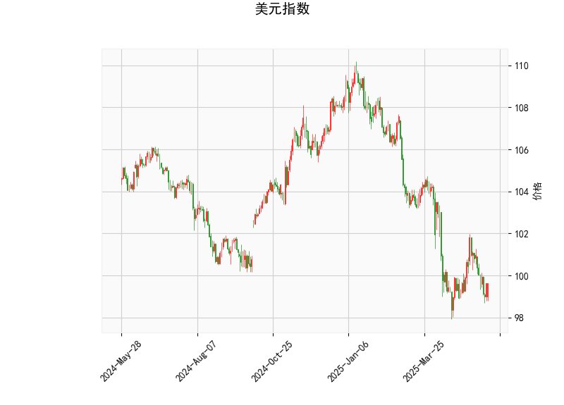

# 美元指数技术分析及A股港股投资机会判断

---

## 一、美元指数技术分析解读

### 1. **价格与布林带**
- **当前价99.61**位于布林下轨（97.43）与中轨（101.47）之间，贴近下轨运行，显示短期处于**弱势区间**。
- **中轨101.47**为中期压力位，若突破可能开启反弹；**下轨97.43**为关键支撑，若跌破或加速下行。

### 2. **RSI指标**
- **44.28**处于中性偏弱区间，未进入超卖区域（<30），反映当前下跌动能**未充分释放**，需警惕进一步探底风险。

### 3. **MACD指标**
- **MACD线（-0.433）**与**信号线（-0.429）**接近粘合，**MACD柱（-0.0043）**接近零轴，暗示**下跌动能减弱**，但未形成明确金叉，需等待方向确认。

### 4. **K线形态**
- **CDLCLOSINGMARUBOZU**（光头光脚阳线/阴线）：当前价格处于低位，若后续出现实体阳线，可能预示短期**超跌反弹**；若延续阴线形态，则可能继续下探。

---

## 二、A股与港股投资机会及策略

### 1. **美元弱势下的宏观逻辑**
- **流动性改善预期**：若美元指数持续走弱，可能缓解新兴市场资本外流压力，利好A股/港股风险偏好。
- **汇率联动效应**：人民币兑美元若走强，将降低外资持有A股/港股的汇兑损失风险，吸引外资回流。

### 2. **A股结构性机会**
- **科技成长板块**（半导体、AI、新能源）：受益于流动性预期改善和政策支持（如国产替代、新质生产力）。
- **高股息防御板块**（电力、煤炭、银行）：若市场波动加大，低估值+高分红资产可能受避险资金青睐。
- **事件驱动策略**：关注中报业绩超预期个股及政策催化领域（如设备更新、消费品以旧换新）。

### 3. **港股修复机会**
- **互联网龙头**（腾讯、美团、阿里）：估值处于历史低位，若美元走弱+外资回流，可能迎来估值修复。
- **恒生科技指数ETF**：通过定投或网格交易捕捉超跌反弹机会。
- **AH溢价套利**：筛选AH溢价率>30%的标的（如中信证券、中芯国际），做多H股/做空A股对冲。

### 4. **风险提示**
- **美元反弹风险**：若美国通胀数据超预期或美联储释放鹰派信号，可能逆转美元弱势格局。
- **地缘政治扰动**：中美关系、台海局势等事件可能加剧市场波动。
- **技术面背离**：美元指数若跌破布林下轨后快速反弹，需警惕短期反转风险。

---

**操作建议**：短期关注A股科技成长板块的左侧布局机会，港股可逢低配置互联网龙头；中期维持高股息资产的防御性仓位，利用AH溢价套利对冲汇率风险。建议结合止损（如跌破布林下轨3%）和动态止盈（RSI>70分批减仓）控制风险。