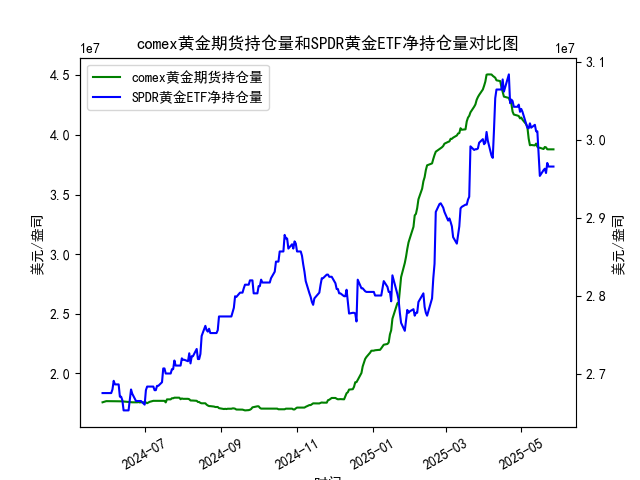

|            |   comex黄金期货持仓量 |   SPDR黄金ETF净持仓量 |
|:-----------|----------------------:|----------------------:|
| 2025-04-29 |           4.15776e+07 |           3.04512e+07 |
| 2025-04-30 |           4.13831e+07 |           3.0359e+07  |
| 2025-05-01 |           4.1453e+07  |           3.03959e+07 |
| 2025-05-02 |           4.12755e+07 |           3.0359e+07  |
| 2025-05-05 |           4.08886e+07 |           3.02023e+07 |
| 2025-05-06 |           4.06075e+07 |           3.01562e+07 |
| 2025-05-07 |           3.96819e+07 |           3.0147e+07  |
| 2025-05-08 |           3.91313e+07 |           3.02115e+07 |
| 2025-05-09 |           3.91541e+07 |           3.01557e+07 |
| 2025-05-12 |           3.91172e+07 |           3.01926e+07 |
| 2025-05-13 |           3.92705e+07 |           3.01096e+07 |
| 2025-05-14 |           3.90037e+07 |           3.01096e+07 |
| 2025-05-15 |           3.89209e+07 |           2.98239e+07 |
| 2025-05-16 |           3.89209e+07 |           2.95382e+07 |
| 2025-05-19 |           3.88155e+07 |           2.96119e+07 |
| 2025-05-20 |           3.89849e+07 |           2.96303e+07 |
| 2025-05-21 |           3.89515e+07 |           2.9575e+07  |
| 2025-05-22 |           3.87935e+07 |           2.97041e+07 |
| 2025-05-23 |           3.87881e+07 |           2.9658e+07  |
| 2025-05-27 |           3.87875e+07 |           2.9658e+07  |

### 1. COMEX黄金期货持仓量与SPDR黄金ETF净持仓量的相关性及影响逻辑

#### **相关性分析**  
COMEX黄金期货持仓量和SPDR黄金ETF净持仓量均反映市场对黄金的投资情绪，但两者的参与主体和交易逻辑不同：  
- **COMEX黄金期货持仓量**：主要反映机构投资者、对冲基金和投机者的短期交易行为。持仓量上升通常表明市场波动预期增强（多头或空头头寸增加），价格可能进入趋势性行情；持仓量下降则可能预示资金离场或观望情绪。  
- **SPDR黄金ETF净持仓量**：代表实物黄金的长期配置需求，参与者多为避险资金和长期投资者。持仓量增加表明市场对黄金的避险或抗通胀需求上升，反之则可能反映风险偏好改善或资金流向其他资产。  

**影响逻辑**：  
- **正向联动**：若两者同步上升，表明短期投机资金与长期配置资金共同推动金价，行情持续性较强（如2024年6月至7月的同步增仓推动金价上涨）。  
- **背离信号**：若COMEX持仓下降而ETF持仓上升，可能暗示短期投机资金获利了结，但长期资金仍看好黄金（如2024年8月数据）；反之则可能预示短期反弹但缺乏长期支撑。  

---

### 2. 近期投资机会分析（聚焦最近一周数据）

#### **数据关键变化**  
- **COMEX黄金期货持仓量**：  
  - **最近一周（以2025年5月23日至5月27日为例）**：持仓量从**39,687,453.67**小幅波动至**38,787,453.67**，呈现温和下降趋势，表明部分投机资金离场。  
  - **今日（假设为数据最后一日）**：持仓量较昨日下降约0.02%，短期动能趋弱。  

- **SPDR黄金ETF净持仓量**：  
  - **最近一周**：持仓量从**29,657,980.61**回升至**29,703,064.84**后持平，显示长期资金在低位出现试探性买入。  
  - **今日**：持仓量较昨日微增0.1%，短期企稳信号初现。  

#### **投资机会判断**  
1. **短期博弈机会**：  
   - COMEX持仓量连续下降叠加ETF持仓企稳，表明短期抛压可能接近尾声。若金价未创新低，可关注超跌反弹机会。  
   - 需结合金价技术面（如支撑位企稳）或外部事件（如美联储政策预期）验证。  

2. **中长期配置窗口**：  
   - ETF持仓量在低位区间（29.5-29.7百万盎司）反复震荡，若后续增仓放量，可能预示避险需求回归（如地缘风险或经济数据走弱）。  

3. **风险提示**：  
   - COMEX持仓量未明显回升前，需警惕金价短期波动加剧；若ETF持仓再次转弱，可能强化下行趋势。  

#### **结论**  
近期建议**轻仓参与超跌反弹**，并关注SPDR黄金ETF持仓量的持续性改善信号。若两者同步回升，则可能开启新一轮多头行情。