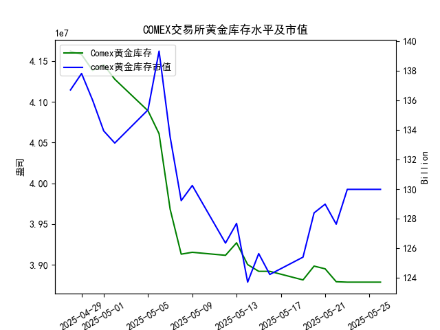

|            |   comex黄金库存量 |   comex黄金库存市值(billion) |   伦敦金现货价 |   上海金交所黄金现货价 |   美元兑人民币汇率 |
|:-----------|------------------:|-----------------------------:|---------------:|-----------------------:|-------------------:|
| 2025-04-29 |       4.15776e+07 |                       3314.5 |        3305.05 |                 780.05 |             7.2029 |
| 2025-04-30 |       4.13831e+07 |                       3286.4 |        3302.05 |                 780.19 |             7.2014 |
| 2025-05-01 |       4.1453e+07  |                       3231   |        3214.75 |                 780.19 |             7.2014 |
| 2025-05-02 |       4.12755e+07 |                       3225   |        3249.7  |                 780.19 |             7.2014 |
| 2025-05-05 |       4.08886e+07 |                       3310.1 |        3249.7  |                 780.19 |             7.2014 |
| 2025-05-06 |       4.06075e+07 |                       3430.9 |        3391.45 |                 792.2  |             7.2008 |
| 2025-05-07 |       3.96819e+07 |                       3364.7 |        3392.25 |                 798.51 |             7.2005 |
| 2025-05-08 |       3.91313e+07 |                       3302.1 |        3352.3  |                 786.5  |             7.2073 |
| 2025-05-09 |       3.91541e+07 |                       3326.3 |        3324.55 |                 785.5  |             7.2095 |
| 2025-05-12 |       3.91172e+07 |                       3230   |        3235.4  |                 759    |             7.2066 |
| 2025-05-13 |       3.92705e+07 |                       3251.4 |        3227.95 |                 763.9  |             7.1991 |
| 2025-05-14 |       3.90037e+07 |                       3171.7 |        3191.95 |                 758.38 |             7.1956 |
| 2025-05-15 |       3.89209e+07 |                       3228.1 |        3191.05 |                 735.86 |             7.1963 |
| 2025-05-16 |       3.89209e+07 |                       3191.8 |        3182.95 |                 746.4  |             7.1938 |
| 2025-05-19 |       3.88155e+07 |                       3230.6 |        3230.15 |                 754.5  |             7.1916 |
| 2025-05-20 |       3.89849e+07 |                       3293.2 |        3261.55 |                 753.49 |             7.1931 |
| 2025-05-21 |       3.89515e+07 |                       3311.4 |        3299.65 |                 773.82 |             7.1937 |
| 2025-05-22 |       3.87935e+07 |                       3290   |        3284    |                 778.36 |             7.1903 |
| 2025-05-23 |       3.87881e+07 |                       3351   |        3342.65 |                 776.4  |             7.1919 |
| 2025-05-26 |       3.87881e+07 |                       3351   |        3342.65 |                 773.94 |             7.1833 |

### 近期COMEX黄金库存与价格关联性分析

#### 1. **库存与价格的正相关性验证**
- **长期趋势（近一个月）**：COMEX黄金库存从4月28日的4161万盎司降至5月26日的3878万盎司（降幅**7%**），而伦敦金价从3296.30美元/盎司升至3342.65美元/盎司（涨幅**1.4%**），整体呈现**库存下降伴随价格上升**的趋势，符合“正相关”假设。
- **短期波动（最近一周）**：5月19日至26日，库存下降**0.08%**（3881万→3878万），伦敦金价上涨**3.5%**（3230→3342美元），短期正相关性显著增强，库存微降可能通过市场情绪放大价格波动。

---

### 近期投资机会挖掘（聚焦最近一周及今日变化）

#### 1. **伦敦金价突破性上涨**
- **关键数据**：  
  - 5月23日伦敦金价单日上涨**58.65美元**（3284→3342.65美元），创近期新高，今日（5月26日）价格持平，需关注突破后是否形成新支撑位。
  - 同期库存下降**0.02%**（3879万→3878万），供需关系边际改善。
- **机会**：若价格站稳3340美元上方，可考虑**短期多头策略**，目标看向前高3390美元区域。

#### 2. **沪伦价差收窄与汇率套利**
- **跨市场价差**：  
  - 5月26日上海金价**773.94元/克**（人民币计价），伦敦金价**3342.65美元/盎司**，按当日汇率7.1833换算为**2402元/克**，价差达**24%**（剔除税费和运费后仍存套利空间）。
  - 今日美元兑人民币汇率跌至**7.1833**（人民币升值），进一步压低上海金价。
- **机会**：若价差持续偏离历史均值，可关注**卖出伦敦金、买入上海金**的跨市场套利机会。

#### 3. **库存边际变化与价格敏感度**
- **库存拐点信号**：  
  - 5月22-23日库存连续下降（3879万→3878万），同期金价上涨**2.2%**，显示市场对库存变化敏感度提升。
  - 今日库存持平，但若未来一周库存加速下降，可能触发价格二次上涨。
- **机会**：若库存跌破3870万（近一年低点），可布局**中长期多头头寸**。

---

### 风险提示
1. **美元波动风险**：美元兑人民币汇率快速走弱（今日7.1833 vs 昨日7.1919），若美元反弹可能压制金价。
2. **库存异动**：若下周库存意外回升（如交易所补库），可能打破当前供需平衡。
3. **政策风险**：关注美联储货币政策及中国外汇管制政策对跨市场套利的潜在影响。

---

### 结论
近期重点关注**伦敦金价突破有效性**及**沪伦价差修复机会**，短期操作以日内波段为主，中长期需等待库存进一步下降确认趋势。