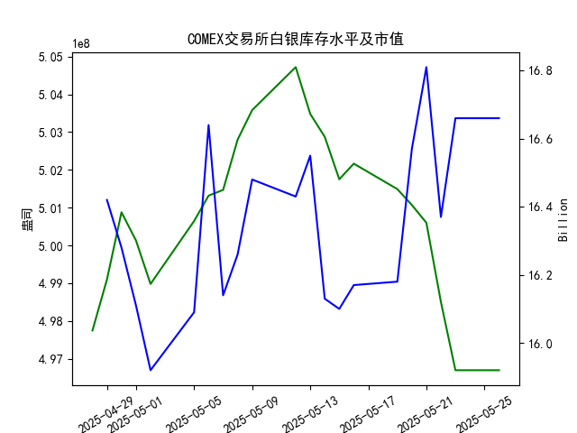

|            |   comex白银库存量 |   comex白银库存市值(billion) |   伦敦银现货价 |   上海金交所白银现货价 |   美元兑人民币汇率 |
|:-----------|------------------:|-----------------------------:|---------------:|-----------------------:|-------------------:|
| 2025-04-29 |       4.99098e+08 |                       32.89  |         33.225 |                   8197 |             7.2029 |
| 2025-04-30 |       5.00876e+08 |                       32.51  |         32.225 |                   8163 |             7.2014 |
| 2025-05-01 |       5.00128e+08 |                       32.205 |         32.125 |                   8163 |             7.2014 |
| 2025-05-02 |       4.98978e+08 |                       31.91  |         32.365 |                   8163 |             7.2014 |
| 2025-05-05 |       5.00644e+08 |                       32.14  |         32.365 |                   8163 |             7.2014 |
| 2025-05-06 |       5.01317e+08 |                       33.19  |         33.025 |                   8221 |             7.2008 |
| 2025-05-07 |       5.01469e+08 |                       32.195 |         32.875 |                   8229 |             7.2005 |
| 2025-05-08 |       5.028e+08   |                       32.335 |         32.43  |                   8100 |             7.2073 |
| 2025-05-09 |       5.03581e+08 |                       32.73  |         32.515 |                   8150 |             7.2095 |
| 2025-05-12 |       5.04719e+08 |                       32.56  |         32.02  |                   8124 |             7.2066 |
| 2025-05-13 |       5.03481e+08 |                       32.88  |         32.98  |                   8214 |             7.1991 |
| 2025-05-14 |       5.02874e+08 |                       32.085 |         32.885 |                   8172 |             7.1956 |
| 2025-05-15 |       5.0175e+08  |                       32.085 |         32.085 |                   7967 |             7.1963 |
| 2025-05-16 |       5.02164e+08 |                       32.195 |         32.135 |                   8062 |             7.1938 |
| 2025-05-19 |       5.0149e+08  |                       32.265 |         32.52  |                   8113 |             7.1916 |
| 2025-05-20 |       5.01069e+08 |                       33.065 |         32.5   |                   8057 |             7.1931 |
| 2025-05-21 |       5.00598e+08 |                       33.575 |         33.16  |                   8237 |             7.1937 |
| 2025-05-22 |       4.98504e+08 |                       32.84  |         32.725 |                   8268 |             7.1903 |
| 2025-05-23 |       4.96695e+08 |                       33.535 |         33.095 |                   8244 |             7.1919 |
| 2025-05-26 |       4.96695e+08 |                       33.535 |         33.095 |                   8239 |             7.1833 |

### 近期白银市场投资机会分析（基于2025年5月19日-5月26日数据）

---

#### **核心指标变化（今日5月26日 vs 昨日5月23日）**
1. **COMEX白银库存**：  
   - 库存量连续下降后首次持平（5/23: **4.9669亿盎司** → 5/26: **4.9669亿盎司**）。  
   - 库存市值同步持平（16.66 → 16.66十亿美元），反映短期供需平衡。

2. **国际白银价格（伦敦）**：  
   - 价格维持高位震荡（5/23: **33.095美元/盎司** → 5/26: **33.095美元/盎司**），短期缺乏新驱动。

3. **国内白银价格（上海）**：  
   - 微跌5元/千克（5/23: **8244** → 5/26: **8239**），受人民币升值压制。

4. **美元兑人民币汇率**：  
   - 人民币显著升值（5/23: **7.1919** → 5/26: **7.1833**），降低进口成本。

---

#### **投资机会与逻辑**
##### 1. **跨市场套利机会（高确定性）**  
   - **价差分析**：  
     - 伦敦银价换算为人民币后约**7643元/千克**（基于33.095美元/盎司和汇率7.1833），上海银价为**8239元/千克**，价差达**596元/千克**。  
     - **机会**：卖出上海银、买入伦敦银，锁定无风险利润（需扣减交易和物流成本）。  

##### 2. **国际白银多头布局（趋势性机会）**  
   - **驱动逻辑**：  
     - COMEX库存连续下降（近一周减少**480万盎司**），反映供应收紧预期。  
     - 伦敦银价站稳33美元关口，技术面支撑明显，若突破前高（5/21: **33.16美元**）可能打开上行空间。  

##### 3. **国内白银回调风险（短期机会）**  
   - **驱动逻辑**：  
     - 国内溢价过高（价差约**7.8%**），叠加人民币升值压力，上海银价存在回调需求。  
     - 可轻仓逢高做空或等待价差收敛后平仓。  

##### 4. **汇率敏感性对冲策略**  
   - **驱动逻辑**：  
     - 人民币升值趋势下，国内银价涨幅或弱于国际（如5/26伦敦银价持平，上海银价微跌）。  
     - 持有白银多头时，可同步做多美元/人民币汇率对冲汇率风险。  

---

#### **风险提示**
- **套利限制**：需确认跨境交割可行性及税费成本（如增值税、仓储费）。  
- **库存波动**：若COMEX库存反弹，可能削弱国际银价上涨动力。  
- **宏观事件**：美联储政策、地缘冲突等或引发价格剧烈波动。  

---

#### **操作建议**
- **优先策略**：跨市场套利（需快速执行）。  
- **次优策略**：伦敦银价突破33.2美元后追多，止损32.8美元。  
- **保守策略**：观望上海银价价差修复，回调至8100元/千克以下分批建仓。