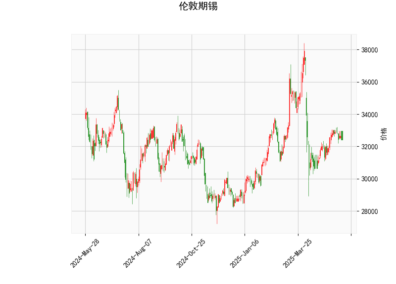

# 伦敦期锡技术分析及投资策略

## 一、技术指标解读

### 1. **价格与RSI指标**
- **当前价32410**位于布林带中轨（33105）与下轨（29222）之间，接近中轨但未突破，暗示短期处于中性偏弱区域。
- **RSI 49**接近50分水岭，反映市场多空力量暂时平衡，但需警惕突破中轨后的方向选择。

### 2. **MACD指标**
- **MACD线（49.91）大幅高于信号线（19.58）**，柱状图（30.32）处于强势扩张状态，形成典型的“金叉加速”形态，短期动能偏多。
- 但MACD绝对值较高（接近50），需关注后续是否出现顶背离信号。

### 3. **布林带指标**
- **上轨36988/中轨33105/下轨29222**构成宽幅震荡区间，当前价格距离中轨（-2.1%）比下轨（+10.9%）更近，技术上存在向上测试中轨的倾向。
- 若突破中轨，可能打开向36000-37000区间的上行空间；若跌破近期低点，则可能向下轨靠拢。

### 4. **K线形态组合**
- **CDLBELTHOLD（孕线）+CDLMATCHINGLOW（匹配低点）**：暗示底部支撑可能正在形成。
- **CDLMARUBOZU（秃蜡烛）+CDLCLOSINGMARUBOZU（收盘秃）**：显示局部存在强势单边波动。
- **CDLLONGLINE（长脚十字线）**：反映多空争夺激烈，需配合后续K线确认方向。

---

## 二、投资机会与策略

### 1. **趋势交易策略**
- **多头机会**：若价格放量突破中轨33105且MACD维持扩张，可建立多单，目标上看上轨36988（潜在空间+14.1%），止损设于31500（当前价-2.8%）。
- **空头机会**：若价格跌破31500并伴随RSI下破45，可尝试短空，目标下看下轨29222（潜在空间-7.3%），止损设于32500。

### 2. **套利策略**
- **布林带区间交易**：在29222-33105区间内采取“下轨买入/中轨卖出”的网格策略，每500点设置一个交易档位。
- **跨期套利**：关注近远月合约价差，若出现超3%的贴水结构可考虑正向套利（买近月/卖远月）。

### 3. **事件驱动策略**
- **库存数据敏感期**：LME锡库存若持续下降（当前处于历史低位），可提前布局看涨期权。
- **新能源产业链动态**：光伏焊带、半导体等下游需求超预期时，可配合突破信号加仓多头。

---

## 三、风险提示
1. **假突破风险**：当前RSI未形成明显背离，但MACD高位易引发获利回吐。
2. **宏观扰动**：美联储政策、印尼锡出口禁令变化可能引发价格剧烈波动。
3. **流动性风险**：锡期货日均成交量约2000手，大额订单可能造成价格闪崩。
4. **技术指标冲突**：K线形态中同时包含趋势延续（秃蜡烛）与反转信号（孕线），需等待形态确认。