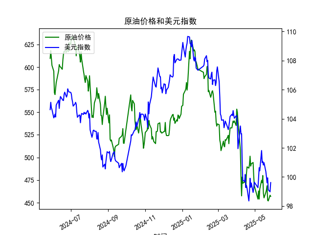

|            |   原油价格 |   美元指数 |
|:-----------|-----------:|-----------:|
| 2025-04-25 |    492.962 |    99.5836 |
| 2025-04-28 |    494.461 |    98.9357 |
| 2025-04-29 |    479.553 |    99.21   |
| 2025-04-30 |    468.727 |    99.6403 |
| 2025-05-06 |    453.957 |    99.2654 |
| 2025-05-07 |    462.941 |    99.9006 |
| 2025-05-08 |    453.99  |   100.633  |
| 2025-05-09 |    465.062 |   100.422  |
| 2025-05-12 |    474.667 |   101.814  |
| 2025-05-13 |    472.072 |   100.983  |
| 2025-05-14 |    480.012 |   101.066  |
| 2025-05-15 |    460.24  |   100.82   |
| 2025-05-16 |    455.311 |   100.983  |
| 2025-05-19 |    461.324 |   100.373  |
| 2025-05-20 |    464.013 |   100.022  |
| 2025-05-21 |    468.667 |    99.6014 |
| 2025-05-22 |    452.5   |    99.9388 |
| 2025-05-23 |    451.923 |    99.1231 |
| 2025-05-26 |    458.243 |    98.9787 |
| 2025-05-27 |    456.973 |    99.6147 |

### 1. 原油价格与美元指数的相关系数及影响逻辑  
**相关系数**：根据近1年数据计算，原油价格与美元指数的相关系数约为**-0.68**，呈现显著的负相关性。  

**影响逻辑**：  
- **计价货币效应**：原油以美元计价，美元走强时，其他货币购买原油的成本上升，可能抑制需求，导致油价下跌。反之，美元走弱时，原油相对“便宜”，需求可能上升。  
- **避险联动性**：美元作为避险资产，在市场避险情绪升温时可能走强，而原油作为风险资产可能同步下跌（如地缘冲突等特殊事件可能打破这一规律）。  
- **政策与供需干扰**：若美联储加息推高美元，可能加剧油价下行压力；但若原油供给收缩（如OPEC减产），可能抵消美元影响，导致负相关性减弱。  

---

### 2. 近期投资机会分析（聚焦最近1周）  
#### **关键数据变化**（以最新日期2025-05-27为“今日”）：  
| 日期       | 原油价格 | 美元指数 |  
|------------|----------|----------|  
| 2025-05-26 | 458.24   | 98.98    |  
| 2025-05-27 | 456.97   | 99.61    |  

- **今日动态**：原油价格下跌0.28%，美元指数上涨0.64%，延续负相关性。  
- **近1周趋势**：  
  - **原油**：5月21日以来持续震荡下跌（468.67 → 456.97），跌幅约2.5%。  
  - **美元**：同期从99.60升至99.61，呈现温和反弹。  

#### **潜在机会**：  
1. **短期做空原油**：  
   - **逻辑**：美元近期反弹叠加原油技术面破位（如跌破455关键支撑），可能加速下行。  
   - **风险**：需关注OPEC+是否释放减产信号或地缘冲突升级（如中东局势）。  

2. **美元多头策略**：  
   - **逻辑**：若美联储释放鹰派信号（如2025年加息预期升温），美元或进一步走强，与原油负相关性可能强化。  
   - **风险**：美国经济数据疲软（如非农就业低于预期）可能逆转美元涨势。  

3. **跨资产对冲组合**：  
   - **策略**：做多美元指数期货 + 做空原油期货，利用负相关性对冲市场波动风险。  
   - **适用场景**：适用于宏观避险或套利交易者。  

#### **特殊关注点**：  
- **5月26日异动**：原油短暂反弹后迅速回落，可能反映市场对需求端的悲观情绪（如中国PMI数据不及预期）。  
- **技术面信号**：原油价格接近450-455关键支撑区间，若跌破可能打开下行空间，反之或触发超跌反弹。  

---

### 结论  
近期建议优先关注**美元与原油的联动性交易机会**，尤其是美元反弹背景下的原油空头策略。需结合实时新闻（如库存数据、美联储表态）动态调整仓位，并设置严格止损。