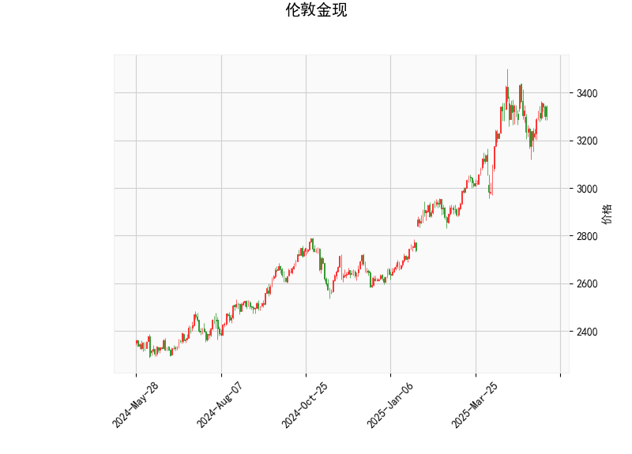

# 伦敦金现技术分析及策略建议

## 一、技术指标解析

### 1. 价格与RSI分析
- **当前价格3300.455**位于布林通道中轨（3181.91）上方，但显著低于上轨（3483.98），显示价格处于中性偏强区域，但未突破关键压力位。
- **RSI 52.87**位于50中性线上方但低于超买阈值，表明市场短期动能中性略偏多，但未形成明显单边趋势。

### 2. MACD指标
- **MACD线（24.83）下穿信号线（28.15）**形成死叉，柱状图（-3.32）显示负值扩大，表明短期下跌动能正在增强，需警惕回调风险。

### 3. 布林通道
- **通道宽度达604点**（上轨3483.98 vs 下轨2879.84），反映市场波动率较高。
- 当前价格位于**中上轨之间**，若站稳中轨可能测试上轨，若跌破中轨则可能向下轨运行。

### 4. K线形态
- **CDLBELTHOLD（多头吞噬形态）**：出现在下跌末端时暗示趋势反转可能。
- **CDLMATCHINGLOW（匹配低点形态）**：连续两根K线低点接近，显示空头力量衰减。

---

## 二、投资机会与策略建议

### 1. 趋势交易机会
- **多头策略**：若价格站稳3350且MACD柱状图转正，可分批建仓，目标布林上轨3483，止损设于中轨3180下方。
- **空头策略**：若价格跌破3250且RSI下穿50，可轻仓做空，目标下轨2880，止损设3300上方。

### 2. 套利策略
- **布林通道套利**：在2879-3483区间进行波段操作，接近下轨3%时低吸，接近上轨3%时高抛。
- **MACD背离交易**：若价格创新低但MACD柱状图未同步走弱，可反向建仓。

### 3. 风险控制要点
- **止损设置**：单边交易建议3%浮动止损，突破关键位后移动止损。
- **仓位管理**：单次交易不超过15%仓位，叠加形态信号时不超过25%。
- **时间窗口**：重点关注美盘时段波动率放大机会，亚盘时段宜观望。

---

## 三、关键支撑/阻力位
| 级别        | 价格区间   | 技术意义                   |
|-------------|------------|---------------------------|
| 强阻力位    | 3483-3500  | 布林上轨+整数关口          |
| 短期压力位  | 3350-3380  | 前高密集成交区             |
| 多空分水岭  | 3180-3200  | 布林中轨+心理关口          |
| 强支撑位    | 2900-2880  | 布林下轨+整数关口          |

> **提示**：建议结合美联储议息会议、美元指数走势等宏观事件进行多因子验证，当前技术面显示市场处于方向选择关键期，需做好双向波动预案。