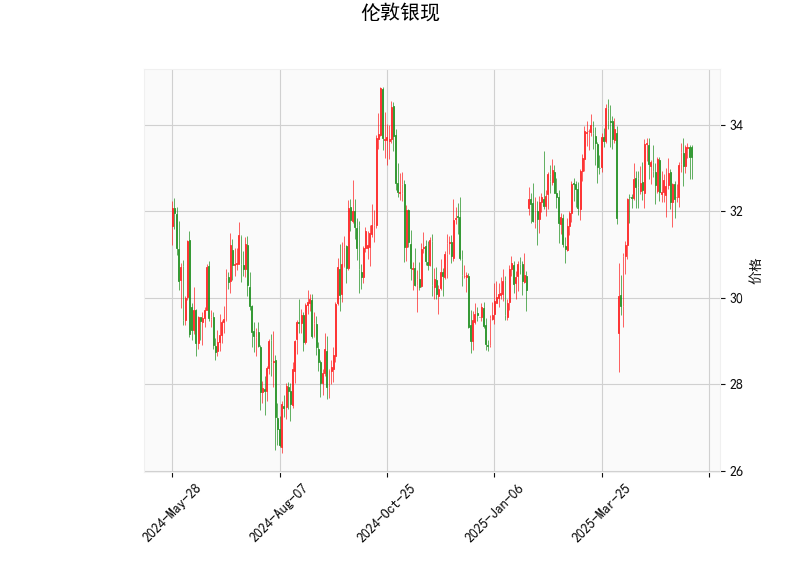

# 伦敦银现技术分析与投资策略

## 一、技术指标分析

### 1. 价格与布林带
- **当前价**33.242位于布林通道中轨（32.88）与上轨（34.69）之间，距离中轨较近。  
- **通道宽度**显示34.69-31.07=3.62美元波动空间，当前价格处于近一周高位但未触及压力位，短期仍有上行试探可能。  
- **中轨支撑有效性**需要关注32.88能否站稳，若跌破可能向下轨31.07方向运行。

### 2. 动量指标
- **RSI 54.25**处于中性区间（30-70），既无超买也无超卖信号，但接近50中轴的向上突破具有短期看涨指引。  
- **MACD金叉**：MACD线（0.168）上穿信号线（0.0998），柱状图由负转正（0.068），显示多头动能开始积聚，但绝对值偏小需持续观察。

### 3. K线形态
- **CDLMATCHINGLOW**看涨形态出现，该形态需满足：连续两日收盘价接近且第二日未创新低，通常出现在下跌趋势末端，暗示空头力量衰竭。需结合成交量确认有效性。

---

## 二、投资机会与策略

### 1. 趋势交易机会
- **多头策略**（突破确认）：  
  若价格突破布林上轨34.69且MACD柱持续放大，可建立多单，目标前高35.5-36区域，止损设于中轨32.88下方。  
- **回调策略**：  
  若价格回踩中轨32.88附近且RSI未跌破40，可轻仓试多，目标上看上轨，止损31.9（下轨上方）。

### 2. 套利机会
- **跨期套利**：  
  关注近远月合约价差，若库存数据出现下降预期，可做多近月/做空远月。当前需等待库存报告触发机会。  
- **金银比套利**：  
  金银比现处85附近（金价2400/银价33.24），若该比值突破90历史高位，可做空黄金/做多白银进行均值回归交易。

### 3. 风险提示
- **事件敏感期**：本周美联储会议纪要将影响美元指数，银价与美元负相关性（-0.8）需重点监控。  
- **止损设置**：所有策略建议设置1.5-2%动态止损，突破型交易需配合5分钟K线量能确认。  
- **形态验证**：CDLMATCHINGLOW需配合未来三日收盘价站稳33.2上方确认有效性，警惕假突破风险。

---

（注：以上分析基于当前技术指标，实际交易需结合实时市场消息与仓位管理）