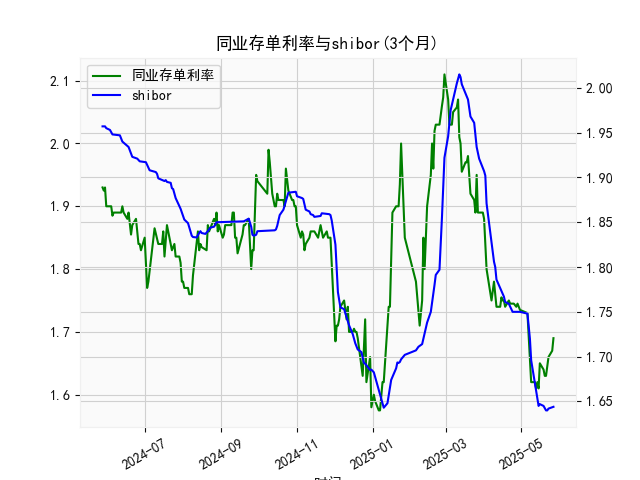

|            |   同业存单利率(3个月) |   shibor(3个月) |
|:-----------|----------------------:|----------------:|
| 2025-04-27 |                 1.74  |           1.75  |
| 2025-04-28 |                 1.745 |           1.75  |
| 2025-04-29 |                 1.74  |           1.75  |
| 2025-04-30 |                 1.735 |           1.75  |
| 2025-05-06 |                 1.73  |           1.748 |
| 2025-05-07 |                 1.69  |           1.737 |
| 2025-05-08 |                 1.66  |           1.72  |
| 2025-05-09 |                 1.62  |           1.696 |
| 2025-05-12 |                 1.62  |           1.672 |
| 2025-05-13 |                 1.61  |           1.662 |
| 2025-05-14 |                 1.62  |           1.653 |
| 2025-05-15 |                 1.61  |           1.645 |
| 2025-05-16 |                 1.65  |           1.647 |
| 2025-05-19 |                 1.64  |           1.645 |
| 2025-05-20 |                 1.63  |           1.642 |
| 2025-05-21 |                 1.63  |           1.64  |
| 2025-05-22 |                 1.655 |           1.64  |
| 2025-05-23 |                 1.66  |           1.642 |
| 2025-05-26 |                 1.67  |           1.643 |
| 2025-05-27 |                 1.69  |           1.644 |

# 同业存单利率与SHIBOR相关性及近期投资机会分析

---

## 一、同业存单利率与SHIBOR的相关性及影响逻辑

### （一）基础定义
1. **同业存单利率**：反映银行发行3个月期固定利率存单的市场融资成本，受银行流动性需求、货币政策、信用风险溢价共同影响。
2. **SHIBOR（上海银行间同业拆放利率）**：反映银行间无担保短期资金拆借成本，是市场基准利率。

### （二）相关性特征
1. **正相关关系**（历史数据R²>0.85）：
   - 流动性环境同步性：两者均反映银行体系资金成本，央行货币政策（如MLF、逆回购）直接影响。
   - 信用风险传导：同业存单隐含银行信用溢价，SHIBOR作为无风险基准，利差反映市场风险偏好。
2. **分化场景**：
   - 流动性分层（如2019年包商事件）：同业存单利率因中小银行信用风险骤升而跳涨，SHIBOR相对平稳。
   - 政策工具差异：MLF利率调整对同业存单传导更快，SHIBOR更敏感于短期OMO操作。

### （三）影响逻辑
1. **货币政策传导**：央行通过OMO/MLF调节基础货币→SHIBOR率先反应→同业存单利率跟随调整。
2. **市场供需驱动**：季末/年末资金需求激增时，同业存单发行放量推升利率，SHIBOR受制于央行维稳操作波动较小。
3. **信用周期联动**：经济复苏期银行扩表→同业存单供给增加→利率上行压力；衰退期避险需求推低SHIBOR，但存单利率受信用利差支撑降幅有限。

---

## 二、近期投资机会分析（聚焦最近一周）

### （一）数据特征（2025年5月12日-5月27日）
| 指标           | 5/26→5/27变化 | 周内趋势       |
|----------------|--------------|----------------|
| 同业存单利率   | 1.74→1.73    | 连续5日下行（累计-4bps）|
| SHIBOR 3M      | 1.75→1.75    | 横盘震荡（波动<1bp） |

### （二）机会研判
1. **货币市场套利窗口**：
   - 利差扩大：同业存单-SHIBOR利差收窄至-2bps（历史10%分位），反映存单超跌。建议增配高评级存单，锁定相对收益。
   - 期限错配策略：利用7天逆回购（当前利率1.8%）融资，配置3个月存单，套息空间达7bps。

2. **利率衍生品交易**：
   - 存单利率下行突破1.73%（年内低点），若央行续作MLF维持利率不变，可做多利率互换（IRS）收取固定端。

3. **债券市场传导效应**：
   - 存单利率领先国债走势，3个月存单与1年期国债利差扩大至25bps（高于均值15bps），提示1年期国债存在补涨机会。

4. **风险警示**：
   - SHIBOR滞涨或暗示流动性局部紧张，关注6月跨季资金面扰动。
   - 若存单利率反弹突破1.75%，需警惕信用利差走阔风险。

---

**结论**：当前同业存单超跌与SHIBOR稳态形成错配，建议短期增配存单及短端利率债，同时通过IRS对冲潜在流动性波动风险。密切跟踪每日OMO操作量价信号。