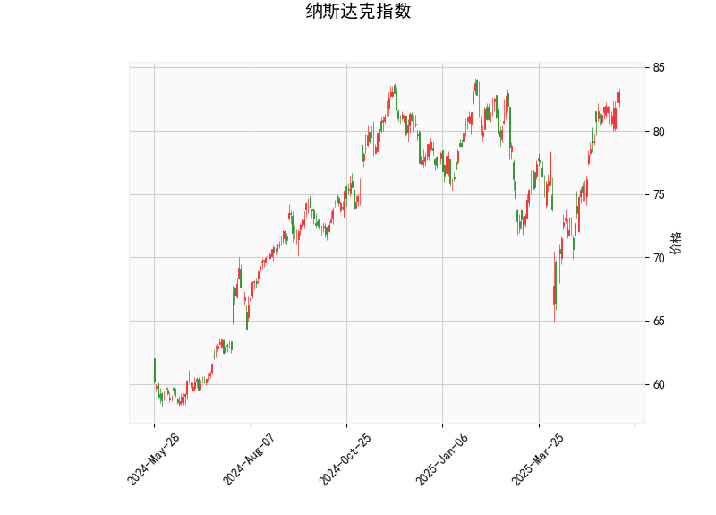

# 纳斯达克指数技术分析及投资策略

## 一、技术指标解读

### 1. **动量指标**
- **RSI（69.09）**：接近超买阈值（70），显示短期买盘强劲，但需警惕回调风险。尚未进入绝对超买区域，暗示仍有上涨动能。
- **MACD（1.92 vs 1.81）**：柱状图转为正值且向上发散，MACD线位于信号线上方，表明短期看涨动能增强，但两者差值较小，需关注是否持续扩大。

### 2. **波动率与趋势**
- **布林带（当前价83.06 vs 上轨84.10）**：价格紧贴上轨，处于强势区域，但需观察是否突破或回落。中轨（76.11）与当前价差距显著，中期上升趋势明确。
- **K线形态（CDLGAPSIDESIDEWHITE）**：两侧缺口伴随连续阳线，通常表示买方主导且趋势延续信号，需结合成交量验证。

### 3. **关键位置**
- **上方阻力**：布林带上轨84.10为短期压力位，突破后可能加速上行。
- **下方支撑**：中轨76.11为中期强弱分界线，若跌破可能引发深度回调。

---

## 二、投资机会与策略

### 1. **趋势跟踪策略**
- **突破追涨**：若价格站稳84.10上方且成交量放大，可加仓或开多单，目标看向前高或布林带外扩区域（如85.5-86.0）。
- **止损设置**：跌破中轨76.11时需止损，防止趋势反转风险。

### 2. **回调博弈策略**
- **超买回撤**：若RSI突破70后回落且价格跌破83.0，可尝试短线空单，目标下看80.0（心理关口）及78.0（前支撑平台）。
- **支撑买入**：价格回落至中轨76.11附近时，若MACD未死叉且RSI未跌破50，可布局中线多单。

### 3. **套利机会**
- **布林带收敛波段**：若价格在84.10-76.11区间震荡，可高抛低吸，结合RSI超买/超卖信号反向操作。
- **期权对冲**：买入看涨期权（行权价84.0-85.0）同时卖出看跌期权（行权价78.0），利用波动率扩张获利。

---

## 三、风险提示
1. **RSI背离风险**：若价格创新高但RSI未同步上行，可能预示顶背离。
2. **宏观事件冲击**：美联储政策、通胀数据等可能打破技术形态。
3. **止损纪律**：所有策略需严格执行止损（如布林带中轨下方2%），避免单边行情损失。