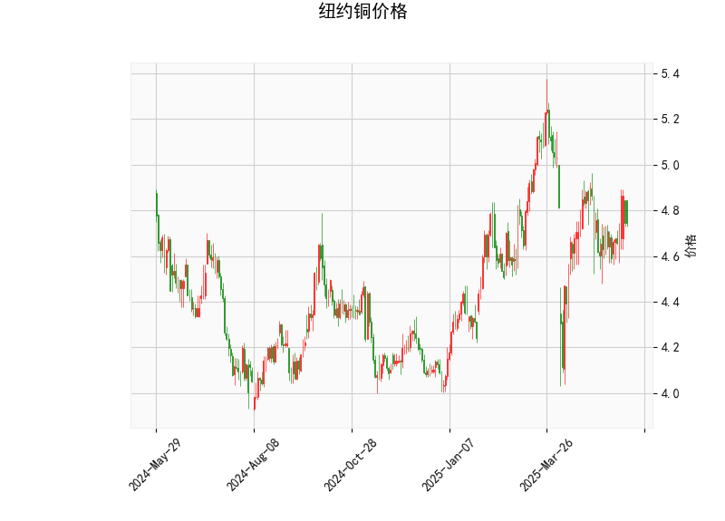

### 一、技术分析结果解读

#### 1. **价格与布林轨道**
- **当前价（4.745）**略低于布林中轨（4.787），但远高于布林下轨（4.341），表明价格处于中下轨之间，短期可能面临方向选择。
- **布林带收窄**：上轨（5.233）与下轨（4.341）间距较大，但当前价格未明显突破中轨，显示市场暂时缺乏趋势性波动，需关注中轨（4.787）能否被突破。

#### 2. **RSI（51.14）**
- RSI值接近50中性区域，显示多空力量暂时平衡，既无超买（>70）也无超卖（<30）信号，需结合其他指标判断短期动能。

#### 3. **MACD指标**
- **MACD线（0.0073）上穿信号线（-0.0082）**，形成金叉，且柱状图（0.0155）为正值并扩大，表明短期看涨动能增强。
- **信号较弱**：MACD和信号线绝对值均接近零轴，需警惕假突破风险。

#### 4. **K线形态**
- **CDLBELTHOLD（捉腰带线）**：若出现在下跌趋势中，可能暗示短期反转。
- **CDLLONGLINE（长实体线）**：显示单边力量（买方或卖方）主导，需结合前后K线确认方向。
- **CDLMATCHINGLOW（相同低价）**：连续两日低点相近，可能预示底部支撑。

---

### 二、投资机会与策略

#### 1. **短期看涨机会（需验证）**
- **入场条件**：若价格站稳中轨（4.787）且MACD持续扩张，可尝试做多。
- **目标位**：布林上轨（5.233）附近。
- **止损位**：布林下轨（4.34）下方或前低点。

#### 2. **套利策略**
- **跨期套利**：若近月合约反弹力度强于远月（需验证库存/供需面），可做多近月、做空远月。
- **波动率策略**：布林带收窄后若突破中轨，可押注波动率放大（如买入看涨期权）。

#### 3. **风险提示**
- **假突破风险**：MACD信号较弱，若价格未能站稳中轨，可能回踩下轨。
- **K线形态矛盾**：CDLBELTHOLD需确认是否为阳线（看涨）或阴线（看跌）。

---

### 三、总结
- **短期偏多**：MACD金叉和K线形态支撑反弹，但需价格确认突破中轨。
- **中长期观望**：RSI中性且布林带未明显开口，趋势性机会仍需等待。
- **建议结合基本面**（如库存、美元指数、中国需求）增强信号有效性。