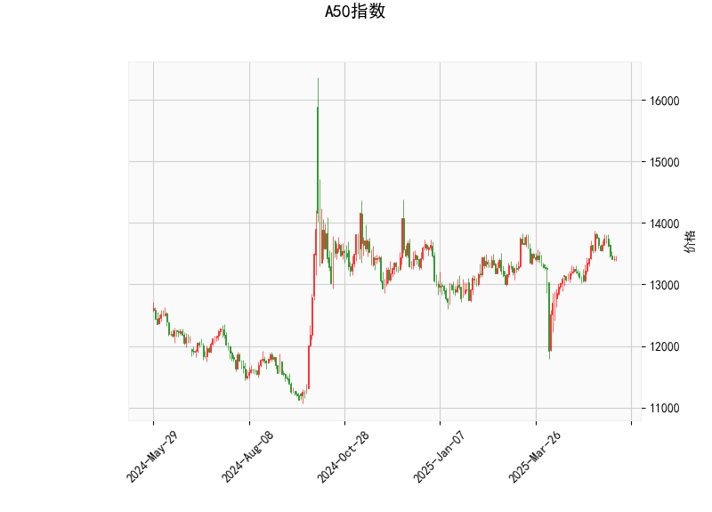

# A50指数的技术分析结果分析

## 总体概述
A50指数当前价格为13413.0点，基于提供的指标显示，市场处于相对中性的状态，但存在一定的下行风险。RSI和MACD指标暗示动量不强，K线形态则反映出市场不确定性和波动性。整体来看，短期内指数可能处于整理期，缺乏明显趋势，需要密切关注价格突破关键水平。

## 关键指标分析
- **RSI (相对强弱指数)**: 当前值为49.29，这表明指数处于中性区域（RSI通常在30-70之间视为中性）。RSI接近50，暗示买卖力量基本平衡，但略低于50可能表示轻微的卖方优势。如果RSI跌破30，将进入超卖区；反之，若升至70以上，则可能过度买入。短期内，这反映市场缺乏强烈动量。

- **MACD (移动平均收敛散度)**: MACD线为71.76，信号线为106.31，直方图为-34.55。MACD线低于信号线，且直方图为负值，这是一个典型的看跌信号，表明短期动量向下。投资者需注意，如果MACD线向上穿越信号线，可能出现买入机会；反之，继续下行则强化卖出信号。目前的MACD状态显示，指数可能面临修正或回调。

- **Bollinger Bands (布林带)**: 上轨为13987.03，中轨为13309.49，下轨为12631.95。当前价格13413.0位于中轨上方，但未接近上轨，这暗示价格在正常波动范围内，市场相对稳定。如果价格跌破中轨（13309.49），可能测试下轨支撑（12631.95），这通常被视为看跌信号；反之，若突破上轨，可能触发上行趋势。布林带的宽度显示当前波动性适中，没有极端扩张。

- **K线形态**: 形态包括CDLDOJI、CDLHIGHWAVE、CDLLONGLEGGEDDOJI和CDLSPINNINGTOP。这些形态均表示市场不确定性和犹豫不决：
  - CDLDOJI和CDLLONGLEGGEDDOJI：反映买卖力量均衡，常见于转折点，可能预示反转或持续整合。
  - CDLHIGHWAVE：显示高波动性，但方向不明，提醒投资者注意潜在剧烈变动。
  - CDLSPINNINGTOP：表示市场顶部或底部信号，常出现于趋势转换前。
  总体上，这些形态建议短期内指数可能维持震荡，而不是形成强烈趋势。

## 近期投资或套利机会和策略判断
### 市场机会评估
基于上述分析，A50指数短期内可能存在整合机会，但不宜过度乐观。RSI中性、MACD看跌和K线不确定性表明，指数可能在13300-14000点区间震荡。潜在机会包括：
- **投资机会**: 如果市场突破布林带上轨（13987.03），可能迎来反弹行情，适合多头布局；反之，若跌破中轨（13309.49），则可能触发回调，投资者可考虑做空。整体不确定性较高，适合风险偏好中性的投资者。
- **套利机会**: A50指数作为期货或ETF标的，可能存在跨期或跨市场套利。例如，利用期货与现货价格差异（如A50期货与相关股票指数的价差），或基于技术指标的波动进行范围套利。但当前K线形态显示高不确定性，套利需谨慎，优先选择低波动期操作。

### 推荐策略
- **观望与等待策略**: 鉴于RSI接近中性线和MACD的看跌信号，建议短期内采用观望策略。等待RSI突破50（转为看涨）或MACD直方图转为正值时再入场。同时，监控K线形态变化，如果连续出现强势形态（如大阳线），可考虑建仓。
  
- **范围交易策略**: 利用布林带进行区间操作。在13413.0点附近，价格可能在中轨（13309.49）和上轨（13987.03）之间波动。策略包括：
  - 在接近下轨（12631.95）时买入，目标卖出至中轨或上轨。
  - 设置止损在关键水平下方（如13200点），控制风险。
  这适合短期交易者，预计回报率为5-10%。

- **风险管理建议**: 市场不确定性高，建议控制仓位（不超过总资金的30%），并结合基本面因素（如经济数据或政策变动）验证信号。避免在K线形态频繁出现时盲目操作，优先选择低风险工具如期权进行套利测试。

总之，A50指数当前处于中性偏弱状态，投资者应以防御为主，抓住潜在突破机会。实际操作需结合实时数据和个人风险承受能力。