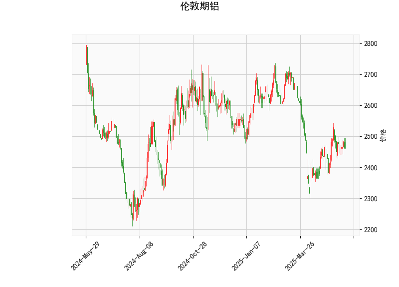

### 伦敦期铝技术分析结果分析

#### 1. 整体技术指标解读
根据提供的伦敦期铝技术分析数据，我们可以对当前市场状况进行全面评估。当前价格为2465.0，处于相对稳定的区间。以下是对关键指标的逐一分析：

- **RSI (Relative Strength Index，相对强弱指数)**: 当前RSI值为50.41。这表明市场处于中性状态，通常RSI在30-70区间内表示无明显超买或超卖信号。RSI略高于50，暗示短期内可能有轻微的牛市势头，但整体动量并不强劲，投资者需警惕潜在的横盘整理。

- **MACD (Moving Average Convergence Divergence，移动平均收敛散度)**: MACD线值为3.65，信号线值为1.31，MACD直方图值为2.34。MACD线高于信号线，且直方图为正值，这是一个典型的看涨信号，表明短期内价格可能出现上行趋势。然而，直方图值虽正但不显著，建议结合其他指标确认，避免假突破。

- **Bollinger Bands (布林带)**: 上轨为2709.83，中轨为2491.72，下轨为2273.61。当前价格2465.0位于中轨下方，但仍处于中轨和下轨之间。这反映出市场波动性适中，没有极端超买或超卖情况。如果价格向上突破中轨，可能测试上轨（2709.83），反之若跌破下轨，则可能进入修正阶段。

- **K线形态**: 检测到"CDLMATCHINGLOW"模式，这是一个看涨的反转形态，通常表示价格可能在低点附近形成双底或类似结构，暗示潜在反弹。结合当前价格在中轨附近，这种形态增强了短期多头的可能性，但需注意市场确认。

总体而言，技术指标显示伦敦期铝当前处于中性偏看涨的态势。RSI和Bollinger Bands 表明市场稳定，MACD和K线形态提供了一些上行信号，但整体强度中等，缺乏强烈趋势。投资者应关注价格是否能有效突破中轨，以确认潜在方向。

#### 2. 近期可能存在的投资或套利机会和策略
基于上述技术分析，我们可以推断近期可能的投资机会和策略。伦敦期铝作为大宗商品，其价格受全球经济、供需动态影响，但从技术面来看，以下是关键判断：

##### 投资机会分析
- **潜在多头机会**: 当前指标显示轻微看涨信号（MACD正直方图和CDLMATCHINGLOW形态），价格接近中轨，暗示短期反弹可能。如果全球经济复苏（如制造业需求增加）或能源成本下降，铝价可能向上测试上轨（2709.83）。预计上行空间在5-10%，但需防范全球经济不确定性导致的回落。
  
- **潜在空头风险**: RSI在中性区且价格未突破中轨，如果市场出现负面消息（如供应过剩），价格可能跌向下轨（2273.61），提供逢低买入的机会。但从当前数据看，空头信号不强。

- **套利机会**: 由于铝作为工业金属，其价格与铜或其他商品相关性较高，可能存在跨品种套利。例如，如果伦敦期铝与上海期铝价差扩大（当前价位下，国际价高于国内价），投资者可考虑跨市场套利。同时，跨期套利（如买入近期合约、卖出远期合约）可能存在，如果远期合约定价过高（基于季节性需求）。

##### 推荐策略
- **多头策略**: 
  - **买入并持有**: 在当前价位（2465.0）附近买入多头头寸，目标设在上轨（2709.83）。止损可设在下轨（2273.61）下方，以控制风险。结合MACD信号，当直方图继续扩大时加仓。
  - **风险管理**: 分配资金不超过总仓位的20%，并监控RSI是否升至70以上（超买信号）。

- **套利策略**:
  - **跨市场套利**: 如果伦敦期铝与亚洲交易所（如LME vs. SHFE）价差超过历史均值（假设为5-10美元/吨），可买入低价市场合约并卖出高价市场合约，实现无风险或低风险收益。当前价位下，关注国际贸易摩擦对价差的影响。
  - **跨期套利**: 买入近期合约（假设3-6个月），卖出远期合约（12个月以上），如果远期升水过高（基于预期需求）。例如，若远期合约价格高于当前MACD暗示的趋势，可锁定价差收益。
  - **结合技术与基本面**: 待价格突破中轨后执行多头套利，同时关注铝行业基本面（如电动汽车需求或环保政策），以增强策略准确性。

总体策略建议: 短期内以多头为主，但保持谨慎。市场波动可能受宏观因素影响（如美联储政策或中国经济数据），建议在执行前使用模拟交易测试。投资者应根据个人风险偏好调整仓位，避免过度杠杆。