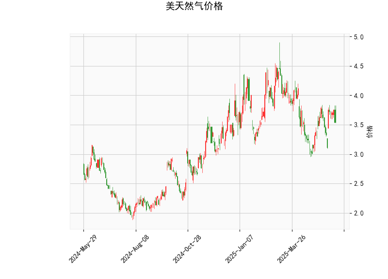

### 1. 美天然气价格的技术分析结果分析

以下是对给定技术分析指标的详细解读，这些指标 collectively 反映了美天然气价格的当前市场动态。整体来看，指标显示市场处于中性偏看涨状态，但缺乏强烈信号，投资者需谨慎观察后续发展。

- **当前价格（Current Price）**：价格为 3.539美元，位于布林带中轨（3.660）附近。这表明价格处于中性水平，没有明显偏离均值，市场波动性较低。短期内，价格可能在布林带范围内震荡，除非出现突破。

- **RSI（Relative Strength Index）**：RSI值为 49.237，接近中性水平（50）。RSI低于50表示市场未出现超卖状态，但也未超买（超买通常>70，超卖<30）。这暗示当前缺乏强烈的买卖压力，价格可能继续横盘整理。如果RSI向上突破50，可能预示轻微看涨势头。

- **MACD（Moving Average Convergence Divergence）**：MACD线为 0.0277，信号线为 0.0109，柱状图（MACD Hist）为 0.0168。正值MACD线高于信号线，表明短期移动平均线向上穿越长期移动平均线，形成看涨信号。这是一个潜在的买入提示，但柱状图值较小，表明看涨动能不强。如果MACD柱状图继续扩大，可能强化多头趋势。

- **布林带（Bollinger Bands）**：上轨为 4.365，中轨为 3.660，下轨为 2.954。当前价格（3.539）接近中轨，处于布林带的中间区域。这反映市场波动性中等，没有极端情况。如果价格向上突破上轨，可能触发强势上涨；反之，向下突破下轨则可能出现回调。目前的窄带宽度暗示短期内可能维持震荡。

- **K线形态**：
  - **CDLCLOSINGMARUBOZU**：这是一种强势蜡烛形态，通常表示价格以强势方式收盘，几乎没有上影线，暗示市场存在强烈趋势方向（看涨或看跌）。结合当前MACD看涨信号，这可能预示短期上行潜力，但需确认后续蜡烛以避免假突破。
  - **CDLMATCHINGLOW**：这表示最近两根K线的低点相同，常见于支撑位附近，可能暗示价格触及底部并潜在反转。结合RSI中性，这可能是一个短期支撑信号，投资者可关注是否形成更强的反转模式。

总体分析：美天然气价格当前处于中性偏看涨态势。RSI和布林带显示市场稳定，MACD提供轻微看涨信号，而K线形态（如CDLCLOSINGMARUBOZU）增强了短期上行动能。但整体信号不强烈，需结合基本面（如天气因素、全球能源需求）验证，避免单凭技术指标决策。

### 2. 近期可能存在的投资或套利机会和策略

基于上述技术分析，近期美天然气市场可能存在有限的投资机会，特别是针对短期多头策略。以下是针对当前指标的判断和建议策略，重点强调风险管理，因为市场不确定性较高（如季节性需求波动或地缘政治影响）。

#### 可能的投资机会
- **看涨机会**：MACD的正向交叉和CDLCLOSINGMARUBOZU形态暗示短期上行潜力。如果价格突破布林带上轨（4.365），可能触发向上趋势，投资者可考虑在3.600附近买入。RSI接近50也支持这一观点，但需警惕回调风险。
- **套利机会**：天然气市场常与原油或电力相关联。若天然气价格相对原油（如WTI原油）出现低估（当前天然气价格低于历史均值），可探索跨资产套利。例如，如果天然气价格维持在3.500-4.000区间，而原油上涨，可通过多头天然气和空头原油的组合策略获利。但需注意套利窗口短暂，需实时监控相关资产价格。
- **风险与限制**：当前指标中性，缺乏强势突破信号，机会可能较小。季节性因素（如冬季需求高峰）可能放大波动，但若RSI跌破40或MACD转为负值，机会将转向看跌。

#### 投资策略建议
- **多头策略**： 
  - **买入点**：等待价格突破布林带上轨（4.365）并确认MACD柱状图扩大。若RSI向上突破50，可在3.600以上入场。
  - **目标位**：首次目标设在4.000（上轨附近），进一步目标可到4.500（基于历史高点）。
  - **止损设置**：置于下轨（2.954）下方，如3.400以下，以控制损失。
  
- **套利策略**：
  - **跨商品套利**：若天然气价格与原油价差扩大（例如，天然气/原油比率低于历史均值），可采用多头天然气和空头原油的配对交易。使用MACD作为触发信号，当MACD正交叉时执行。
  - **波动率套利**：如果布林带收窄（当前已窄），可通过期权策略（如买入看涨期权）捕捉潜在突破。预计波动率上升时，收益更高。
  
- **风险管理与总体建议**：
  - **资金分配**：仅使用总资金的10-20%参与，优先小额测试。
  - **监控指标**：每日跟踪RSI和MACD变化，若RSI超买（>70）或MACD反转，及时退出。
  - **结合基本面**：技术分析仅为参考，需关注外部因素如美国库存数据或全球能源政策。建议新手避免短期套利，转而采用中长期多头持仓。
  - **潜在挑战**：市场易受突发事件影响，如天气变化导致需求急剧波动，投资者应准备备用计划。

总之，近期投资机会以短期多头为主，但需等待更明确信号。策略应以保守为主，强调止损和多样化，以最大化回报并最小化风险。