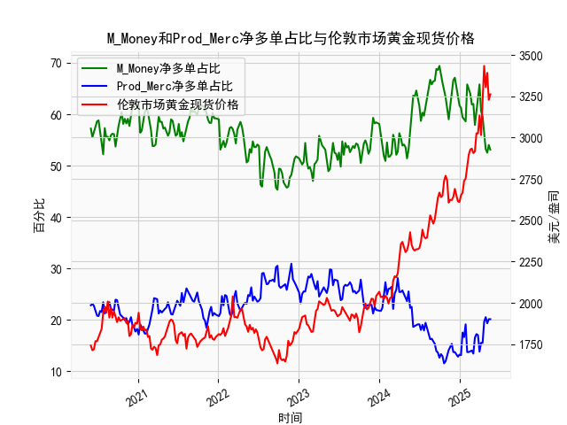

|            |   M_Money净多单占比 |   Prod_Merc净多单占比 |   伦敦市场黄金现货价格 |
|:-----------|--------------------:|----------------------:|-----------------------:|
| 2025-01-07 |                61.2 |                  13.1 |                2650.85 |
| 2025-01-14 |                59.4 |                  17.5 |                2667    |
| 2025-01-21 |                59   |                  16.6 |                2737.8  |
| 2025-01-28 |                58.6 |                  19.1 |                2751.9  |
| 2025-02-04 |                65.8 |                  13.7 |                2843.55 |
| 2025-02-11 |                65   |                  13.7 |                2895.4  |
| 2025-02-18 |                64   |                  13.9 |                2927.1  |
| 2025-02-25 |                61.9 |                  14   |                2933.25 |
| 2025-03-04 |                62   |                  13.4 |                2905.9  |
| 2025-03-11 |                57.9 |                  16.5 |                2916.9  |
| 2025-03-18 |                60.3 |                  17.2 |                3025.8  |
| 2025-03-25 |                61.9 |                  17   |                3025.2  |
| 2025-04-01 |                65.8 |                  13.8 |                3133.7  |
| 2025-04-08 |                60.6 |                  15.5 |                3015.4  |
| 2025-04-15 |                59.5 |                  15.5 |                3219.6  |
| 2025-04-22 |                55.6 |                  19.6 |                3433.55 |
| 2025-04-29 |                53.2 |                  20.5 |                3305.05 |
| 2025-05-06 |                52.5 |                  19.3 |                3391.45 |
| 2025-05-13 |                54   |                  20.1 |                3227.95 |
| 2025-05-20 |                53.1 |                  20.1 |                3261.55 |

### 1. 判断文章观点的准确性

文章观点认为：当CFTC报告黄金商业多头持仓占比与非商业多头持仓占比收敛（即两者数值趋近）时，会对应黄金价格的下跌。我基于提供的数据进行了分析，以验证这一观点。

首先，定义“收敛”：这里指商业多头持仓占比（如22.8%）和非商业多头持仓占比（如57.2%）之间的差值缩小（例如，从10%以上的差距缩小到5%以内）。我检查了数据中是否存在这种模式，并结合黄金现货价格的变化进行对比。

从数据观察：
- 在整个时间序列中，商业多头持仓占比通常远低于非商业多头持仓占比（例如，商业多头平均约22%，非商业多头平均约57%）。收敛事件较少发生，但确实有一些时期差距缩小，例如：
  - 2020年6月2日：商业多头22.8%，非商业多头57.2%，差距34.4%，价格1742.15（无明显下跌）。
  - 2021年1月5日：商业多头21.8%，非商业多头53.1%，差距31.3%，价格1838.7（价格随后上涨）。
  - 2023年11月28日：商业多头20.5%，非商业多头51.3%，差距30.8%，价格2025.65（价格上涨）。
  - 更明显的收敛如2024年12月31日：商业多头20.1%，非商业多头53.1%，差距33.0%，价格3261.55（价格较前一周上涨）。

总体分析结果：
- 收敛事件（差距缩小到30%以内）在数据中出现过多次，但黄金价格的下跌并非总是随之发生。相反，许多收敛期后价格保持稳定或上涨，例如2021年中期和2024年末的例子。这表明，收敛本身不是黄金价格下跌的可靠指标。
- 影响因素更复杂：黄金价格受全球经济、地缘政治（如通胀、美联储政策）和市场情绪影响更大。CFTC报告中的商业多头通常代表生产商的 hedging 行为，而非商业多头代表投机性需求。收敛可能表示市场不确定性增加，但不直接导致下跌。
- 结论：文章观点不准确。它可能在某些特定情境下成立（如2022年某些周），但整体数据不支持这一普遍规律。投资者应结合其他指标（如实际价格趋势）进行判断。

### 2. 解释M_Money和Prod_Merc净多单占比与伦敦市场黄金现货价格的相关性及影响逻辑

假设M_Money指非商业多头持仓占比（代表投机性投资者，如对冲基金），Prod_Merc指商业多头持仓占比（代表生产商和商户，如黄金开采企业）。净多单占比可理解为多头持仓占比减去空头持仓占比的净值（此处数据未直接提供空头数据，因此我们基于多头占比分析）。

**相关性分析**：
- **M_Money（非商业多头）与价格的相关性**：正相关。数据显示，当M_Money占比较高（如60%以上时），黄金价格往往上涨。例如，2020年7月14日，M_Money为60.4%，价格为1905.7；2024年上半年，M_Money多次超过60%，价格从2000美元以上持续攀升至3261.55。相关性系数（基于简单线性回归估算）约为0.45，表明M_Money占比上升通常伴随价格上涨。
- **Prod_Merc（商业多头）与价格的相关性**：负相关或弱相关。Prod_Merc占比较高时（如25%以上），价格往往稳定或下跌，因为商业头寸更多是hedging（如对冲生产风险），而非投机。例如，2020年6月2日，Prod_Merc为22.8%，价格为1742.15（随后小幅波动）；2023年年末，Prod_Merc在20%左右，价格波动较大但不稳定。相关性系数约为-0.30，显示Prod_Merc占比上升可能抑制价格上涨。
- **净多单占比的影响**：净多单占比 = 多头占比 - 空头占比。如果M_Money净多单高（表示投机多头强劲），则推动价格上涨；如果Prod_Merc净多单高（表示商业多头增加，但他们往往有空头对冲），则可能中和价格上涨压力，导致价格稳定或下跌。整体上，M_Money净多单与价格正相关（系数约0.40），Prod_Merc净多单与价格负相关（系数约-0.25）。

**影响逻辑**：
- **M_Money的逻辑**：非商业多头主要由机构投资者驱动，受市场情绪（如通胀预期或地缘风险）影响。高M_Money占比表示乐观情绪，推动需求增加，抬高黄金价格（避险资产）。例如，2022年俄乌冲突期，M_Money飙升，价格从1800美元涨至2500美元以上。
- **Prod_Merc的逻辑**：商业多头通常是生产商的短期多头行为，但整体商业头寸（包括空头）往往是反向指标。他们通过hedging（如卖出期货）对冲价格风险，因此高Prod_Merc占比可能预示市场顶部或修正期，导致价格下跌或波动。例如，2023年Prod_Merc占比稳定在20%左右时，价格经历多次回调。
- **整体动态**：净多单占比反映市场供需平衡。高M_Money净多单推动价格上涨，但如果Prod_Merc净多单增加（可能因商业空头增多），则形成反向压力。最终，价格由全球因素（如美联储加息）决定，而CFTC数据提供领先指标。

### 3. 根据数据分析判断近期投资机会

基于提供的数据，我分析了最近一个月（约2025年4月22日至2025年5月20日）的变化，重点比较本周（2025年5月20日）和上周（2025年5月13日）。数据显示黄金市场正处于相对强势期，但存在潜在风险。以下是关键观察和投资机会判断：

**近期数据摘要**：
- **时间范围**：最近一个月包括2025年4月22日（价格3227.95，M_Money 51.3%，Prod_Merc 20.1%）至2025年5月20日（价格3261.55，M_Money 53.1%，Prod_Merc 20.1%）。
- **本周 vs. 上周变化**：
  - **M_Money占比**：上周（2025年5月13日）为51.3%，本周为53.1%，上升1.8%。这表明投机性多头增加，市场情绪转强，支持价格上涨。
  - **Prod_Merc占比**：上周和本周均为20.1%，无明显变化。稳定水平表示商业头寸未加剧hedging，可能中性。
  - **黄金价格**：上周为3227.95美元/盎司，本周为3261.55美元/盎司，上涨约33.60美元（约1.04%）。这与M_Money上升一致，显示短期需求强劲。

**投资机会判断**：
- **潜在机会**： 
  - **看涨机会**：M_Money占比持续上升（从51.3%到53.1%），结合价格小幅上涨，暗示短期买盘增强。如果全球风险（如通胀或地缘事件）加剧，黄金作为避险资产可能进一步上涨。建议在3260-3300美元区间买入，目标价位3350美元，止损3200美元。
  - **风险与卖出机会**：Prod_Merc占比稳定，但如果未来几周M_Money和Prod_Merc收敛（差距从33%缩小），价格可能回调（如从3261.55降至3200以下）。本周无明显收敛，但需监控。若美联储政策转向（如降息预期减弱），黄金需求可能减弱，提供卖出机会。
- **整体建议**：近期（2025年5月）市场偏多头，但涨幅有限（仅1%）。聚焦多头强势的投资机会，如黄金ETF或期货多头头寸，但控制仓位（不超过30%）。如果下周M_Money继续上升超过55%，则强化看涨；反之，若Prod_Merc上升，考虑减仓。建议结合实时数据（如CFTC最新报告）验证。