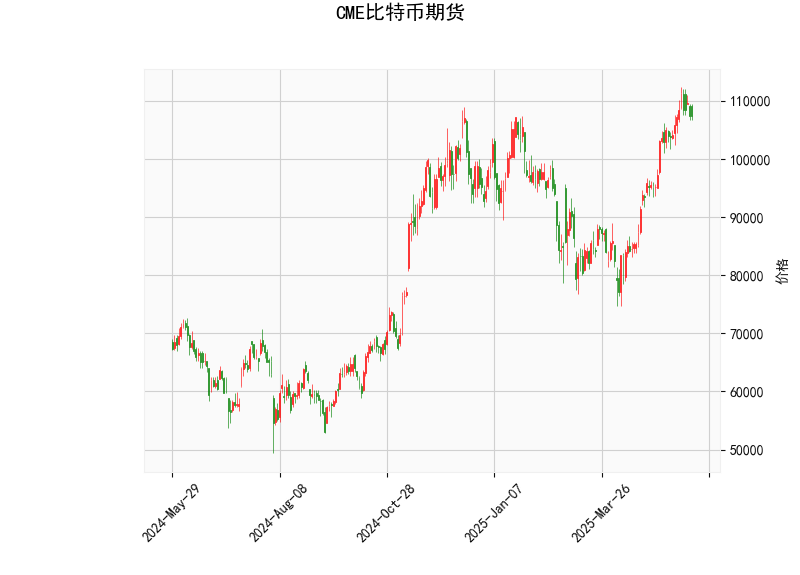

### 1. 对CME比特币期货的技术分析结果进行分析

基于提供的CME比特币期货数据，我们可以从多个技术指标角度对当前市场状况进行评估。以下是对各指标的详细分析：

- **当前价格（107335.0）**：  
  当前比特币期货价格为107335.0美元，这表明价格处于相对较高的水平。相比布林带的中间带（92206.64美元）和上带（112433.83美元），当前价格位于中间带上方，暗示市场可能处于牛市趋势中，但距离上带较近，潜在上行空间有限。如果价格进一步接近或突破上带，可能面临回调风险。

- **RSI（64.36）**：  
  RSI（相对强弱指数）值为64.36，处于中性偏强区域（一般50以上表示强势）。虽然未达到超买阈值（70以上），但已接近这一水平，这意味着市场可能存在短期回调风险。投资者需警惕潜在的卖出压力，尤其是在多头获利了结的情况下。

- **MACD指标（MACD线：4512.54，信号线：4784.97，直方图：-272.43）**：  
  MACD线低于信号线，且直方图为负值，这是一个典型的看跌信号。MACD指标显示短期动量可能正在减弱，暗示市场可能从牛市转向修正阶段。直方图的负值（-272.43）进一步强化了这一观点，表示卖方力量可能正在增强。如果MACD线继续下行，可能会确认进一步的下跌趋势。

- **布林带（上带：112433.83，中带：92206.64，下带：71979.44）**：  
  当前价格位于中带和上带之间，这反映出市场波动性适中，但偏向于上行趋势。布林带的宽度（上带与下带的差距）显示出一定的市场波动性。如果价格向上突破上带（112433.83），可能触发进一步上涨；反之，如果回落至中带以下，则可能进入盘整或下跌阶段。目前的定位提示市场处于相对稳定的牛市区间，但需注意上带作为潜在阻力位。

- **K线形态（CDLBELTHOLD、CDLLONGLINE、CDLMATCHINGLOW）**：  
  这些形态显示了近期价格行为的混合信号：  
  - **CDLBELTHOLD**（可能指Belt Hold形态）：这通常表示价格在强势趋势中维持住了，可能是一个看涨信号，暗示多头控制着市场。  
  - **CDLLONGLINE**（长线形态）：这是一个强势形态，表明近期有一条实体较大的阳线或阴线，显示市场有强烈方向性，可能支持上行趋势。  
  - **CDLMATCHINGLOW**（匹配低点形态）：这是一种看涨底部信号，通常意味着价格在触及相同低点后可能反弹，显示潜在支撑位。  
  整体来看，这些形态偏向于看涨，但需结合其他指标（如MACD的看跌信号）综合判断，避免过度乐观。

总体评估：技术指标呈现出混合信号。RSI和MACD显示市场可能超买并面临回调风险，而布林带和K线形态则暗示潜在的上行支撑。短期内，市场可能处于盘整阶段，投资者应关注价格是否突破关键水平（如布林上带）。

### 2. 分析判断近期可能存在的投资或套利机会和策略

基于上述分析，CME比特币期货市场存在一些潜在的投资和套利机会，但需谨慎对待市场的不确定性。以下是针对近期可能的机遇和策略的判断：

- **投资机会**：  
  - **看涨机会**：K线形态（如CDLMATCHINGLOW和CDLLONGLINE）显示潜在底部支撑，如果价格稳定在当前水平或向上突破布林上带（112433.83），可能迎来反弹。RSI虽接近超买，但未确认过度超买，因此适合短期多头策略，例如在支撑位（如当前价附近）买入期货合约，目标设在布林上带以上。  
  - **看跌机会**：MACD的负直方图和RSI的超买风险暗示短期回调可能。如果价格回落至布林中带（92206.64）以下，投资者可考虑做空策略，例如在107000美元附近卖出期货合约，止损设在上带上方，以捕捉修正行情。  
  总体而言，看涨机会稍占优势，但需等待确认信号，如MACD金叉（MACD线向上穿越信号线）。

- **套利机会**：  
  - **跨市场套利**：比特币期货价格（107335.0）与现货市场（如Coinbase或Binance）的价差可能存在套利空间。如果CME期货价格高于现货（正向市场），投资者可考虑在CME卖出期货，同时在现货市场买入比特币，待价差收窄后平仓获利。反之，如果出现负向市场（期货价格低于现货），则可反向操作。近期比特币波动性较高，价差可能扩大，尤其在全球经济事件（如美联储政策变动）影响下。  
  - **跨品种套利**：如果CME比特币期货与其它加密货币期货（如以太坊）之间存在相关性异常，投资者可利用比特币的强势（如K线形态所示）进行配对交易，例如在比特币期货多头头寸的同时，在相关弱势资产上做空，以捕捉市场不平衡。  

- **投资策略建议**：  
  - **短期策略**：采用“买入并持有回调”的方法——在RSI回落至60以下时买入，目标价格为布林上带以上，止损设在下带（71979.44）附近。同时，结合MACD信号，避免在直方图负值时入场。  
  - **风险管理策略**：鉴于混合信号，建议控制仓位（如不超过总资金的20%），设置严格止损（如在105000美元以下），并监控全球事件（如通胀数据或监管新闻）对比特币的影响。  
  - **套利策略**：使用算法工具监控价差，进行低风险套利交易。例如，设定自动化程序，当CME与现货价差超过1%时触发套利操作，但需注意交易成本和流动性风险。  
  - **整体风险提示**：比特币市场高度波动，RSI和MACD的看跌信号可能放大回调风险。建议结合基本面分析（如比特币ETF流入或宏观经济数据）辅助决策，避免单纯依赖技术指标。

总之，近期投资机会以短期多头为主，但套利策略更具稳定性和风险控制优势。投资者应根据个人风险偏好和市场动态调整策略。