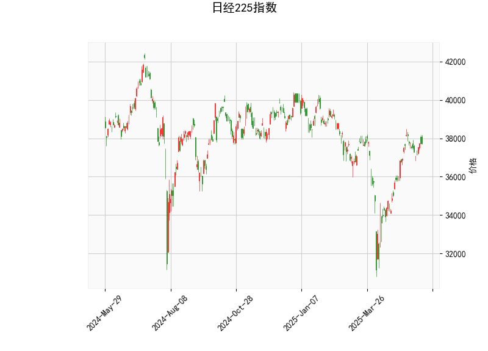

### 日经225指数技术分析结果解析

#### 1. 对技术分析结果的详细分析
以下是对日经225指数当前技术指标的逐项分析，基于提供的指标数据（当前价为37722.4）。这些指标帮助我们评估市场趋势、动量和潜在反转信号。

- **当前价格（Current Price）**:
  - 日经225指数当前报价为37722.4，位于Bollinger Bands的中轨（36269.15）和上轨（39637.19）之间。这表明价格处于中性区域，尚未出现明显的超买或超卖状态。相比中轨，当前价略高于平均水平，暗示短期内市场可能维持稳定，但若突破上轨，可能引发进一步上涨。

- **RSI（Relative Strength Index，相对强弱指数）**:
  - RSI值为60.33，这是一个中性偏上水平（RSI通常以70为超买阈值和30为超卖阈值）。RSI高于50表示买方主导，但未达到超买区，表明市场动力强劲但未过度。近期日经225可能继续上行，但如果RSI接近70，可能需要警惕回调风险。

- **MACD（Moving Average Convergence Divergence，移动平均收敛发散）**:
  - MACD线为462.28，信号线为477.50，MACD直方图（Hist）为-15.22。这显示MACD线低于信号线，形成一个负直方图，暗示短期看跌信号（称为“死叉”）。尽管MACD整体处于正值（表示长期多头趋势），但负Hist表明动量正在减弱，可能预示短期修正或回调。如果MACD线向上交叉信号线，将转为看涨。

- **Bollinger Bands（布林带）**:
  - 上轨（Upper Band）：39637.19  
  - 中轨（Middle Band）：36269.15  
  - 下轨（Lower Band）：32901.11  
    当前价（37722.4）位于中轨和上轨之间，表明价格波动处于正常范围内。布林带收窄可能表示市场即将突破（向上或向下），而当前位置偏向上轨，暗示潜在的上行压力。但如果价格回落至中轨以下，可能测试支撑水平。

- **K线形态（Candlestick Patterns）**:
  - **CDLCLOSINGMARUBOZU（收盘马拉烛）**: 这是一个强势形态，通常表示强烈的趋势延续（如果是上涨实体烛）。结合当前价，它可能反映近期买方主导的市场，但需警惕反转。
  - **CDLLONGLINE（长线）**: 表示价格出现大幅波动，实体部分较长，暗示市场情绪强烈。目前这可能对应于强势上涨，但也可能预示高位回调。
  - **CDLMATCHINGLOW（匹配低点）**: 这是一个潜在的反转信号，表明价格可能在特定低点找到支撑。如果近期价格测试该低点，它可能成为买入机会，但需结合其他指标确认。

总体而言，技术指标显示日经225指数处于多头主导的阶段（RSI和K线形态支持），但MACD的负直方图和布林带位置暗示短期回调风险。市场可能在37700-38000区间内震荡，等待突破方向确认。

#### 2. 近期可能存在的投资或套利机会和策略判断
基于上述分析，以下是对日经225指数近期投资机会的判断。日经225作为日本主要股指，其机会可能涉及股票、期货、期权或相关衍生品。策略需结合全球经济因素（如日元汇率、美联储政策）进行调整，并强调风险管理。

- **可能的投资机会**:
  - **短期多头机会**: RSI处于中性偏上且K线形态（如CDLCLOSINGMARUBOZU）显示强势，暗示如果MACD直方图转为正（即MACD线向上交叉信号线），可能迎来反弹。当前价接近布林带中轨，提供潜在支撑（约36269）。建议在37800以上买入，目标上看轨39637。若RSI未超买，日经225可能测试38000-39000区间。
  - **短期回调机会**: MACD负直方图和CDLMATCHINGLOW形态表明可能出现修正。价格若回落至中轨（36269）附近，可视为低吸机会，尤其如果全球风险偏好稳定（如美股上涨）。这适合波段交易者，预计回调幅度5-10%。
  - **套利机会**: 日经225期货或期权市场可能存在价差套利。例如，利用日经225期货与现货指数的基差（如果期货折价），或跨期套利（买入近期合约、卖出远期合约）。若日元贬值或日本央行政策利好，指数相关ETF（如EWJ）与期货间的套利窗口可能出现。当前指标显示波动性适中，适合中性策略，如期权价差交易（e.g., 买入看涨期权、卖出看跌期权）。

- **推荐策略**:
  - **多头策略**: 若MACD信号改善（直方图转为正），采用“买入并持有”策略，目标价39600（上轨）。设置止损在36200（中轨以下），仓位控制在50%以内。适用于ETF或期货投资者。
  - **回调策略**: 等待价格回落至37500以下再买入，利用CDLMATCHINGLOW作为支撑。结合RSI回落至55以下，执行“均线追踪”策略（e.g., 基于中轨动态调整）。
  - **套利策略**: 对于经验丰富的投资者，考虑“指数套利”：如果日经225现货与期货价差扩大（e.g., 基于MACD背离），进行跨市场套利。示例：买入现货指数ETF，卖出相应期货合约，锁定价差。风险较低，但需监控成交量和流动性。
  - **风险管理建议**: 所有策略均需设置止盈/止损（e.g., 止损10%）。鉴于MACD信号，短期内避免重仓。外部因素如地缘政治或经济数据（如日本CPI）可能放大波动，建议结合基本面分析。

总之，近期日经225指数存在中期多头潜力，但短期回调风险较高。投资者应优先选择波动率较低的工具（如ETF），并根据个人风险承受力调整策略。持续监控指标变化，以避免单边判断。