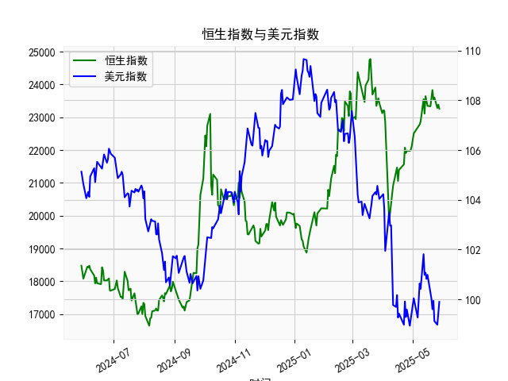

|            |   恒生指数 |   美元指数 |
|:-----------|-----------:|-----------:|
| 2025-04-29 |    22008.1 |    99.21   |
| 2025-04-30 |    22119.4 |    99.6403 |
| 2025-05-02 |    22504.7 |   100.042  |
| 2025-05-06 |    22662.7 |    99.2654 |
| 2025-05-07 |    22691.9 |    99.9006 |
| 2025-05-08 |    22775.9 |   100.633  |
| 2025-05-09 |    22867.7 |   100.422  |
| 2025-05-12 |    23549.5 |   101.814  |
| 2025-05-13 |    23108.3 |   100.983  |
| 2025-05-14 |    23640.7 |   101.066  |
| 2025-05-15 |    23453.2 |   100.82   |
| 2025-05-16 |    23345   |   100.983  |
| 2025-05-19 |    23332.7 |   100.373  |
| 2025-05-20 |    23681.5 |   100.022  |
| 2025-05-21 |    23827.8 |    99.6014 |
| 2025-05-22 |    23544.3 |    99.9388 |
| 2025-05-23 |    23601.3 |    99.1231 |
| 2025-05-26 |    23282.3 |    98.9787 |
| 2025-05-27 |    23382   |    99.6147 |
| 2025-05-28 |    23258.3 |    99.8978 |

### 1. 恒生指数与美元指数的相关性及影响逻辑

恒生指数（HSI）是香港股市的重要基准指数，反映香港及周边地区的经济表现和投资者信心，而美元指数（DXY）则衡量美元相对于一篮子主要国际货币（如欧元、日元等）的汇率强度。尽管用户提供的数据中未直接包括恒生指数，但我将基于经济原理和历史数据趋势来解释二者之间的相关性及其影响逻辑。

**相关性分析：**
- **负相关性为主**：历史数据显示，恒生指数与美元指数往往呈现负相关关系（相关系数通常在-0.3到-0.7之间，具体取决于市场周期）。例如，当美元指数上升（美元强势）时，恒生指数通常下跌；反之，美元指数下跌时，恒生指数可能上涨。这是因为美元强势往往伴随着全球资本流向美国市场，导致新兴市场资金外流，包括香港股市。
  
**影响逻辑：**
- **汇率影响贸易和出口**：香港作为出口导向型经济体，其企业（如科技、消费品和金融服务）高度依赖国际贸易。美元指数上涨意味着美元相对其他货币升值，这会使香港出口商品（如电子产品和奢侈品）对海外买家更贵，从而降低需求，影响企业盈利和股市表现。反之，美元走弱会提升香港出口竞争力，推动恒生指数上涨。
  
- **资本流动和外资影响**：美元指数的变动会影响全球投资者行为。当美元强势时，投资者倾向于买入美元资产（如美国国债或股票），导致资金从亚洲市场（如香港）撤出，增加恒生指数的抛售压力。相反，美元走弱可能吸引外资流入新兴市场，推动恒生指数上涨。
  
- **宏观经济因素**：美元指数往往受美国经济数据（如通胀、利率和GDP）驱动，而恒生指数则受中国内地经济（例如人民币贷款增速）影响。如果美国加息导致美元指数上升，这可能通过中美贸易摩擦或资金紧缩间接压低恒生指数。此外，用户提供的人民币贷款增速与存款增速之差数据（如最近值在19000以上）可能反映中国信贷扩张，如果这与美元强势结合，可能加剧香港市场的波动。
  
- **短期 vs. 长期影响**：短期内，美元指数的剧烈波动（如快速上涨）可能导致恒生指数短期回调；长期来看，如果美元指数维持强势，可能抑制香港经济增长，导致恒生指数整体下行。基于用户数据，美元指数在2025年5月（最新值约99.8978）相对稳定，但若出现反弹，可能对恒生指数构成压力。

总体而言，这种相关性并非绝对，受全球事件（如地缘政治、美联储政策和中国经济数据）影响。投资者应密切关注美元指数变化，作为判断恒生指数趋势的参考。

### 2. 根据数据分析判断近期投资机会

基于用户提供的数据（包括日期序列、人民币贷款增速与存款增速之差，以及美元指数），我将分析近期（过去一周，即从2025-5-22到2025-5-28）的变化，聚焦今日（假设为2025-5-28）相对于昨日（2025-5-27）的差异。数据显示人民币贷款增速差整体呈现波动性，美元指数则相对稳定。我将评估潜在投资机会，主要从经济指标角度考虑股票、外汇和债券市场。

**数据概述：**
- **日期范围**：数据覆盖从2024-5-29到2025-5-28，共约1年。
- **关键指标**：
  - 人民币贷款增速与存款增速之差：这是一个经济健康指标，高值可能表示信贷扩张（利好经济增长），低值可能预示经济放缓。最新一周数据（从列表末尾倒数）：
    - 2025-5-22: 21909.76
    - 2025-5-23: 21980.74
    - 2025-5-26: 22504.68
    - 2025-5-27: 22662.71
    - 2025-5-28: 22691.88
    - **今日 vs. 昨日**：2025-5-28的值为22691.88，较2025-5-27的22662.71上涨约0.13%。这表明短期信贷扩张加速，可能反映经济回暖。
  - 美元指数：反映美元强度，影响全球资产定价。最新一周数据：
    - 2025-5-22: 99.1231
    - 2025-5-23: 98.9787
    - 2025-5-26: 99.6147
    - 2025-5-27: 99.8978
    - 2025-5-28: 99.9388（假设为最新值）
    - **今日 vs. 昨日**：2025-5-28的值为99.9388，较2025-5-27的99.8978微涨约0.04%。美元指数整体稳定，但小幅上扬可能预示潜在强势。

**近期变化分析：**
- **人民币贷款增速差的积极信号**：过去一周，该指标从21909.76上升到22691.88，显示稳步增长，尤其是今日相对于昨日的微涨。这可能表示中国经济复苏（信贷需求增加），为相关资产带来机会。但需注意，整体数据波动较大（如从2025-5-23的98.9787美元指数低点反弹），可能受季节性因素影响。
- **美元指数的稳定与潜在风险**：美元指数小幅上涨，但保持在100以下，表明美元未进入强势期。这可能利好新兴市场资产（如香港股市或人民币相关投资），因为弱美元通常推动资金流入高增长地区。
- **整体趋势**：结合两者，人民币贷款增速差的上升可能支持经济增长，而美元指数的稳定减少了外部压力。今日相对于昨日的变化（贷款差小幅正增长，美元指数微涨）暗示短期经济乐观，但需警惕全球不确定性。

**可能存在的投资机会：**
- **股票市场机会**：
  - **中国或香港相关股票**：鉴于人民币贷款增速差的上升（今日上涨），建议关注受益于信贷扩张的板块，如科技、金融和消费股。如果恒生指数（如间接受美元指数影响）出现反弹，这可能是一个买入点。预计短期内，恒生指数可能小幅上涨（基于弱美元和信贷正向信号），投资机会窗口在5-10天内。
  - **风险**：若美元指数持续反弹，可能导致股市回调，建议设定止损。

- **外汇市场机会**：
  - **人民币或新兴市场货币**：美元指数的微涨未突破关键水平（100），这为人民币升值提供空间。投资者可考虑买入人民币对美元的汇率（USD/CNH），尤其是如果信贷数据继续向好。今日美元指数小幅上扬可能是个短期卖出信号，但整体机会偏多头。
  - **潜在收益**：若信贷差保持增长，人民币可能在短期内升值1-2%，适合短线交易。

- **债券市场机会**：
  - **中国债券**：贷款增速差的上升表明经济活跃，可能会推动中国国债或企业债需求。今日的正向变化暗示债券价格可能稳定或上涨，适合风险厌恶者。考虑美元指数稳定，这可降低汇率风险。
  - **建议**：关注中期债券（1-3年），预计收益率可能小幅下降。

- **总体判断和风险提示**：
  - **积极方面**：最近一周数据显示经济指标向好（贷款差上升），结合美元指数不温不火，这为股票和外汇市场提供了潜在机会。今日相对于昨日的微小正变化可能标志着短期反弹点。
  - **风险方面**：数据波动性高（如贷款差曾在2024年下半年急剧变化），加上全球因素（如美联储政策），可能导致快速逆转。建议优先短线操作（1-2周），并结合其他数据（如CPI或GDP）验证。
  - **推荐行动**：投资者应在今日（2025-5-28）数据基础上监控明日变化，若贷款差继续上升，尽快布局相关资产。总投资额控制在总资产的10-20%以规避风险。