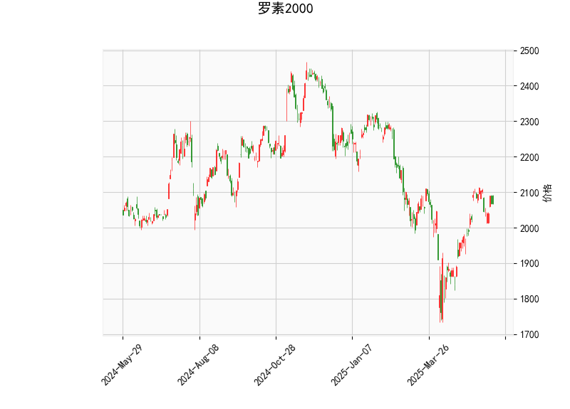

### 罗素2000指数技术分析结果详解

#### 1. 对技术指标的整体分析
罗素2000指数（Russell 2000）当前价格为2067.80，基于提供的指标，我们可以从多个维度评估其市场态势。以下是对各指标的逐一分析，并结合整体市场情境进行解读：

- **RSI（Relative Strength Index，相对强弱指数）**：当前RSI值为55.82，这表明指数处于中性区域（RSI通常在30-70之间被视为中性）。RSI高于50但未超过70，暗示近期买方力量略占上风，但尚未进入超买状态（超买阈值为70以上）。这反映出市场可能维持平稳，但如果RSI继续上升，可能预示短期上行潜力。

- **MACD（Moving Average Convergence Divergence，移动平均收敛散度）**：MACD线值为23.60，信号线值为25.44，直方图（MACD Hist）为-1.83（负值）。MACD线低于信号线，显示出短期看跌信号，这通常表示动量正在减弱，可能伴随小幅回调。然而，MACD值的差距较小（仅约1.84点），且整体水平处于正值，这意味着回调可能只是暂时的修正，而非强烈反转。如果MACD线向上交叉信号线，将成为潜在的多头信号。

- **布林带（Bollinger Bands）**：当前价格2067.80位于中间带（1998.77）和上带（2177.23）之间，具体处于中轨上方约69点。这表明指数在近期波动中保持相对强势，中轨（1998.77）作为动态支撑位，价格的当前位置暗示市场稳定且有上行空间。如果价格突破上带（2177.23），可能触发进一步上涨；反之，如果跌破中轨，可能测试下带（1820.31）作为支撑。布林带的收窄或扩张趋势需进一步观察，以判断波动率变化。

- **K线形态**：提供的K线形态包括CDLBELTHOLD、CDLCLOSINGMARUBOZU、CDLLONGLINE、CDLMARUBOZU和CDLMATCHINGLOW。这些形态整体显示出强势趋势和潜在支撑：
  - **CDLBELTHOLD和CDLMARUBOZU**：这些形态通常表示趋势延续，特别是强势多头，暗示买方控制了市场。
  - **CDLCLOSINGMARUBOZU和CDLLONGLINE**：强调了价格的强势移动，可能反映出强烈的上行势头或快速收盘。
  - **CDLMATCHINGLOW**：这暗示了潜在的支撑位，可能在价格回调时提供买入机会。
  
  总体上，这些K线形态偏向多头，结合RSI和布林带，显示罗素2000指数可能正处于一个巩固阶段，尽管MACD显示轻微弱势。市场可能在短期内维持上行趋势，但需警惕外部因素如经济数据或美联储政策的影响。

综合分析：罗素2000指数当前显示出中性偏多的态势。RSI和K线形态支持潜在的上行，而MACD的负直方图提醒短期回调风险。整体而言，指数可能在2060-2180区间震荡，如果多头形态持续，这一区间可能成为积累多头头寸的机会。

#### 2. 近期可能的投资或套利机会及策略判断
基于上述分析，罗素2000指数的近期机会主要聚焦于短期波动和趋势延续。罗素2000作为小型股指数，往往对经济增长和风险偏好敏感，以下是针对当前指标的判断和策略建议：

- **可能的机会**：
  - **短期投资机会**：指数当前价格处于布林带中轨上方，K线形态显示强势，暗示潜在的上行空间（目标可能向2177附近测试）。如果RSI继续上升至60以上，或MACD线向上交叉信号线，这可能触发买入机会。另一方面，CDLMATCHINGLOW形态提供潜在支撑，如果价格回调至2000附近，这可视为低吸点。
  - **套利机会**：罗素2000指数的期货或期权合约（如IWM ETF相关衍生品）可能存在跨市套利机会。例如，如果现货价格与期货价格出现偏差（如基于MACD的短期弱势导致期货滞后），投资者可通过期货-现货套利获利。但需注意，当前市场波动性中等，套利窗口可能短暂，且需监控经济数据（如CPI或就业报告）以避免突发风险。
  - **整体市场情境**：作为小型股代表，罗素2000可能受益于经济复苏（如通胀缓解或利率下行），但MACD的弱势提醒了通胀或地缘风险的潜在影响。近期机会偏向多头，但回调风险需重视。

- **投资策略建议**：
  - **多头策略**：在当前RSI中性且K线强势的情况下，建议在价格回调至中轨（约2000）附近买入Russell 2000相关ETF（如IWM）或指数基金。目标位可设在上带（2177）附近，止损设在中轨下方（约1980），以控制风险。结合MACD，如果直方图转为正值，可加仓。
  - **套利策略**：利用衍生品进行跨期套利，例如在现货强势（K线形态支持）时，买入近月期货并卖出远月期货，以捕捉价格收敛。或通过期权策略（如买入看涨期权、卖出看跌期权）来对冲MACD弱势风险，目标是锁定短期波动收益。风险控制点：若RSI突破70，考虑部分平仓以避免超买回调。
  - **风险管理建议**：优先使用技术指标组合（如RSI + MACD确认信号），并结合基本面因素（如美国经济数据）。建议仓位控制在总资产的20-30%以内，设置动态止损（如基于布林带下轨）。如果市场出现大幅回调（价格跌破1820），转向观望或转向防御性资产。

总之，近期罗素2000指数的投资机会以多头为主，但需警惕MACD的短期信号。投资者应根据个人风险承受能力和市场动态调整策略，保持谨慎乐观。