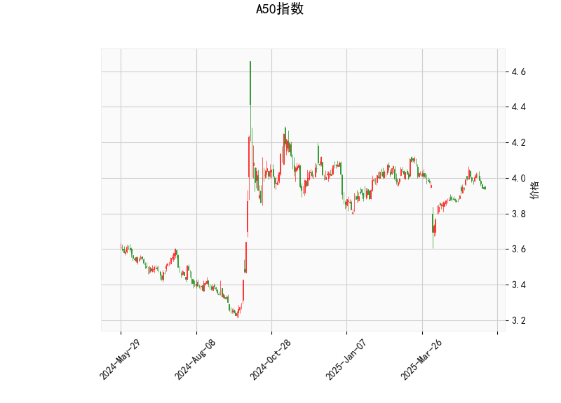

### A50指数技术分析结果分析

#### 1. 对技术分析结果的详细解读
基于提供的A50指数技术指标数据，以下是对各指标的逐一分析，帮助理解当前市场的技术面状况：

- **当前价格（Current Price）**：当前价格为3.942，位于布林带中轨（Middle Band，3.951）的附近。这表明价格处于相对中性的位置，没有明显偏离均值，市场可能在短期内保持盘整状态。如果价格持续靠近中轨，可能会测试上轨（4.134）或下轨（3.769）的支撑/阻力。

- **RSI（Relative Strength Index）**：RSI值为47.08，这是一个中性水平（低于50）。RSI低于30通常表示超卖状态，而高于70表示超买。目前的RSI显示市场力量相对均衡，但略微偏弱，暗示短期内可能缺乏强势上涨的动力。如果RSI进一步下降至30以下，可能会出现超卖反弹机会。

- **MACD（Moving Average Convergence Divergence）**：MACD线值为0.0108，信号线值为0.0171，柱状图（Histogram）为-0.0063。这显示MACD线处于信号线之下，形成了一个负向直方图，暗示短期趋势可能转为看跌。MACD是动量指标，当柱状图为负时，通常表示卖出信号或价格可能进一步下行。投资者需关注MACD是否会死叉（MACD线下穿信号线），这可能加剧下行压力。

- **布林带（Bollinger Bands）**：上轨为4.134，中轨为3.951，下轨为3.769。当前价格（3.942）紧邻中轨，表明市场波动性适中，没有极端扩张或收缩。如果价格跌破下轨（3.769），可能触发超卖信号；反之，如果向上突破上轨（4.134），则可能出现强势上涨。整体上，布林带显示价格在均值附近震荡，适合观察潜在的均值回归机会。

- **K线形态**：形态为“CDLMATCHINGLOW”（匹配低点模式），这是一个典型的看跌反转形态，通常表示价格可能在短期内继续下探或测试支撑位。该形态出现时，市场往往处于弱势整理阶段，投资者应警惕进一步的下跌风险，如价格跌向布林带下轨。

总体而言，A50指数的技术指标显示当前市场处于中性偏弱状态。RSI和布林带的中性位置表明短期无明显趋势，而MACD的负直方图和CDLMATCHINGLOW形态增加了看跌风险。市场可能在盘整后出现方向性选择，如果外部因素（如经济数据或全球事件）介入，可能会放大波动。

#### 2. 近期可能存在的投资或套利机会和策略判断
基于上述技术分析，以下是对A50指数近期投资或套利机会的判断。需要强调的是，投资决策应结合基本面、市场情绪和风险管理，技术分析仅作为参考。机会评估基于当前指标的弱势信号，但也考虑潜在的反弹可能性。

##### 潜在投资机会
- **看跌机会主导**：当前MACD负直方图和CDLMATCHINGLOW形态暗示短期下行风险较大。如果价格跌破布林带下轨（3.769），可能形成更强的卖出信号，投资者可考虑在3.900-3.800区间布局看跌头寸（如卖空或买入看跌期权）。预计下行空间有限，可能至3.700附近（基于历史支撑）。
  
- **反弹机会存在**：RSI处于中性（47.08），接近超卖边缘，如果市场出现技术性反弹（如MACD金叉或价格触及下轨），可视为买入点。尤其在全球市场稳定或A50相关经济数据向好的情况下，价格可能回升至中轨（3.951）以上，目标上看至4.000-4.100。

- **风险评估**：整体机会偏向保守。看跌机会的胜率较高，但需防范突发反弹（如政策刺激）。投资者应设定止损位，例如在价格回升至4.000以上时退出。

##### 潜在套利策略
套利策略通常涉及利用市场 inefficiencies，如跨品种或跨市场价差，但基于A50指数的技术数据，以下建议聚焦于衍生品和短期操作：
  
- **卖空套利（Short Selling Strategy）**：鉴于MACD和K线形态的看跌信号，可在当前价位（3.942）附近建立卖空头寸，目标下探至布林带下轨（3.769）。如果A50期货或期权市场出现价差（如现货 vs. 期货），可结合套利。例如，卖空A50期货的同时买入相关资产（如中国股指ETF）以对冲，预计收益在1-3%（基于波动率）。风险点：如果RSI跌至30以下，可能触发反弹，需设置止损在3.950以上。

- **期权套利（Options Arbitrage Strategy）**：买入看跌期权（Put Option）作为保护性策略，或进行牛市价差套利（Bull Put Spread）。例如，在当前价位买入3.900行权价的看跌期权，卖出3.700行权价的看跌期权，利用隐含波动率差异获利。潜在机会：如果市场波动性上升（布林带扩张），期权价格可能放大，收益可达2-5%。策略要点：监控MACD信号线，如果转为正向，及时平仓。

- **均值回归套利（Mean Reversion Strategy）**：价格靠近布林带中轨，适合均值回归操作。买入在下轨附近（3.769以下）的多头头寸，同时卖出在上轨附近的空头头寸，形成跨期套利。如果价格回归中轨（3.951），可获利1-2%。适用于波动率较低的盘整期，但需结合RSI确认，避免在弱势市场过度操作。

##### 总体策略建议
- **风险管理优先**：近期策略应以短线操作为主，控制仓位在30-50%，并设置严格的止盈/止损（如5-10%的波动范围）。例如，买入信号可待MACD金叉或RSI>50时触发。
- **市场环境影响**：A50指数受中国经济和全球风险事件影响，如果有正面催化剂（如CPI数据改善），看涨机会可能增加；反之，地缘政治风险可能放大看跌信号。
- **适用人群**：适合经验丰富的交易者或机构投资者，散户可通过跟踪指数基金间接参与，避免单一技术指标决策。

最终，投资机会需结合实时数据和个人风险偏好调整，本分析仅供参考。