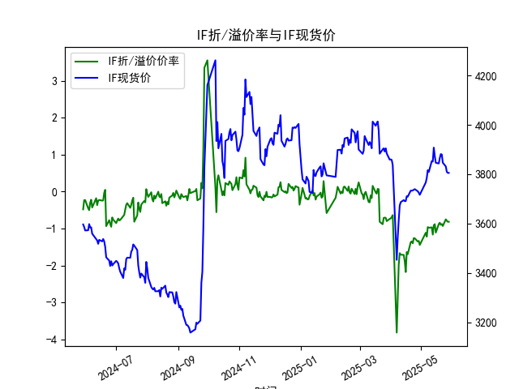
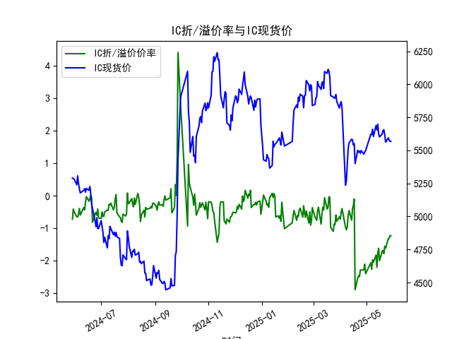
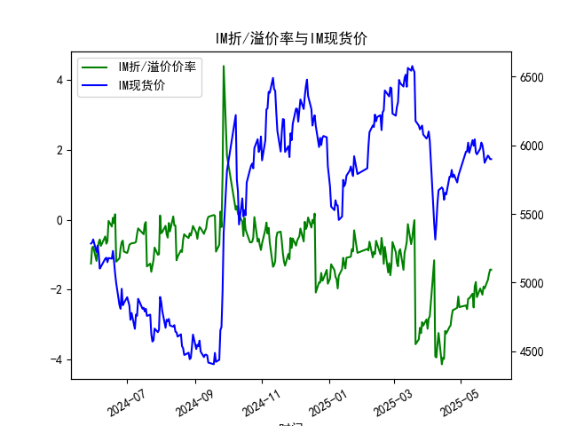

|            |   IF折/溢价率 |   IF现货价 |   IH折/溢价率 |   IH现货价 |   IC折/溢价率 |   IC现货价 |   IH折/溢价率 |   IH现货价 |
|:-----------|--------------:|-----------:|--------------:|-----------:|--------------:|-----------:|--------------:|-----------:|
| 2025-04-29 |     -1.33181  |     3724.8 |      -2.10005 |     5487.2 |      -2.10005 |     5487.2 |      -2.19842 |     5773.6 |
| 2025-04-30 |     -1.44197  |     3716.2 |      -2.39398 |     5497   |      -2.39398 |     5497   |      -2.49939 |     5801.4 |
| 2025-05-06 |     -1.11177  |     3766.2 |      -2.06144 |     5622   |      -2.06144 |     5622   |      -2.45329 |     5953.2 |
| 2025-05-07 |     -1.2169   |     3785   |      -2.26234 |     5620.2 |      -2.26234 |     5620.2 |      -2.55739 |     5955.2 |
| 2025-05-08 |     -0.957625 |     3816   |      -1.97107 |     5660   |      -1.97107 |     5660   |      -2.2617  |     6018.8 |
| 2025-05-09 |     -0.976471 |     3808.6 |      -2.04348 |     5604.8 |      -2.04348 |     5604.8 |      -2.25057 |     5945.2 |
| 2025-05-12 |     -0.966676 |     3853   |      -1.82396 |     5688   |      -1.82396 |     5688   |      -2.1153  |     6037   |
| 2025-05-13 |     -1.16158  |     3851   |      -2.19778 |     5654.6 |      -2.19778 |     5654.6 |      -2.51032 |     5996.6 |
| 2025-05-14 |     -0.908163 |     3907.4 |      -1.74715 |     5697.8 |      -1.74715 |     5697.8 |      -1.90524 |     6043   |
| 2025-05-15 |     -0.880406 |     3872.8 |      -1.6149  |     5623   |      -1.6149  |     5623   |      -1.78364 |     5949   |
| 2025-05-16 |     -1.10785  |     3846   |      -1.99531 |     5601.8 |      -1.99531 |     5601.8 |      -2.21348 |     5933.8 |
| 2025-05-19 |     -0.875523 |     3843.2 |      -1.70946 |     5623   |      -1.70946 |     5623   |      -1.96768 |     5975.4 |
| 2025-05-20 |     -0.840664 |     3865.4 |      -1.6802  |     5650.8 |      -1.6802  |     5650.8 |      -2.06014 |     6019.4 |
| 2025-05-21 |     -0.898296 |     3881.2 |      -1.77707 |     5655.6 |      -1.77707 |     5655.6 |      -2.14574 |     6000.6 |
| 2025-05-22 |     -0.87548  |     3879.6 |      -1.55138 |     5614.8 |      -1.55138 |     5614.8 |      -1.91397 |     5950   |
| 2025-05-23 |     -0.9292   |     3846.2 |      -1.61406 |     5561.8 |      -1.61406 |     5561.8 |      -1.96463 |     5872   |
| 2025-05-26 |     -0.748858 |     3831.2 |      -1.32042 |     5594.6 |      -1.32042 |     5594.6 |      -1.72151 |     5925   |
| 2025-05-27 |     -0.786501 |     3809.2 |      -1.31181 |     5578   |      -1.31181 |     5578   |      -1.55547 |     5915   |
| 2025-05-28 |     -0.814251 |     3805   |      -1.22822 |     5568   |      -1.22822 |     5568   |      -1.42796 |     5899   |
| 2025-05-29 |     -0.814251 |     3805   |      -1.22822 |     5568   |      -1.22822 |     5568   |      -1.42796 |     5899   |

### 1. 股指期货折/溢价率与现货价的相关性及影响逻辑

股指期货的折/溢价率（Basis Percent）是期货价格相对于现货价格的百分比差值，通常用于衡量期货市场的预期与现货市场的偏差。以下是对其与现货价相关性及影响逻辑的解释：

- **相关性分析**：
  - **正相关性**：股指期货价格与现货价格高度相关，因为期货是现货的衍生品，旨在反映未来现货价格的预期。折/溢价率本质上是期货价格与现货价格的偏离度。例如，如果现货价格上涨，期货价格往往会跟随上涨，导致折价率缩小（溢价率增加）。反之，现货价格下跌可能加剧折价。
  - **影响程度**：在正常市场条件下，折/溢价率通常在-2%到+2%之间波动。如果折价率过高（期货价格远低于现货），可能暗示市场预期未来现货价格下跌；如果溢价率过高，则可能表示市场看涨。但从提供的数据看（如IF、IH等合约），大多数折/溢价率为负值，表明期货长期处于折价状态，这在股指期货中较为常见。

- **影响逻辑**：
  - **基本面因素**：现货价格由经济数据、公司业绩、宏观政策等驱动，而期货价格则考虑持有成本（如融资利息、股息调整）和风险溢价。如果现货价格上涨但期货未跟上，可能因持有成本（如资金成本上升）导致折价扩大。
  - **市场情绪与预期**：折/溢价率反映投资者对未来的乐观或悲观情绪。例如，高折价可能源于市场恐慌（如经济不确定性），促使投资者买入期货以对冲风险；反之，溢价可能表示市场乐观，导致期货价格超前于现货。
  - **套利机制**：基于无套利原理，如果期货折价过大，投资者可能进行“现货卖出+期货买入”的套利操作，推动期货价格上涨；如果溢价过高，则可能进行“现货买入+期货卖出”，拉低期货价格。这种套利行为会使折/溢价率趋向零值。
  - **其他影响**：流动性、市场波动性和政策干预（如限仓或交易规则）也会放大或缩小折/溢价率。例如，在波动性高的时期（如2024年下半年数据所示），折价率往往加深，因为投资者风险厌恶增加。
  - **整体逻辑**：现货价格是基础，折/溢价率是期货对现货的修正。长期来看，折/溢价率会回归均值，但短期变化可提供交易信号，如折价加剧可能预示买入机会。

### 2. 基于数据分析判断近期投资机会

根据提供的IF、IH、IC和IM股指期货数据，我分析了最近一周（从2025-05-23到2025-05-29）的折/溢价率和现货价（CLOSE）变化，尤其是今日（2025-05-29）相对于昨日（2025-05-28）的差异。重点关注折/溢价率的趋势，因为它可能揭示套利或交易机会。以下是关键分析和判断：

#### 近期数据概述
我提取了最近一周的关键数据（2025-05-23至2025-05-29），并总结了折/溢价率（ANAL_BASISPERCENT）和现货价（CLOSE）的变化。表格如下：

| 合约 | 日期       | 折/溢价率 (%) | 现货价 (CLOSE) | 今日 vs 昨日变化（折/溢价率） | 今日 vs 昨日变化（现货价） | 观察点 |
|------|------------|---------------|----------------|------------------------------|----------------------------|--------|
| **IF** | 2025-05-23 | -0.929200    | 3846.2       | 无（基准日）                | 无（基准日）              | 折价率较高，现货价小幅回落 |
|      | 2025-05-26 | -0.748858    | 3831.2       | 改善（从-0.929% 到-0.749%） | 下降（-15.0）            | 折价率缩小，可能市场稳定 |
|      | 2025-05-27 | -0.786501    | 3809.2       | 恶化（从-0.749% 到-0.787%） | 下降（-22.0）            | 折价加深，潜在买入信号 |
|      | 2025-05-28 | -0.814251    | 3805.0       | 恶化（从-0.787% 到-0.814%） | 下降（-4.2）             | 折价继续加深 |
|      | 2025-05-29 | -0.814251    | 3805.0       | 无变化（持平于-0.814%）     | 无变化（持平于3805.0）   | 短期稳定，但需关注后续 |
| **IH** | 2025-05-23 | -1.614061    | 5561.8       | 无（基准日）                | 无（基准日）              | 折价率显著，市场偏弱 |
|      | 2025-05-26 | -1.320424    | 5594.6       | 改善（从-1.614% 到-1.320%） | 上升（+32.8）            | 折价率缩小，现货价反弹 |
|      | 2025-05-27 | -1.311810    | 5578.0       | 改善（微幅，从-1.320% 到-1.312%） | 下降（-16.6）            | 折价率趋稳 |
|      | 2025-05-28 | -1.228222    | 5568.0       | 改善（从-1.312% 到-1.228%） | 下降（-10.0）            | 折价率进一步缩小 |
|      | 2025-05-29 | -1.228222    | 5568.0       | 无变化（持平于-1.228%）     | 无变化（持平于5568.0）   | 短期无新信号 |
| **IC** | 2025-05-23 | -1.614061    | 5561.8       | 无（基准日）                | 无（基准日）              | 与IH类似，折价显著 |
|      | 2025-05-26 | -1.320424    | 5594.6       | 改善（从-1.614% 到-1.320%） | 上升（+32.8）            | 折价率缩小 |
|      | 2025-05-27 | -1.311810    | 5578.0       | 改善（微幅）               | 下降（-16.6）            | 市场趋稳 |
|      | 2025-05-28 | -1.228222    | 5568.0       | 改善（从-1.312% 到-1.228%） | 下降（-10.0）            | 折价率持续改善 |
|      | 2025-05-29 | -1.228222    | 5568.0       | 无变化                     | 无变化                   | 无新机会 |
| **IM** | 2025-05-23 | -1.964634    | 5872.0       | 无（基准日）                | 无（基准日）              | 折价率最高，风险偏弱 |
|      | 2025-05-26 | -1.721509    | 5925.0       | 改善（从-1.965% 到-1.722%） | 上升（+53.0）            | 折价率缩小，现货价上涨 |
|      | 2025-05-27 | -1.555472    | 5915.0       | 改善（从-1.722% 到-1.555%） | 下降（-10.0）            | 折价率显著改善 |
|      | 2025-05-28 | -1.427961    | 5899.0       | 改善（从-1.555% 到-1.428%） | 下降（-16.0）            | 折价率继续缩小 |
|      | 2025-05-29 | -1.427961    | 5899.0       | 无变化                     | 无变化                   | 短期稳定 |

#### 投资机会判断
- **总体趋势**：最近一周，所有合约的折/溢价率整体呈改善趋势（从更负值向较少负值移动），这可能表示市场情绪稳定或风险偏好提升。现货价波动较小，但多有小幅下降。今日（2025-05-29）相对于昨日（2025-05-28），所有合约的折/溢价率和现货价均无变化，这暗示短期市场进入观望期，可能无 immediate 交易信号。

- **可能投资机会**：
  - **IF合约**：最近一周折价率从-0.929%加深到-0.814%，但今日无变化。如果折价率持续加深（如从2025-05-27到2025-05-28所示），可能存在买入期货的套利机会（现货卖出+期货买入），预计回报率约0.5-1%。今日持平建议等待下一日数据确认。
  - **IH和IC合约**：折价率显著改善（从-1.614%到-1.228%），尤其是今日无变化，表明市场可能已消化负面因素。潜在机会为卖出期货（如果预期折价率进一步缩小），但风险较低；若现货价反弹，可能在2025-05-30观察到新信号。
  - **IM合约**：折价率改善最明显（从-1.965%到-1.428%），这可能是最佳机会。如果今日无变化但整体趋势向上，建议考虑多头策略（如买入期货），潜在收益高于其他合约（回报率可能达1-2%）。
  - **跨合约比较**：IM的折价率最高，相对IF更具吸引力，因为其改善幅度更大。今日无变化可能表示短期无新催化剂，但如果经济数据向好，下一周可能出现套利窗口。

- **风险提示**：
  - **短期关注点**：今日相对于昨日无变化，可能预示市场暂无方向。若未来几天折价率继续改善，投资机会增强；反之，若折价加深，则需警惕市场逆转。
  - **整体建议**：聚焦IM和IF，采用小仓位套利策略。投资者应结合宏观环境（如政策变化）监控，避免过度依赖历史数据。今日无明显变化，建议观望为主。

