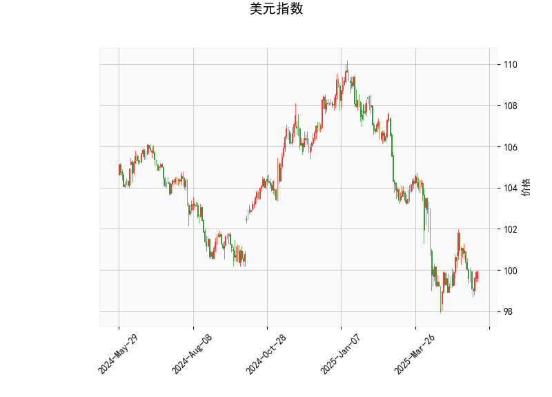

### 1. 美元指数的技术分析结果解读

美元指数当前价位为99.8978，整体呈现出中性偏弱的态势，以以下关键指标为基础进行分析：

- **RSI（相对强弱指数）**：当前值为46.60，处于中性区域（RSI在30-70之间通常被视为中性）。该值低于50表明美元指数短期内可能处于弱势状态，但尚未进入超卖区（低于30），因此不排除短期反弹的可能性。投资者需关注RSI是否向上突破50，这可能预示着趋势逆转。

- **MACD（移动平均收敛散度）**：MACD线值为-0.3784，信号线值为-0.4150，MACD直方图（Hist）值为0.0366（正值）。MACD线高于信号线且Hist正向，显示出潜在的看涨信号（如金叉形成），暗示短期内可能出现向上交叉。然而，整体MACD值为负，表明美元指数仍处于熊市区间。这反映出卖方力量占优，但多头可能在酝酿反击。如果MACD线继续向上，美元指数或迎来短期反弹。

- **Bollinger Bands（布林带）**：上轨为105.40，中轨为101.40，下轨为97.41。当前价99.90位于下轨（97.41）和中轨（101.40）之间，接近中轨。这表明价格处于相对低位，可能已接近超卖状态，潜在反弹风险增加。如果价格向上突破中轨，将是多头信号；反之，若跌破下轨，则可能进一步走弱。

- **K线形态**：当前K线形态为空（无特定模式），这意味着短期内缺乏明显的蜡烛图信号（如锤头或吞没形态）。投资者应结合其他指标观察后续形态变化。

总体而言，美元指数显示出弱势但潜在反弹的迹象。短期内（可能1-2周），若MACD金叉确认和RSI向上反弹，美元指数可能小幅走强；但如果RSI跌破30或价格跌破下轨，将加剧下行压力。全球市场需警惕美元波动对汇率和资产的影响。

### 2. 基于美元指数分析判断近期A股和港股的投资或套利机会及策略

美元指数的弱势（结合RSI和MACD的信号）通常对新兴市场有利，尤其是A股和港股，因为美元走弱可能推动资金流入这些市场，推动人民币相对走强，从而提振相关资产价格。然而，当前美元指数的潜在反弹迹象（如MACD Hist正向）增加了不确定性，可能导致短期资金外流或波动加剧。以下是针对近期（1-3个月内）的分析和建议：

#### 投资机会分析
- **对A股的影响**：A股（中国大陆股票市场）与美元指数负相关较强。如果美元指数维持弱势或反弹有限，A股可能受益于外资流入和人民币升值，尤其是在科技、消费和新能源板块。这些板块（如上证指数中的龙头股）往往在新兴市场资金回流时表现活跃。当前美元弱势暗示A股短期内可能有反弹机会，但若美元反弹（如突破中轨），A股易受出口股和周期股拖累，整体风险偏好可能降低。
  
- **对港股的影响**：港股（恒生指数等）作为国际化和连接内地市场的桥梁，更直接受美元波动影响。美元弱势可能吸引外资买入H股（如腾讯、阿里等中概股），带来估值修复机会。但美元潜在反弹可能加剧港股波动，特别是H股与A股的联动效应下。如果美元走强，港股的国际资金可能流向美元资产，导致短期下行压力。

- **潜在投资机会**：
  - **反弹机会**：如果美元指数未能强势反弹，A股和港股可能迎来中期上涨窗，如A股科技股或港股消费股受益于国内经济复苏。
  - **套利机会**：中港套利（如A股与H股的价差套利）值得关注。例如，A股某公司股价高于其H股对应股时，可考虑卖出A股并买入H股（或反之），利用两地市场估值差异获利。当前美元弱势环境下，H股相对A股更具吸引力，因为港股流动性更好且更容易受国际资金影响。

#### 投资策略建议
- **短期策略（1-2周）**：
  - **观望为主**：鉴于美元指数的MACD潜在金叉，建议先观察。若美元反弹确认（如RSI>50），则短期内可能对A股和港股不利，优先采取防御性策略，如减持高贝塔股（波动率高的股票）。
  - **针对A股**：选择低估值蓝筹股（如银行、保险）作为防守型投资，或买入ETF（如沪深300 ETF）以捕捉潜在反弹。避免追高科技股，除非美元弱势持续。
  - **针对港股**：关注H股低价股套利机会，例如通过“南下资金”流入港股的趋势，买入被低估的中概股。利用期权或衍生品对冲美元反弹风险。

- **中期策略（1-3个月）**：
  - **多元化配置**：如果美元指数保持在100以下，建议增加A股和港股暴露，如分配20-30%资金到A股消费板块和港股科技股。结合基本面（如中国经济数据），可通过主题基金（如新能源ETF）参与。
  - **套利策略**：实施“A+H股套利”——监控A股和H股价差（例如，如果A股溢价率过高），使用量化工具（如算法交易）在两地市场间进行无风险或低风险套利。预计美元弱势将维持套利窗口开放。
  - **风险管理**：设置止损位（如若美元指数突破103，及时减仓A股港股）。结合宏观因素（如美联储政策），避免单一依赖技术指标。

总体风险提示：美元指数的潜在反弹可能放大A股和港股的波动，因此策略应以控制风险为主，优先选择流动性强的资产。投资者需结合实时数据（如RSI突破）动态调整。