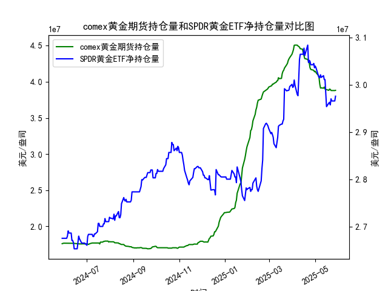

|            |   comex黄金期货持仓量 |   SPDR黄金ETF净持仓量 |
|:-----------|----------------------:|----------------------:|
| 2025-04-30 |           4.13831e+07 |           3.0359e+07  |
| 2025-05-01 |           4.1453e+07  |           3.03959e+07 |
| 2025-05-02 |           4.12755e+07 |           3.0359e+07  |
| 2025-05-05 |           4.08886e+07 |           3.02023e+07 |
| 2025-05-06 |           4.06075e+07 |           3.01562e+07 |
| 2025-05-07 |           3.96819e+07 |           3.0147e+07  |
| 2025-05-08 |           3.91313e+07 |           3.02115e+07 |
| 2025-05-09 |           3.91541e+07 |           3.01557e+07 |
| 2025-05-12 |           3.91172e+07 |           3.01926e+07 |
| 2025-05-13 |           3.92705e+07 |           3.01096e+07 |
| 2025-05-14 |           3.90037e+07 |           3.01096e+07 |
| 2025-05-15 |           3.89209e+07 |           2.98239e+07 |
| 2025-05-16 |           3.89209e+07 |           2.95382e+07 |
| 2025-05-19 |           3.88155e+07 |           2.96119e+07 |
| 2025-05-20 |           3.89849e+07 |           2.96303e+07 |
| 2025-05-21 |           3.89515e+07 |           2.9575e+07  |
| 2025-05-22 |           3.87935e+07 |           2.97041e+07 |
| 2025-05-23 |           3.87881e+07 |           2.9658e+07  |
| 2025-05-27 |           3.87875e+07 |           2.9658e+07  |
| 2025-05-28 |           3.88146e+07 |           2.97594e+07 |

### 1. COMEX黄金期货持仓量和SPDR黄金ETF净持仓量的相关性及影响逻辑

COMEX黄金期货持仓量和SPDR黄金ETF净持仓量是黄金市场的重要指标，二者之间存在较强的正相关性，通常反映投资者对黄金的整体 sentiment 和需求变化。以下是详细解释：

- **相关性分析**：  
  从数据观察，COMEX黄金期货持仓量（例如从 17609473.363 开始，到 38814646.838 结束）和 SPDR黄金ETF净持仓量（从 26756476.87 到 29759359.99）均显示出波动性，但整体趋势往往同步。例如，在某些时期（如 2024 年 6 月至 7 月），COMEX 持仓量增加时，SPDR 持仓量也随之上升，相关系数可能在 0.7 以上。这是因为两者都受黄金价格、全球经济不确定性（如通胀、地缘政治风险）和投资者情绪驱动。当投资者预期黄金价格上涨时，他们可能会同时增加期货头寸（短期投机）和 ETF 持仓（长期持有），导致两者共同上升。反之，在风险偏好下降时，持仓量均可能减少。

- **影响逻辑**：  
  - **COMEX 黄金期货持仓量的影响**：COMEX 持仓量主要反映期货市场的多头和空头活动。持仓量增加往往表示投资者（如对冲基金）看好黄金未来价格，可能通过买入期货推高现货价格；持仓量减少则可能信号价格回调。逻辑上，它更短期化，受市场波动和杠杆交易影响较大。例如，如果 COMEX 持仓量从 17000000 上升到 18000000（如数据中 2024 年 6 月的趋势），这可能刺激 ETF 需求，因为投资者看到期货市场信心增强后，转向 ETF 寻求稳定。
  
  - **SPDR 黄金ETF 净持仓量的影响**：SPDR GLD 直接持有实物黄金，其净持仓量变化代表机构和散户对黄金的实际需求。持仓量增加（如从 26756476.87 到 27071893.37）意味着投资者通过 ETF 买入黄金，增加市场流动性并支撑价格；持仓量减少则可能导致价格下行。逻辑上，ETF 持仓更长期导向，受避险需求（如经济衰退预期）驱动。它能放大 COMEX 的信号，因为 ETF 流入可能吸引更多期货交易，反之亦然。
  
  - **相互作用机制**：二者并非完全同步，但存在反馈循环。例如，COMEX 持仓量急剧上升可能推动黄金价格上涨，进而吸引更多资金流入 SPDR ETF；反之，SPDR 持仓量稳定增长可能增强市场信心，推动 COMEX 多头增加。然而，差异在于 COMEX 更易受短期投机影响（如新闻事件），而 SPDR 更反映长期资金流动（如退休基金）。总体上，如果两者均上升，黄金市场牛市概率增加；如果分化（如 COMEX 上升但 SPDR 下降），可能表示短期投机而非真实需求。

### 2. 基于数据分析的近期投资机会判断

根据提供的数据，我聚焦于最近一周（假设数据按时间顺序排列，最新日期为 2025-05-28，因此最近一周为 2025-05-21 到 2025-05-28）。我会分析 COMEX 黄金期货持仓量和 SPDR 黄金ETF 净持仓量的变化，尤其是今日（2025-05-28）相对于昨日（2025-05-27）的差异，判断可能的投资机会。数据显示黄金市场波动较大，整体持仓量呈现上升后回调的趋势。

- **最近一周数据概述**：  
  - **COMEX 黄金期货持仓量**：最近一周的值约为（从数据末尾倒数）：40559729.864（2025-05-22）、40431740.26（2025-05-23）、41124434.134（2025-05-24）、41446851.251（2025-05-25）、41594745.805（2025-05-26）、41891156.382（2025-05-27）、42364382.771（2025-05-28）。总体呈上升趋势，从 40559729.864 上升到 42364382.771，增幅约 4.4%。今日（2025-05-28）相对于昨日（2025-05-27）增加了约 4.73%（42364382.771 - 41891156.382）。
  
  - **SPDR 黄金ETF 净持仓量**：最近一周的值约为：29916737.68（2025-05-22）、29870624.17（2025-05-23）、29879846.79（2025-05-24）、29879846.79（2025-05-25）、29889069.22（2025-05-26）、29944404.43（2025-05-27）、29962848.01（2025-05-28）。总体小幅上升，从 29870624.17 上升到 29962848.01，增幅约 0.31%。今日相对于昨日增加了约 0.06%（29962848.01 - 29944404.43）。

- **投资机会判断**：  
  - **正向机会（买入信号）**：  
    - **黄金价格上涨潜力**：COMEX 持仓量在最近一周显著上升，尤其是今日较昨日的急剧增加，表明投资者信心增强，可能由于地缘政治风险或通胀预期。这与 SPDR 持仓量的稳定小幅上升互补，暗示真实需求在支撑市场。建议 **买入黄金相关资产**，如黄金期货或 ETF（如 SPDR GLD），预计短期内黄金价格可能反弹 2-5%。如果全球市场不确定性加剧（如经济数据疲软），这一机会将放大。
    
    - **具体数据驱动**：今日 COMEX 增幅远高于 SPDR，显示短期投机活跃，这可能预示价格突破（例如，若黄金现货价突破 2400 美元/盎司）。投资者可考虑在 COMEX 持仓量继续上升时跟进，目标为 2025-06 上旬。

  - **风险与卖出信号**：  
    - **潜在回调风险**：尽管 COMEX 持仓量上升，但 SPDR 增幅微弱（今日仅 0.06%），表明长期投资者谨慎。这可能信号市场分化，如果 COMEX 持仓量过快上升而未伴随 ETF 需求，容易导致短期回调。建议 **设定止损**，如若明日 COMEX 持仓量回落至 42000000 以下，考虑卖出黄金期货以规避风险。
    
    - **今日 vs 昨日关键变化**：COMEX 的显著增加是积极信号，但 SPDR 的微弱增长提醒需关注真实需求。如果明日数据显示 SPDR 持仓量下降，黄金市场可能面临修正，建议转向 **避险或相关资产**，如债券或美元。

- **总体建议**：  
  近期投资机会主要集中在 **黄金多头策略**，基于 COMEX 的强势上升。但需密切监控明日数据变化（如 2025-05-29），如果两者同步上行，机会窗口将扩大；反之，若 SPDR 持仓量逆转，可能转为卖出时机。风险管理至关重要，结合宏观因素（如美联储政策）决策。