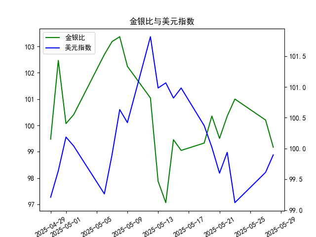

|            |    金价 |   银价 |   美元指数 |   金银比 |
|:-----------|--------:|-------:|-----------:|---------:|
| 2025-04-29 | 3305.05 | 33.225 |    99.21   |  99.4748 |
| 2025-04-30 | 3302.05 | 32.225 |    99.6403 | 102.469  |
| 2025-05-01 | 3214.75 | 32.125 |   100.187  | 100.07   |
| 2025-05-02 | 3249.7  | 32.365 |   100.042  | 100.408  |
| 2025-05-06 | 3391.45 | 33.025 |    99.2654 | 102.693  |
| 2025-05-07 | 3392.25 | 32.875 |    99.9006 | 103.186  |
| 2025-05-08 | 3352.3  | 32.43  |   100.633  | 103.37   |
| 2025-05-09 | 3324.55 | 32.515 |   100.422  | 102.247  |
| 2025-05-12 | 3235.4  | 32.02  |   101.814  | 101.043  |
| 2025-05-13 | 3227.95 | 32.98  |   100.983  |  97.876  |
| 2025-05-14 | 3191.95 | 32.885 |   101.066  |  97.064  |
| 2025-05-15 | 3191.05 | 32.085 |   100.82   |  99.4561 |
| 2025-05-16 | 3182.95 | 32.135 |   100.983  |  99.0493 |
| 2025-05-19 | 3230.15 | 32.52  |   100.373  |  99.3281 |
| 2025-05-20 | 3261.55 | 32.5   |   100.022  | 100.355  |
| 2025-05-21 | 3299.65 | 33.16  |    99.6014 |  99.5069 |
| 2025-05-22 | 3284    | 32.725 |    99.9388 | 100.351  |
| 2025-05-23 | 3342.65 | 33.095 |    99.1231 | 101.002  |
| 2025-05-27 | 3296.7  | 32.9   |    99.6147 | 100.204  |
| 2025-05-28 | 3300.85 | 33.285 |    99.8978 |  99.1693 |

### 1. 金银比与美元指数的相关性及影响逻辑

金银比（Gold-Silver Ratio）是黄金价格除以白银价格的比率，用于衡量黄金相对于白银的价值变化。通常，当金银比较高时，表示黄金相对于白银更“昂贵”，可能暗示投资者更青睐黄金作为避险资产；当金银比较低时，则可能意味着白银相对更具吸引力。

美元指数（US Dollar Index）衡量美元对一篮子主要货币（如欧元、日元等）的汇率变化，反映美元的整体强弱。美元指数上升表示美元强势，下降则表示美元疲软。

**相关性：**
- 金银比与美元指数之间存在一定的负相关性，但并非绝对一致。这是因为黄金和白银作为以美元计价的贵金属，其价格往往受美元波动影响。当美元指数上升（美元强势）时，贵金属的价格通常会下跌，因为美元升值使这些资产对持有其他货币的投资者来说更昂贵，从而降低需求。反之，美元指数下降（美元疲软）时，贵金属价格可能上涨。
- 具体到金银比：黄金被视为更纯粹的避险资产，而白银兼具工业需求，因此它们对美元变化的反应可能不同。美元强势时，白银价格可能下跌更多（由于工业需求敏感），导致金银比上升；美元疲软时，如果黄金价格相对稳定或上涨较少，金银比可能下降。

**影响逻辑：**
- **美元强势的影响**：当美元指数上升时，投资者可能转向美元资产，减少对贵金属的配置，导致黄金和白银价格双双下跌。但如果白银下跌幅度大于黄金，金银比会扩大，这可能为白银投资者提供买入机会。
- **美元疲软的影响**：美元指数下降时，贵金属作为避险工具的需求增加，可能推动金银比缩小。如果白银价格上涨更快，金银比下降，这可能暗示白银相对更 undervalued。
- **其他因素**：虽然美元是主要驱动因素，但金银比还受全球经济、地缘政治、市场情绪和工业需求影响。例如，在经济不确定期，黄金的需求可能更强，导致金银比上升。即使美元指数稳定，金银比也可能波动。
- **总体逻辑**：投资者常使用金银比作为信号，当美元强势时监控金银比上升是否过度（可能预示白银反弹机会）；当美元疲软时，关注金银比下降是否创造黄金或白银的买入点。基于历史数据，这种相关性并非线性，可能因市场条件而异。

### 2. 根据数据分析判断近期投资机会

基于提供的数据，我将聚焦于最近一周的變化（即2025-5-22至2025-5-28的可用数据），并特别强调今日（2025-5-28）相对于昨日（2025-5-27）的变化。数据包括金银比和美元指数的20个日频值，对应20个日期，从2025-4-29到2025-5-28。

**数据概述：**
- **金银比数据**：整体呈现波动性，从4月29日的99.47开始，逐步变化，到5月28日降至99.17。最近一周的可用数据（2025-5-22至2025-5-28）为：100.20（5-22）、100.35（5-23）、99.17（5-27）、99.17（5-28）。金银比在最近几天趋于稳定，但今日（5-28）与昨日（5-27）相比持平（均为99.17）。
- **美元指数数据**：从4月29日的99.21开始波动，到5月28日升至99.90。最近一周的可用数据为：99.61（5-22）、99.90（5-23）、99.61（5-27）、99.90（5-28）。美元指数在最近几天小幅波动，但今日（5-28）较昨日（5-27）上升了约0.29点（从99.61到99.90）。

**近期变化分析：**
- **最近一周整体趋势**：
  - 金银比：在2025-5-22至5-23期间小幅上升（从100.20到100.35），随后在5-27和5-28保持在99.17。这表明金银比可能已触及短期稳定点，黄金相对于白银的价值未进一步扩大，暗示白银可能相对更吸引人。
  - 美元指数：在2025-5-22至5-23上升（从99.61到99.90），然后在5-27小幅回落至99.61，但今日（5-28）又回升至99.90。这显示美元短期内呈现波动性向上趋势，可能由于外部因素如经济数据或市场情绪支持美元强势。
  - **今日 vs 昨日**：金银比持平（99.17），而美元指数上升。这可能反映美元强势对贵金属需求的轻微抑制，但金银比未进一步上升，表明白银未被过度抛售。

- **潜在投资机会判断：**
  - **白银买入机会**：金银比在最近一周未显著上升，且今日持平，暗示黄金相对于白银的价值未扩大。这可能是一个买入白银的信号，尤其如果美元指数继续上升但金银比保持稳定，白银价格可能在工业需求回暖时反弹。投资者可关注如果金银比跌破99.00，将可能强化白银的相对价值。
  - **黄金卖出或观望**：金银比稳定表明黄金未出现强势避险需求。如果美元指数持续上升，黄金价格可能进一步承压，提供短期卖出机会。但需谨慎，因为黄金在经济不确定期仍具避险价值。
  - **美元相关机会**：美元指数今日上升，可能利好美元资产（如美国股票或债券）。如果这一趋势延续，投资者可考虑增持美元计价资产，或对冲贵金属头寸以防范美元强势带来的下行风险。
  - **整体风险与建议**：近期数据显示市场波动性较高（金银比波动约1-3点，美元指数波动约0.3点），可能源于季节性因素或全球事件。潜在机会包括：
    - **短期买入白银**：若金银比继续稳定在99左右，目标价位可设在白银价格上涨5-10%时获利。
    - **美元多头策略**：今日上升趋势若延续，可布局美元指数相关ETF。
    - **风险警示**：数据仅覆盖20天，样本有限；今日金银比持平可能预示短期无剧变，但若美元指数急升，可能导致金银比反弹，增加贵金属投资风险。建议结合更广泛的市场数据（如通胀预期）进行决策。