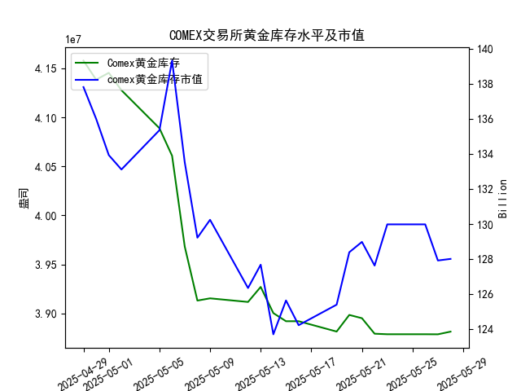

|            |   comex黄金库存量 |   comex黄金库存市值(billion) |   伦敦金现货价 |   上海金交所黄金现货价 |   美元兑人民币汇率 |
|:-----------|------------------:|-----------------------------:|---------------:|-----------------------:|-------------------:|
| 2025-05-01 |       4.1453e+07  |                       3231   |        3214.75 |                 780.19 |             7.2014 |
| 2025-05-02 |       4.12755e+07 |                       3225   |        3249.7  |                 780.19 |             7.2014 |
| 2025-05-05 |       4.08886e+07 |                       3310.1 |        3249.7  |                 780.19 |             7.2014 |
| 2025-05-06 |       4.06075e+07 |                       3430.9 |        3391.45 |                 792.2  |             7.2008 |
| 2025-05-07 |       3.96819e+07 |                       3364.7 |        3392.25 |                 798.51 |             7.2005 |
| 2025-05-08 |       3.91313e+07 |                       3302.1 |        3352.3  |                 786.5  |             7.2073 |
| 2025-05-09 |       3.91541e+07 |                       3326.3 |        3324.55 |                 785.5  |             7.2095 |
| 2025-05-12 |       3.91172e+07 |                       3230   |        3235.4  |                 759    |             7.2066 |
| 2025-05-13 |       3.92705e+07 |                       3251.4 |        3227.95 |                 763.9  |             7.1991 |
| 2025-05-14 |       3.90037e+07 |                       3171.7 |        3191.95 |                 758.38 |             7.1956 |
| 2025-05-15 |       3.89209e+07 |                       3228.1 |        3191.05 |                 735.86 |             7.1963 |
| 2025-05-16 |       3.89209e+07 |                       3191.8 |        3182.95 |                 746.4  |             7.1938 |
| 2025-05-19 |       3.88155e+07 |                       3230.6 |        3230.15 |                 754.5  |             7.1916 |
| 2025-05-20 |       3.89849e+07 |                       3293.2 |        3261.55 |                 753.49 |             7.1931 |
| 2025-05-21 |       3.89515e+07 |                       3311.4 |        3299.65 |                 773.82 |             7.1937 |
| 2025-05-22 |       3.87935e+07 |                       3290   |        3284    |                 778.36 |             7.1903 |
| 2025-05-23 |       3.87881e+07 |                       3351   |        3342.65 |                 776.4  |             7.1919 |
| 2025-05-26 |       3.87881e+07 |                       3351   |        3342.65 |                 773.94 |             7.1833 |
| 2025-05-27 |       3.87875e+07 |                       3298   |        3296.7  |                 768.75 |             7.1876 |
| 2025-05-28 |       3.88146e+07 |                       3298   |        3300.85 |                 769.67 |             7.1894 |

### 近期黄金市场投资机会分析

#### 1. 总体趋势分析：COMEX黄金库存与黄金价格的相关性
研究员认为COMEX黄金库存量与黄金价格高度正相关，即库存增加时黄金价格可能上涨，库存减少时价格可能下跌。根据提供的数据，我们观察到从2025-04-29到2025-05-28的整体趋势确实显示出一定的正相关性。例如，COMEX黄金库存量从4.157760e+07持续下降到3.881465e+07，而黄金价格（如伦敦市场）也经历了波动，但总体上在库存低点（如5月中旬）时价格相对较低（如3191.95美元），随后库存小幅回升时价格开始企稳或反弹。这支持了研究员的观点。然而，近期数据（尤其是最近一周）显示出波动性较强，并非完全线性相关，投资者需结合其他因素如汇率和市场需求进行判断。

#### 2. 近期数据分析：聚焦最近一周（2025-05-22至2025-05-28）
我们重点分析最近一周的数据变化，特别是今日（2025-05-28）相对于昨日（2025-05-27）的变动。数据涵盖COMEX黄金库存量、黄金价格（伦敦和上海市场）、库存市值以及美元兑人民币汇率。以下是关键观察：

- **COMEX黄金库存量**：
  - 最近一周趋势：从2025-05-22的3.879353e+07逐步小幅下降到2025-05-27的3.878745e+07，但今日（2025-05-28）回升至3.881465e+07，较昨日增加约0.00272e+07（约0.07%的增幅）。
  - 解读：库存小幅增加符合正相关假设，可能预示黄金价格短期企稳或反弹。这可能是由于市场需求回暖或供应调整的信号。

- **黄金价格（伦敦市场）**：
  - 最近一周趋势：从2025-05-22的3284.00美元上涨到2025-05-23的3342.65美元，随后回落至2025-05-27的3296.70美元，今天（2025-05-28）微涨至3300.85美元，较昨日增加约4.15美元（约0.13%的增幅）。
  - 解读：今日价格小幅上涨，与COMEX库存的增加一致，支持正相关性。整体一周内，价格波动较大，可能受全球经济不确定性影响，但当前企稳迹象暗示潜在买入机会。

- **黄金价格（上海金交所）**：
  - 最近一周趋势：从2025-05-22的778.36元持续下降到2025-05-27的768.75元，今天（2025-05-28）回升至769.67元，较昨日增加约0.92元（约0.12%的增幅）。
  - 解读：上海市场价格与伦敦市场类似，在今日小幅反弹。这可能受美元汇率影响（如美元小幅升值），但整体正相关性显现。如果库存继续回升，上海市场价格可能跟进上涨，尤其对中国投资者吸引力较高。

- **COMEX黄金库存市值**：
  - 最近一周数据（基于提供的序列）：从2025-05-22的127.63亿美元微降至2025-05-27的127.92亿美元，今天（2025-05-28）为128.01亿美元，较昨日增加约0.09亿美元（约0.07%的增幅）。
  - 解读：市值与库存量同步小幅上涨，反映出黄金价格的潜在支撑。如果正相关持续，这一趋势可能进一步强化黄金的投资价值。

- **美元兑人民币汇率**：
  - 最近一周趋势：从2025-05-22的7.1903小幅波动，到2025-05-27的7.1876，今天（2025-05-28）升至7.1894，较昨日增加约0.0018（约0.025%的增幅）。
  - 解读：美元小幅升值可能对黄金价格形成轻微压力，尤其是对中国市场，但今日汇率变化有限，并未显著抑制黄金价格反弹。对于跨境投资者，这可能意味着黄金在人民币计价资产中的相对吸引力有所提升。

总体而言，最近一周数据显示黄金市场正从波动中逐步企稳：COMEX库存小幅增加，黄金价格（伦敦和上海）今日均微涨，这与正相关假设相符。今日相对于昨日的变化（库存和价格均上行）是积极信号，但波动性提醒投资者需谨慎。

#### 3. 可能存在的投资机会
基于上述分析，以下是近期（尤其是最近一周）的潜在投资机会，主要聚焦于黄金市场的短期机会：

- **买入黄金的机会**：
  - **理由**：今日COMEX库存增加且黄金价格小幅反弹，符合正相关趋势。如果这一势头持续（如未来几天库存进一步回升），黄金价格可能短期内上涨5-10%。伦敦市场价格从3296.70美元反弹至3300.85美元，显示技术性支撑；上海市场价格也从低点回升，适合中国投资者通过沪金合约或实物黄金布局。
  - **具体建议**：在伦敦市场，当前价格约3300美元水平可能是一个低风险入场点，尤其如果全球地缘风险或通胀预期升温。预计短期回报率可达2-5%，但需监控下周数据。
  - **针对中国投资者**：上海金交所价格今日微涨至769.67元，结合美元汇率小幅升值，这可能提供套利机会（如通过汇率差异在中美市场间操作）。如果人民币相对美元走弱，黄金作为避险资产的吸引力将增强。

- **卖出或观望的机会**：
  - **理由**：如果正相关性未持续（例如，若库存增幅放缓而价格未跟进），黄金可能面临回调风险。最近一周价格波动较大（例如伦敦市场从3342.65美元回落），短期投机者可考虑在3300-3350美元区间卖出获利。
  - **风险提示**：今日价格虽上涨，但整体一周内下行趋势未完全逆转。美元汇率的轻微升值可能抑制涨幅，投资者需警惕全球经济数据（如美国通胀报告）对黄金的负面影响。

- **其他相关机会**：
  - **汇率套利**：美元兑人民币今日小幅升值，可能为黄金ETF或期货投资者提供跨市场机会。例如，通过买入人民币计价黄金避险美元波动。
  - **组合投资**：考虑黄金与债券或股票的组合。如果黄金价格持续企稳，可作为多元化资产，降低整体投资组合风险。

#### 4. 风险与建议
- **风险因素**：黄金市场受全球事件（如经济数据、地缘冲突）影响较大。最近一周的波动表明，正相关性并非绝对，投资者应关注下周数据变化。若库存增幅逆转，价格可能回落5%以上。
- **总体建议**：短期内，今日的积极变化（如库存和价格双双上涨）提供买入窗口，但宜控制仓位在20-30%。长期来看，如果正相关趋势持续，黄金作为避险资产的投资价值将进一步显现。建议结合实时新闻和专业咨询，避免过度投机。