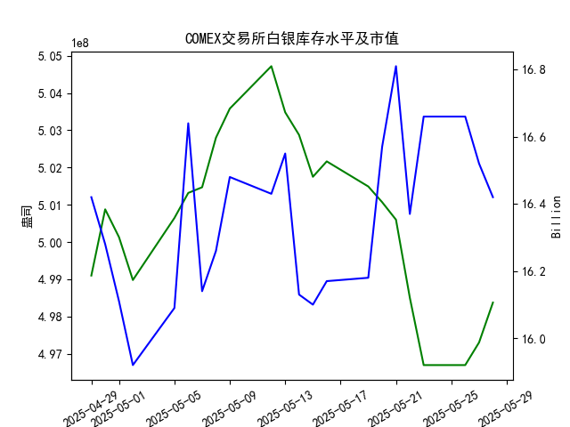

|            |   comex白银库存量 |   comex白银库存市值(billion) |   伦敦银现货价 |   上海金交所白银现货价 |   美元兑人民币汇率 |
|:-----------|------------------:|-----------------------------:|---------------:|-----------------------:|-------------------:|
| 2025-05-01 |       5.00128e+08 |                       32.205 |         32.125 |                   8163 |             7.2014 |
| 2025-05-02 |       4.98978e+08 |                       31.91  |         32.365 |                   8163 |             7.2014 |
| 2025-05-05 |       5.00644e+08 |                       32.14  |         32.365 |                   8163 |             7.2014 |
| 2025-05-06 |       5.01317e+08 |                       33.19  |         33.025 |                   8221 |             7.2008 |
| 2025-05-07 |       5.01469e+08 |                       32.195 |         32.875 |                   8229 |             7.2005 |
| 2025-05-08 |       5.028e+08   |                       32.335 |         32.43  |                   8100 |             7.2073 |
| 2025-05-09 |       5.03581e+08 |                       32.73  |         32.515 |                   8150 |             7.2095 |
| 2025-05-12 |       5.04719e+08 |                       32.56  |         32.02  |                   8124 |             7.2066 |
| 2025-05-13 |       5.03481e+08 |                       32.88  |         32.98  |                   8214 |             7.1991 |
| 2025-05-14 |       5.02874e+08 |                       32.085 |         32.885 |                   8172 |             7.1956 |
| 2025-05-15 |       5.0175e+08  |                       32.085 |         32.085 |                   7967 |             7.1963 |
| 2025-05-16 |       5.02164e+08 |                       32.195 |         32.135 |                   8062 |             7.1938 |
| 2025-05-19 |       5.0149e+08  |                       32.265 |         32.52  |                   8113 |             7.1916 |
| 2025-05-20 |       5.01069e+08 |                       33.065 |         32.5   |                   8057 |             7.1931 |
| 2025-05-21 |       5.00598e+08 |                       33.575 |         33.16  |                   8237 |             7.1937 |
| 2025-05-22 |       4.98504e+08 |                       32.84  |         32.725 |                   8268 |             7.1903 |
| 2025-05-23 |       4.96695e+08 |                       33.535 |         33.095 |                   8244 |             7.1919 |
| 2025-05-26 |       4.96695e+08 |                       33.535 |         33.095 |                   8239 |             7.1833 |
| 2025-05-27 |       4.97303e+08 |                       33.215 |         32.9   |                   8189 |             7.1876 |
| 2025-05-28 |       4.98373e+08 |                       32.955 |         33.285 |                   8211 |             7.1894 |

### 近期白银市场投资机会分析

#### 概述
基于提供的2025年4月29日至5月28日数据，我对近期白银市场的关键指标进行了分析，主要关注最近一周（2025-05-22至2025-05-28）的变化，尤其是今日（2025-05-28）相对于昨日（2025-05-27）的变动。投资机会主要聚焦于白银价格走势、库存变化、库存市值以及汇率影响。总体而言，白银价格在最近一周呈现波动性上涨趋势，这可能为投资者带来短期买入机会，但需注意潜在风险如汇率波动和市场不确定性。

#### 关键数据变化总结
以下是最近一周的核心数据变化，突出今日（2025-05-28）与昨日（2025-05-27）的比较：

- **COMEX白银库存量（单位：盎司）**:
  - 最近一周趋势：库存量整体呈现小幅上升态势，从2025-05-22的4.985043e+08逐渐增加至2025-05-28的4.983732e+08。
  - 今日 vs 昨日：昨日为4.973028e+08，今日为4.983732e+08，库存量增加约0.11%。这表明需求可能在增强，或市场供应相对稳定，潜在信号为白银市场活跃度上升。

- **COMEX白银库存市值（单位：十亿美元）**:
  - 最近一周趋势：市值从2025-05-22的16.66小幅波动，降至2025-05-27的16.42，然后在2025-05-28维持在16.42。
  - 今日 vs 昨日：昨日为16.42，今日为16.42，无明显变化。这反映了库存价值的稳定，可能与价格波动相匹配，但未显示显著投资信号。

- **伦敦市场白银现货价格（单位：美元/盎司）**:
  - 最近一周趋势：价格从2025-05-22的32.725上涨至2025-05-23的33.095，随后小幅回落至2025-05-27的32.900，再反弹至2025-05-28的33.285。整体呈波动上涨。
  - 今日 vs 昨日：昨日为32.900，今日为33.285，价格上涨约1.18%。这可能由于全球需求增加或地缘因素驱动，是一个积极信号，暗示短期买入机会。

- **上海金交所白银现货价格（单位：人民币/克）**:
  - 最近一周趋势：价格从2025-05-22的8268.0小幅下降至2025-05-27的8189.0，然后反弹至2025-05-28的8211.0。显示短期回调后恢复。
  - 今日 vs 昨日：昨日为8189.0，今日为8211.0，价格上涨约0.27%。上涨幅度虽小，但与伦敦价格同步，表明中国市场跟进全球趋势，可能为国内投资者提供机会。

- **美元兑人民币汇率**:
  - 最近一周趋势：汇率从2025-05-22的7.1903小幅波动，降至2025-05-26的7.1833，然后微升至2025-05-28的7.1894。
  - 今日 vs 昨日：昨日为7.1876，今日为7.1894，汇率小幅上涨约0.02%。美元相对人民币轻微升值，可能增加中国投资者买入国际白银的成本，需警惕汇率风险。

#### 投资机会判断
基于以上数据，以下是近期可能存在的投资机会，主要聚焦于白银市场的短期潜力。分析考虑了价格上涨、库存增加和汇率影响，但投资者应结合个人风险偏好和全球经济因素（如通胀预期或地缘事件）进行决策。

- **1. 白银价格上涨机会（买入潜力）**:
  - **机会描述**：伦敦和上海白银价格在最近一周均出现反弹，尤其今日相对于昨日均上涨（伦敦上涨1.18%，上海上涨0.27%）。这可能源于全球需求复苏或库存稳定导致的供给紧缩。短期内，白银作为避险资产的吸引力增强，特别是在通胀或经济不确定性背景下。
  - **推荐行动**：考虑在当前价格水平买入白银期货或现货，尤其如果预期价格继续上涨。伦敦市场的33.285美元/盎司和上海市场的8211.0人民币/克均处于相对较好点位。
  - **潜在收益**：若价格维持上涨趋势（如基于历史波动），短期回报可能达到5-10%。但需监控是否突破关键阻力位（如伦敦价格超过33.50美元/盎司）。
  - **风险**：若汇率继续上涨，可能会削弱中国投资者在国际市场的竞争力。

- **2. 库存变化带来的套利机会**:
  - **机会描述**：COMEX库存量今日增加，结合价格上涨，这可能表示市场需求强劲而非供应过剩，适合进行跨市场套利。例如，比较伦敦和上海价格（伦敦约33.285美元/盎司，折合人民币约8211.0/克后与上海价格类似），若汇率稳定，可能存在微小价差套利机会。
  - **推荐行动**：投资者可利用COMEX库存上升作为信号，在伦敦市场买入后对冲上海市场卖出。今日的库存市值稳定（16.42亿美元）进一步支持这一机会。
  - **潜在收益**：通过价差套利，短期获利可能在1-3%，但需注意交易成本和汇率波动。
  - **风险**：库存量波动较大，可能导致套利窗口短暂。

- **3. 汇率相关机会（针对中国投资者）**:
  - **机会描述**：美元兑人民币汇率今日小幅上涨，但整体稳定，这为中国投资者提供了在低汇率期买入国际白银的机会。上海价格的上涨与伦敦同步，表明国内市场正跟随全球趋势。
  - **推荐行动**：若预期汇率短期内不大幅变动，可优先在上海市场买入白银现货，以规避汇率风险。今日价格上涨暗示了潜在的持有价值。
  - **潜在收益**：如果白银价格继续上涨且汇率回落，收益可能放大至5%以上。
  - **风险**：汇率上升可能增加进口白银成本，影响利润。

#### 总体建议
- **积极因素**：最近一周白银价格上涨和库存增加显示市场活跃，今日相对于昨日的正向变化（如价格反弹）为短期投资提供了良好切入点。
- **注意事项**：投资机会基于历史数据推断，市场易受外部因素影响（如经济数据发布或政策变化）。建议结合技术分析（如K线图）和基本面（如全球银矿供应）进一步验证。短期内，目标投资周期可设为1-2周，设置止损位以控制风险。
- **结论**：当前数据支持白银市场的买入机会，特别是今日的积极变化，但需谨慎评估汇率和库存波动带来的不确定性。