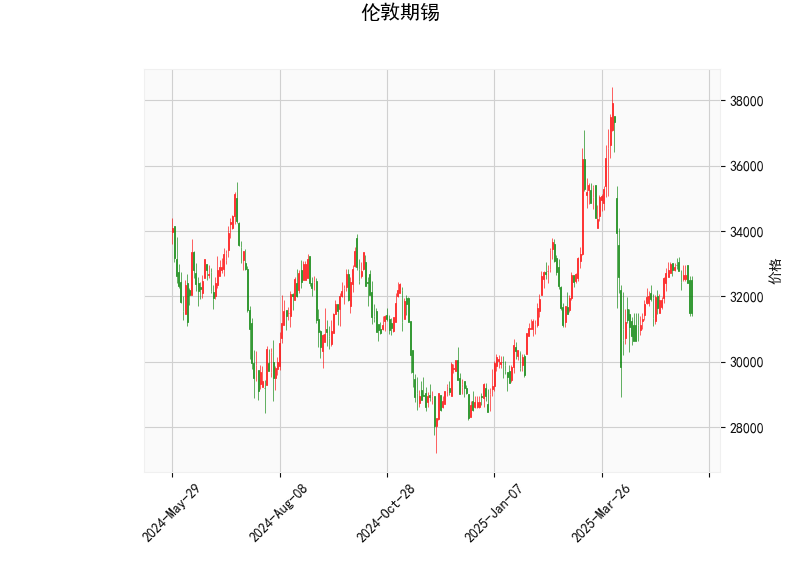

### 伦敦期锡技术分析结果分析

#### 1. 对技术分析结果的详细解读
基于提供的伦敦期锡技术指标数据，我们可以从多个维度分析当前市场状况。以下是对各指标的逐一解释及其对价格走势的潜在含义：

- **当前价格（Current Price）**: 31495.0  
  当前价格处于相对较低水平，与历史波动相比，这可能表示短期内价格已从高点回落。结合其他指标，这可能是一个潜在的支撑或反弹点。

- **RSI（Relative Strength Index，相对强弱指数）: 39.41**  
  RSI值低于50，表明市场可能处于超卖状态。RSI通常用于衡量价格动量的过快变化，当RSI降至30以下时，往往被视为强烈的买入信号。目前的39.41值接近超卖阈值（30），暗示卖方力量可能已耗尽，价格可能出现短期反弹。但如果RSI继续下降，则可能进一步确认下行趋势。

- **MACD（Moving Average Convergence Divergence，移动平均收敛散度）指标**:
  - MACD线: -92.54  
  - MACD信号线: -14.52  
  - MACD柱状图: -78.02  
  MACD线低于信号线，且柱状图为负值，这是一个典型的看跌信号，表明短期动量向下。MACD反映了短期移动平均线与长期移动平均线的差异，目前的负值显示卖方主导市场，可能导致进一步的价格下跌。然而，如果MACD线开始向上穿越信号线，这将是一个潜在的买入信号。

- **Bollinger Bands（布林带）**:
  - 上轨（Upper Band）: 36993.76  
  - 中轨（Middle Band）: 33071.42  
  - 下轨（Lower Band）: 29149.07  
  当前价格（31495.0）位于中轨和下轨之间，接近下轨，这通常被视为价格波动的低点区域。Bollinger Bands衡量价格的波动性：当价格触及下轨时，可能表示超卖状态，预示潜在反弹；反之，如果价格持续在下轨附近徘徊，可能会测试更低支撑位。整体来看，带宽较窄，暗示市场波动性较低，可能即将出现突破。

- **K线形态（K线模式）: CDLMATCHINGLOW**  
  这是一个看跌K线模式，通常表示价格可能在短期内继续下行或形成反转。CDLMATCHINGLOW模式往往出现在价格测试支撑位后，暗示卖方力量占优。如果后续K线未能出现向上突破，这可能加剧下行风险；反之，如果伴随其他指标（如RSI反弹），则可能逆转为买入机会。

**总体市场解读**:  
从以上指标来看，伦敦期锡当前处于弱势态势。RSI显示超卖可能引发反弹，MACD和K线形态则强调下行压力，Bollinger Bands则提示价格接近潜在支撑位。整体上，这反映出市场可能在短期内维持震荡，但超卖信号增加了反弹的可能性。投资者需关注外部因素，如全球经济数据、供应需求变化或地缘政治事件，这些可能放大或逆转技术信号。

#### 2. 近期可能存在的投资或套利机会和策略
基于上述分析，我们可以判断伦敦期锡的潜在机会。当前的技术面显示下行风险，但超卖特征也提供了逆势操作的空间。以下是针对近期可能的机会和策略建议，结合风险管理考虑：

- **可能的投资机会**:
  - **反弹买入机会**: RSI接近超卖水平，且价格靠近Bollinger下轨，这可能是一个短期买入点。投资者可考虑在价格稳定于31000附近时小仓位买入，目标指向中轨（约33000）。如果K线形态出现向上反转（如阳线突破），这将加强买入信号。
  - **卖出或做空机会**: MACD的看跌信号和CDLMATCHINGLOW模式暗示短期下行风险。如果价格跌破下轨（约29150），可考虑做空策略，目标设在30000以下。但需谨慎，因为超卖状态可能导致快速反弹。
  - **波动性交易机会**: Bollinger Bands显示波动性较低，如果市场突破上轨或下轨，将带来高波动性。投资者可利用期权合约捕捉这种突破，例如买入看涨期权以赌反弹。

- **可能的套利策略**:
  - **跨市场套利**: 伦敦期锡与上海期锡或其他金属期货（如铜或锌）可能存在价格差异。如果伦敦期锡价格低于上海期锡的合理价差（考虑运费、汇率等），可进行跨市场套利：例如，在伦敦买入并在上海卖出（或反之）。当前弱势可能放大这种机会，但需实时监控价差。
  - **期权或衍生品套利**: 利用RSI和MACD的矛盾信号，进行牛市价差策略（Bull Spread）。例如，买入短期看涨期权（赌反弹）和卖出远期看涨期权（锁定成本），以较低风险捕捉潜在反弹。反之，如果预期下行，可采用熊市价差策略。
  - **均值回归策略**: 价格处于Bollinger Bands中下部，暗示均值回归可能发生。投资者可构建多头头寸，等待价格回归中轨（约33000），结合止损设置（如低于下轨5%触发）来管理风险。

- **风险与策略建议**:
  - **风险管理**: 技术指标显示不确定性高，建议设置严格止损（如在当前价下方5%设置卖出点），并控制仓位不超过总资金的10%。外部事件（如中国经济数据或全球供应链中断）可能导致突发性波动。
  - **总体策略偏好**: 对于保守投资者，建议观望并等待RSI回升至50以上再入场；对于积极投资者，可在反弹信号出现时尝试小额操作。长期来看，如果全球需求回暖（如新能源行业增长），期锡价格可能向上突破。
  - **监控要点**: 持续跟踪RSI和MACD的动态变化，以及K线新形态。如果MACD柱状图转为正值，将是关键转折点。

总之，近期伦敦期锡的投资机会以短期反弹为主，但下行风险不可忽视。策略应以数据驱动，结合基本面分析，确保风险与回报平衡。