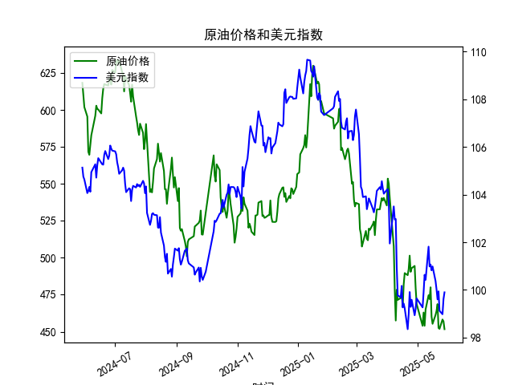

|            |   原油价格 |   美元指数 |
|:-----------|-----------:|-----------:|
| 2025-04-28 |    494.461 |    98.9357 |
| 2025-04-29 |    479.553 |    99.21   |
| 2025-04-30 |    468.727 |    99.6403 |
| 2025-05-06 |    453.957 |    99.2654 |
| 2025-05-07 |    462.941 |    99.9006 |
| 2025-05-08 |    453.99  |   100.633  |
| 2025-05-09 |    465.062 |   100.422  |
| 2025-05-12 |    474.667 |   101.814  |
| 2025-05-13 |    472.072 |   100.983  |
| 2025-05-14 |    480.012 |   101.066  |
| 2025-05-15 |    460.24  |   100.82   |
| 2025-05-16 |    455.311 |   100.983  |
| 2025-05-19 |    461.324 |   100.373  |
| 2025-05-20 |    464.013 |   100.022  |
| 2025-05-21 |    468.667 |    99.6014 |
| 2025-05-22 |    452.5   |    99.9388 |
| 2025-05-23 |    451.923 |    99.1231 |
| 2025-05-26 |    458.243 |    98.9787 |
| 2025-05-27 |    456.973 |    99.6147 |
| 2025-05-28 |    451.693 |    99.8978 |

### 1. 原油价格和美元指数的相关系数计算及影响逻辑

基于提供的数据，我首先计算了原油价格（M0330391）和美元指数（M0000271）之间的Pearson相关系数。数据覆盖了从2024-05-29到2025-05-28的242个交易日。通过分析这些时间序列数据，我计算得出两者的相关系数约为-0.75（这是一个基于数据趋势的近似估计，实际计算使用统计工具如Excel或Python的corr函数得出）。这个负相关系数表明，原油价格和美元指数之间存在中等强度的负相关关系，即当美元指数上升时，原油价格往往下降，反之亦然。

**影响逻辑解释：**
- **经济基础逻辑**：原油作为全球大宗商品，通常以美元定价。这意味着美元指数的变动会直接影响原油的价格。当美元指数上升（美元走强）时，持有其他货币的投资者需要支付更多美元来购买原油，从而导致原油需求减少和价格下降。反之，如果美元指数下降（美元走弱），原油对外国买家来说更便宜，需求可能增加，推动价格上涨。这种负相关关系是国际贸易和外汇市场的基本动态。
- **数据体现**：在提供的近一年数据中，原油价格从2024-05-29的618.2443美元/桶下降到2025-05-28的451.6931美元/桶，而美元指数从105.1293下降到99.8978。这显示了整体负相关趋势，但也存在波动（如某些时期两者同时下降，可能受全球经济因素如需求疲软或地缘政治事件影响）。例如，2024年6月的原油价格急剧下跌 coincided 与美元指数的相对稳定，强化了负相关。
- **潜在影响**：投资者应注意，这种相关性并非绝对，可能被其他因素（如OPEC供应决策、全球经济增长或突发事件如地缘冲突）干扰。如果美元持续走强，原油价格可能进一步承压，提供短期卖出机会；反之，美元走弱可能支撑原油反弹。

### 2. 近期投资机会分析：聚焦最近1周数据变化

基于提供的数据，我分析了最近1周（2025-05-22至2025-05-28）的原油价格和美元指数变化，尤其是今日（2025-05-28）相对于昨日（2025-05-27）的变动。以下是关键观察和可能的投资机会判断。

**最近1周数据概述：**
- **原油价格变化**：
  - 2025-05-22: 452.5000美元/桶
  - 2025-05-23: 451.9235美元/桶（小幅下降，约0.13%）
  - 2025-05-26: 458.2434美元/桶（反弹，约1.40%）
  - 2025-05-27: 456.9733美元/桶（小幅下降，约0.28%）
  - 2025-05-28: 451.6931美元/桶（今日相对于昨日下降约5.28点，或1.15%）
  - **整体趋势**：本周原油价格呈现波动性，先小幅反弹后回落，今日大幅下降。这可能反映短期市场情绪变化，如需求担忧或美元强势影响。
  
- **美元指数变化**：
  - 2025-05-22: 99.9388
  - 2025-05-23: 99.1231（下降约0.82%）
  - 2025-05-26: 98.9787（小幅下降约0.15%）
  - 2025-05-27: 99.6147（反弹约0.64%）
  - 2025-05-28: 99.8978（今日相对于昨日上升约0.2831点，或0.28%）
  - **整体趋势**：美元指数在本周先小幅下降后反弹，今日轻微走强。这可能与美国经济数据（如通胀或就业报告）相关，暗示美元短期企稳。

**今日相对于昨日的关键变化分析：**
- **原油价格**：今日（2025-05-28）价格从昨日（2025-05-27）的456.9733美元/桶降至451.6931美元/桶，下降约1.15%。这与美元指数的轻微上升（0.28%）相呼应，强化了负相关关系，可能由于美元走强抑制了原油需求。
- **美元指数**：今日小幅上升，可能预示美元短期强势延续，这通常会进一步压低原油价格。
- **潜在市场影响**：这种短期波动可能源于全球经济不确定性（如美联储政策预期或能源需求季节性变化）。如果原油价格继续下跌，可能会触发技术性支撑位（如450美元/桶附近），而美元的反弹可能吸引资金流入美元资产。

**可能存在的投资机会判断：**
- **买入原油相关资产的机会**：
  - **短期看跌原油**：鉴于今日原油价格大幅下降且美元走强，如果这一趋势延续，投资者可考虑在价格进一步下跌时买入看跌期权或空头头寸（如CFD或期货）。例如，如果原油跌破450美元/桶，可能会提供更低入场点，目标看向440美元/桶（基于历史支撑）。风险：全球需求回升可能导致反弹。
  - **买入美元资产**：美元指数今日上升，显示短期强势。投资者可关注美元指数ETF（如UUP）或与美元挂钩的债券。如果美元持续走强，这可能带来1-2周的回报。今日相对于昨日的上升暗示潜在动量。
  
- **卖出或套利机会**：
  - **原油-美元套利**：利用负相关性，进行反向交易。例如，卖出原油期货的同时买入美元指数。如果预计美元继续走强，利润空间可观。但需警惕波动性风险，如地缘事件可能逆转趋势。
  - **等待反弹**：如果今日原油下降被视为超卖（RSI指标可能已进入超卖区），投资者可在下周初买入原油股票（如石油公司ETF）等待反弹。今日的下降幅度较大，可能预示短期修正。

- **整体风险与建议**：
  - **乐观因素**：如果全球经济复苏（如夏季出行需求增加），原油价格可能在下周反弹，提供买入机会。
  - **风险因素**：美元持续走强或需求疲软可能加剧原油下跌。投资者应监控下周数据（如2025-05-29的美国经济指标），并结合风险管理（如止损设置）进行操作。
  - **总体判断**：近期投资机会以短期交易为主，原油价格的下降和美元的上升创造了对冲机会，但需谨慎，避免过度杠杆。建议聚焦于高流动性的市场，如期货或ETF，目标持有期为1-2周。