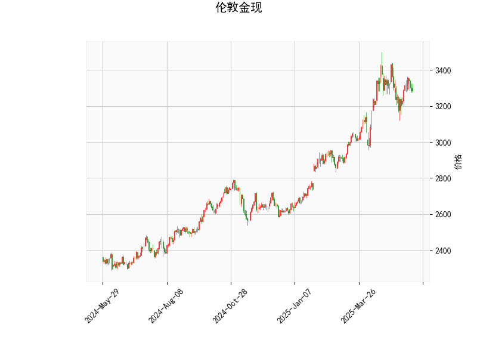

### 1. 对伦敦金现的技术分析结果进行分析

伦敦金现（现货黄金）的当前技术分析结果显示出市场处于相对中性的状态，但存在一些潜在的看涨和看跌信号。下面是对关键指标的详细分析：

- **当前价格（3286.34）**：价格位于布林带的中轨（3188.50）和上轨（3482.16）之间，表明黄金价格当前处于一个相对稳定的区间，没有明显突破上行或下行趋势。这可能反映市场观望情绪较强，投资者在等待更明确的方向。

- **RSI（51.61）**：相对强弱指数（RSI）略高于50，显示市场处于中性偏强势区域。RSI值在50以上通常表示买入势头，但未达到超买水平（70以上），因此短期内可能不会有剧烈上涨。相反，如果RSI回落至50以下，可能预示回调风险。

- **MACD指标**：
  - MACD线（21.27）低于信号线（26.60），且MACD直方图（-5.33）为负值。这暗示短期内存在看跌压力，市场可能正处于回调阶段。MACD的负直方图往往表示卖出信号，但如果MACD线向上交叉信号线，则可能转为看涨。
  - 总体上，MACD显示出短期弱势，但其幅度不大，表明下跌动能可能有限。

- **布林带（Bollinger Bands）**：
  - 上轨（3482.16）、中轨（3188.50）和下轨（2894.85）显示价格波动范围。中轨作为动态支撑位，目前价格高于中轨但未触及上轨，表明市场在正常波动区间内。如果价格跌破中轨，可能测试下轨支撑；反之，如果突破上轨，则可能进入强势上涨阶段。
  - 布林带的收窄（轨道间距较窄）通常预示着潜在的波动性增加，投资者需关注突破信号。

- **K线形态（CDLMATCHINGLOW）**：这是一个经典的看涨K线模式，通常表示价格可能触底反弹。Matching Low 形态出现时，意味着市场可能在低点形成双底或类似结构，暗示短期内有向上反弹的潜力。这与MACD的看跌信号形成对比，整体上显示市场可能处于转折点。

总结分析：技术指标呈现混合信号。RSI和K线形态偏向中性到看涨，支持潜在反弹；但MACD的负值和价格在中轨附近暗示短期回调风险。黄金市场当前可能在筑底，但需进一步确认方向，以避免假突破。

### 2. 分析判断近期可能存在的投资或套利机会和策略

基于上述分析，伦敦金现市场短期内可能存在有限的投资机会，特别是围绕潜在反弹和回调。以下是针对近期可能的投资或套利机会的判断和策略建议。需要强调的是，黄金市场受全球经济、地缘政治和利率影响较大，建议结合基本面分析，并严格执行风险管理。

#### 可能的投资机会
- **反弹机会（看涨）**：K线形态（CDLMATCHINGLOW）显示潜在触底信号，结合RSI的中性水平，如果价格向上突破布林带中轨（3188.50），可能迎来短期反弹。当前价格（3286.34）已接近这一水平，投资者可关注3500附近作为潜在目标。
- **回调机会（看跌）**：MACD的负直方图表明短期下行压力，如果价格跌向布林带下轨（2894.85），可能提供低位买入或卖出机会。但回调幅度可能有限，因为RSI未显示超卖。
- **套利机会**：黄金市场常有跨市场套利潜力，例如现货黄金与期货、ETF或其他衍生品之间的价差。如果现货价格与COMEX黄金期货价格出现异常偏差（如由于流动性差异），可通过无风险套利（如现货多头 + 期货空头）锁定收益。但需注意，目前数据未显示明显价差，套利窗口可能较窄，且需高频交易能力。

#### 投资策略建议
- **多头策略（买入黄金）**：
  - **时机**：等待K线形态确认反弹，例如价格向上突破中轨（3188.50）并RSI升至60以上时入场。
  - **操作**：买入现货黄金或相关ETF，目标价位设在布林带上轨（3482.16）附近。设置止损在下轨（2894.85）下方，以控制风险。
  - **优势**：如果全球风险事件（如地缘冲突）推动黄金避险需求，此策略可能获利。
  - **风险**：MACD看跌信号可能导致短期损失，适合风险偏好中高的投资者。

- **空头策略（卖出黄金）**：
  - **时机**：若MACD直方图继续恶化（例如跌至-10以下）或价格跌破中轨，考虑短期卖出。
  - **操作**：使用期货或差价合约（CFD）卖出，目标价位在3000附近。止盈设在中轨上方，止损在当前价上方。
  - **优势**：短期回调可能带来快速利润。
  - **风险**：K线形态的看涨信号可能导致反弹，空头头寸易被“挤出”。

- **中性或套利策略**：
  - **区间交易**：在布林带中轨（3188.50）和上轨（3482.16）之间进行高抛低吸。例如，当价格接近下轨时买入，接近上轨时卖出，以捕捉波动。
  - **跨资产套利**：如果现货黄金与黄金ETF（如SPDR Gold Shares）价格出现脱节，可同时在现货买入和ETF卖出（或反之），待价差收敛获利。近期机会较小，但可监控全球市场（如纽约 vs 伦敦价格差异）。
  - **优势**：中性策略减少方向风险，适合波动率较低的时期。
  - **风险**：套利需实时数据和低交易成本，普通投资者可能面临执行难度。

#### 总体风险与建议
- **风险因素**：黄金价格易受美联储利率决策、美元走势和全球事件影响。当前指标不一致，可能导致假信号，因此避免重仓操作。
- **建议**：使用小额资金测试，结合其他工具（如移动平均线）确认信号。长期投资者可等待更明确趋势，而短期交易者应优先关注MACD和K线形态的互动。始终设置止损（例如1-2%的账户风险），并定期复盘市场。